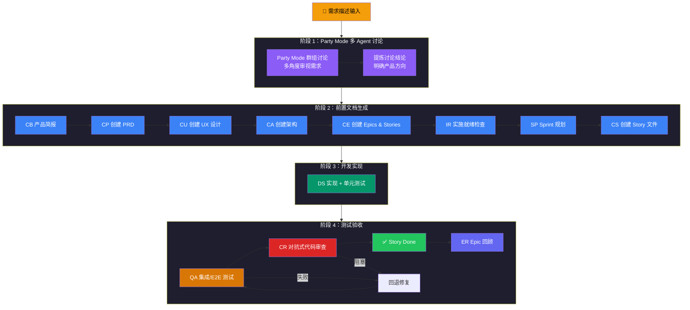
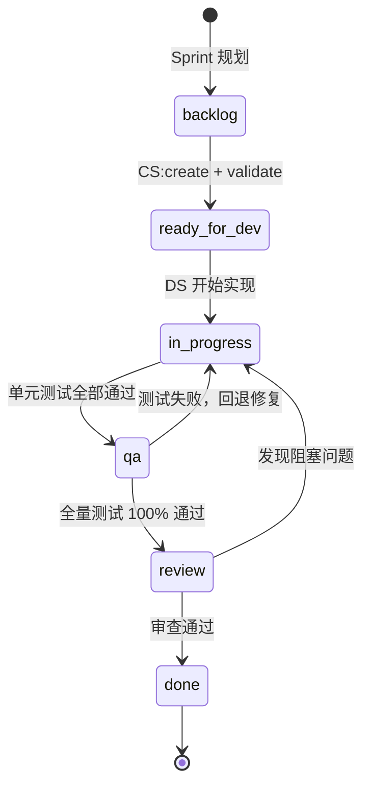

# BMad 快速开发执行路径

**项目：** skill-package
**日期：** 2026-04-14
**版本：** v1.0

---

## 概述

本文档描述了基于 BMad Method 的**快速开发最佳路径**——从一句需求描述出发，经过多 Agent 讨论、前置文档生成、代码实现、测试验收，最终交付可用功能的完整流程。

适用场景：你有一个明确的需求描述，希望以最高效的方式走完 BMad 全流程并交付高质量代码。

---

## 全局流程总览



---

## 阶段 1：Party Mode 多 Agent 讨论

> **目标**：在动手之前，让多个专业 Agent 从不同视角审视需求，避免盲点，明确方向。

### 触发方式

```
/adversarial-discussion-mode
```

或在对话中说：

```
party mode：讨论以下需求 —— [你的需求描述]
```

### 执行细节

| 属性 | 值 |
|------|-----|
| **技能** | `bmad-party-mode` + `bmad-review-adversarial-general` |
| **参与 Agent** | 系统自动选择 2-4 个相关 Agent（通常包含 PM、Architect、Analyst、UX Designer） |
| **输入** | 你的需求描述（自然语言） |
| **输出** | 各 Agent 独立观点 + 对抗式审查发现报告 |

### 工作原理

1. 读取 Agent 清单，根据需求主题选择最相关的 2-4 个 Agent
2. **并行**启动多个子代理，每个独立思考（非角色扮演）
3. 展示各 Agent 完整回复
4. 对抗式审查层补充批判性分析

### 讨论中应关注的要点

- [ ] **产品视角（John/PM）**：需求是否清晰？用户价值是否明确？是否有遗漏的用户场景？
- [ ] **技术视角（Winston/Architect）**：技术可行性？架构影响？是否有技术风险？
- [ ] **用户体验（Sally/UX）**：交互是否合理？是否符合设计规范？
- [ ] **业务视角（Mary/Analyst）**：是否对齐业务目标？有无竞品参考？

### 可选参数

```
party mode --model opus    # 强制使用高能力模型
party mode --solo          # 单 LLM 模式（无子代理，快速但多样性较低）
```

### 产出物

- 多 Agent 讨论记录（对话内保留）
- 对抗式审查发现报告
- **关键决策和共识**（手动提炼，作为后续文档输入）

> ⚠️ **建议**：讨论结束后，手动总结 3-5 条关键结论，作为下一阶段的输入。

---

## 阶段 2：前置文档生成

> **目标**：将讨论结论转化为完整的规划文档体系，确保开发有据可依。

### 文档生成链路

```
CB 产品简报 → CP 创建 PRD → CU UX 设计 → CA 架构 → CE Epics & Stories → IR 就绪检查 → SP Sprint 规划 → CS 创建 Story
```

> ⚠️ **重要**：每个步骤建议在**新对话**中执行，避免上下文过长。

---

### 步骤 2.1：CB — 创建产品简报

| 属性 | 值 |
|------|-----|
| **指令** | `/brief-prd` |
| **技能** | `bmad-product-brief` |
| **执行 Agent** | John（PM） |
| **输入** | 阶段 1 的讨论结论 + 需求描述 |
| **输出** | `planning-artifacts/brief/product-brief-*.md` |

**执行要点**：
- 通过引导式发现梳理产品概念
- 明确目标用户、核心价值、成功指标
- 可选：使用 `bmad-prfaq`（WB）进行 Working Backwards 压力测试

---

### 步骤 2.2：CP — 创建 PRD

| 属性 | 值 |
|------|-----|
| **指令** | `/create-prd` |
| **技能** | `bmad-create-prd` |
| **执行 Agent** | John（PM） |
| **输入** | 产品简报 |
| **输出** | `planning-artifacts/prd/prd-*.md` |

**执行要点**：
- 专家引导式产出完整 PRD
- 包含功能需求（FR）和非功能需求（NFR）
- 可选后续：`bmad-validate-prd`（VP）验证 + `bmad-edit-prd`（EP）编辑

---

### 步骤 2.3：CU — 创建 UX 设计规范

| 属性 | 值 |
|------|-----|
| **指令** | `/create-ux-design` |
| **技能** | `bmad-create-ux-design` |
| **执行 Agent** | Sally（UX Designer） |
| **输入** | PRD |
| **输出** | `planning-artifacts/ux/ux-design-specification.md` |

**执行要点**：
- 基于 PRD 规划 UX 模式和设计规范
- 定义交互模式、组件规范、响应式策略

---

### 步骤 2.4：CA — 创建技术架构

| 属性 | 值 |
|------|-----|
| **指令** | `/create-architecture` 或 `/agent-architect` |
| **技能** | `bmad-create-architecture` |
| **执行 Agent** | Winston（Architect） |
| **输入** | PRD + UX 设计规范 |
| **输出** | `planning-artifacts/architecture.md` |

**执行要点**：
- 引导式记录技术决策（Architecture Decisions）
- 定义技术栈、模式、约束
- 输出架构决策文档

---

### 步骤 2.5：CE — 创建 Epics & Stories

| 属性 | 值 |
|------|-----|
| **指令** | `/create-epics-and-stories` |
| **技能** | `bmad-create-epics-and-stories` |
| **执行 Agent** | John（PM） |
| **输入** | PRD + 架构文档 |
| **输出** | `planning-artifacts/epics/epics.md` |

**执行要点**：
- 将需求拆解为 Epic → Story → AC（验收标准）
- 每个 Story 包含 Given/When/Then 格式的 AC
- 定义 Story 间的依赖关系

---

### 步骤 2.6：IR — 实施就绪检查

| 属性 | 值 |
|------|-----|
| **指令** | `/check-implementation-readiness` |
| **技能** | `bmad-check-implementation-readiness` |
| **执行 Agent** | Winston（Architect） |
| **输入** | PRD + UX + 架构 + Epics |
| **输出** | `planning-artifacts/reports/implementation-readiness-report-*.md` |

**执行要点**：
- 验证 PRD / UX / 架构 / Epics 之间的一致性
- 检查是否有遗漏或冲突
- **强烈推荐**：不通过则回退修正，通过后才进入实现

---

### 步骤 2.7：SP — Sprint 规划

| 属性 | 值 |
|------|-----|
| **指令** | `/sprint-planning` |
| **技能** | `bmad-sprint-planning` |
| **执行 Agent** | Amelia（Dev） |
| **输入** | Epics & Stories |
| **输出** | `implementation-artifacts/sprint-status.yaml` |

**执行要点**：
- 初始化 Sprint 跟踪文件
- 确定 Story 执行顺序
- 所有 Story 初始状态为 `backlog`

---

### 步骤 2.8：CS — 创建 Story 文件

| 属性 | 值 |
|------|-----|
| **指令** | `/create-story` |
| **技能** | `bmad-create-story`（action: create + validate） |
| **执行 Agent** | Amelia（Dev） |
| **输入** | `epics.md` + `architecture.md` + `prd.md` |
| **输出** | `implementation-artifacts/{story-id}.md` |

**执行要点**：
- 从 epics.md 提取 Story 的 AC 和 Technical Notes
- 生成完整的 Story 文件（含 Tasks/Subtasks 分解）
- **必须执行 validate**：验证 Story 文件完整性
- 更新 `sprint-status.yaml`：`backlog` → `ready-for-dev`

### 前置文档 Checklist

```
□ 产品简报（CB）
□ PRD（CP）— 含 FR/NFR
□ UX 设计规范（CU）
□ 架构决策文档（CA）
□ Epics & Stories（CE）
□ 实施就绪报告（IR）— ✅ 通过
□ Sprint 状态文件（SP）
□ Story 文件（CS）— 已验证
```

---

## 阶段 3：开发实现

> **目标**：按 Story 文件严格实现代码 + 单元测试。

### 触发方式

```
/dev-story
```

### 执行细节

| 属性 | 值 |
|------|-----|
| **技能** | `bmad-dev-story` |
| **执行 Agent** | Amelia（Dev） |
| **输入** | 已验证的 Story 文件 |
| **输出** | 代码实现 + 单元测试 |
| **状态变更** | `ready-for-dev` → `in-progress` |

### Amelia 的强制执行规则

1. 实现前**必须完整阅读** Story 文件
2. 按 Tasks/Subtasks **顺序执行**，不跳过不重排
3. 每个 task 完成后编写对应的**单元测试**
4. 仅当实现和测试都完成且通过时才标记 `[x]`
5. 每个 task 后运行**完整测试套件**
6. 不间断执行直到所有 tasks 完成
7. **禁止谎报测试状态**

### 质量门禁（进入 QA 前必须满足）

- [ ] Story 文件中所有 tasks/subtasks 标记 `[x]`
- [ ] 每个 task 有对应的单元测试文件
- [ ] `tsc --noEmit` 零错误
- [ ] `vitest run` 全部通过
- [ ] Dev Agent Record 记录完整

---

## 阶段 4：测试验收

> **目标**：通过集成测试、E2E 测试和对抗式代码审查，确保交付质量。

### 步骤 4.1：QA — 集成/E2E 测试

| 属性 | 值 |
|------|-----|
| **技能** | `bmad-qa-generate-e2e-tests` 或 `bmad-testarch-automate` |
| **执行 Agent** | QA / Amelia（Dev） |
| **输入** | 代码实现 + Story 的 AC |
| **输出** | 集成测试 + E2E 测试文件 |
| **状态变更** | `in-progress` → `qa` |

**执行要点**：
- 为每个 Acceptance Criteria 生成集成测试或 E2E 测试
- 后端 API 测试 → `tests/integration/api/`
- 前端 E2E 测试 → `tests/e2e/` 或 `e2e/`
- 运行完整测试套件（单元 + 集成 + E2E）

**质量门禁**：
- [ ] 每个 AC 至少有一个对应的集成/E2E 测试
- [ ] `vitest run` 全部通过
- [ ] `playwright test` 全部通过（如适用）

**回退规则**：测试失败 → 回退到 `in-progress`，修复后重新进入 `qa`

---

### 步骤 4.2：CR — 对抗式代码审查

| 属性 | 值 |
|------|-----|
| **指令** | `/code-review` |
| **技能** | `bmad-code-review` |
| **执行 Agent** | Reviewer（建议新上下文窗口 + 不同 LLM） |
| **输入** | 代码变更 + Story 文件 |
| **输出** | 代码审查报告 |
| **状态变更** | `qa` → `review` |

**四步审查流程**：


**三层并行审查**：

| 审查层 | 职责 |
|--------|------|
| **Blind Hunter（盲点猎手）** | 寻找隐藏的 bug 和逻辑错误 |
| **Edge Case Hunter（边界猎手）** | 遍历所有分支路径和边界条件 |
| **Acceptance Auditor（验收审计）** | 逐条验证 AC 是否满足 |

**问题分级**：

| 级别 | 含义 | 处理方式 |
|------|------|---------|
| 🔴 Blocker | 阻塞性问题 | 必须修复，回退到 `in-progress` |
| 🟠 Major | 重大问题 | 必须解决或有明确延迟理由 |
| 🟡 Minor | 次要问题 | 建议修复 |
| ⚪ Nit | 代码风格 | 可选修复 |

**质量门禁**：
- [ ] 无 Blocker 级别问题
- [ ] 所有 Major 问题已解决或有明确延迟理由
- [ ] 审查结果记录到 Story 文件

**回退规则**：发现 Blocker/Major → 回退到 `in-progress` → 修复 → `qa` → `review`

---

### 步骤 4.3：Done — Story 签收

| 属性 | 值 |
|------|-----|
| **状态变更** | `review` → `done` |

**签收条件**：
- [ ] 代码审查通过，无阻塞性问题
- [ ] Story 文件 Dev Agent Record 完整记录
- [ ] `sprint-status.yaml` 已更新

---

### 步骤 4.4：ER — Epic 回顾（Epic 完成后）

| 属性 | 值 |
|------|-----|
| **指令** | `/retrospective` |
| **技能** | `bmad-retrospective` |
| **触发条件** | Epic 内所有 Story 达到 `done` |
| **输出** | 回顾报告 |

**回顾内容**：
- What went well / What didn't / Action items
- 架构决策的实际效果评估
- 技术债务识别
- 下一个 Epic 的改进建议

---

## 完整状态流转



---

## 快速执行 Checklist

按顺序执行以下步骤，每步在**新对话**中进行：

```
阶段 1：讨论
  □ /adversarial-discussion-mode — Party Mode 多 Agent 讨论需求
  □ 手动提炼 3-5 条关键结论

阶段 2：文档
  □ /brief-prd              — 创建产品简报
  □ /create-prd             — 创建 PRD
  □ /create-ux-design       — 创建 UX 设计规范
  □ /create-architecture    — 创建技术架构
  □ /create-epics-and-stories — 创建 Epics & Stories
  □ /check-implementation-readiness — 就绪检查（必须通过）
  □ /sprint-planning        — Sprint 规划
  □ /create-story           — 创建 + 验证 Story 文件

阶段 3：开发
  □ /dev-story              — 实现代码 + 单元测试

阶段 4：验收
  □ QA 集成/E2E 测试        — 生成并运行测试
  □ /code-review            — 对抗式代码审查
  □ Story Done              — 签收，更新 sprint-status
  □ /retrospective          — Epic 回顾（Epic 完成后）
```

---

## 指令速查卡

| 阶段 | 指令 | Agent | 产出物 |
|------|------|-------|--------|
| 讨论 | `/adversarial-discussion-mode` | 多 Agent | 讨论记录 + 审查报告 |
| 简报 | `/brief-prd` | John (PM) | `product-brief-*.md` |
| PRD | `/create-prd` | John (PM) | `prd-*.md` |
| UX | `/create-ux-design` | Sally (UX) | `ux-design-specification.md` |
| 架构 | `/create-architecture` | Winston (Arch) | `architecture.md` |
| 拆解 | `/create-epics-and-stories` | John (PM) | `epics.md` |
| 检查 | `/check-implementation-readiness` | Winston (Arch) | `implementation-readiness-report-*.md` |
| 规划 | `/sprint-planning` | Amelia (Dev) | `sprint-status.yaml` |
| Story | `/create-story` | Amelia (Dev) | `{story-id}.md` |
| 开发 | `/dev-story` | Amelia (Dev) | 代码 + 单元测试 |
| 审查 | `/code-review` | Reviewer | 审查报告 |
| 回顾 | `/retrospective` | 全团队 | 回顾报告 |

---

## 时间预估参考

| 阶段 | 预估耗时 | 说明 |
|------|---------|------|
| Party Mode 讨论 | 1 个对话 | 一次性完成 |
| 产品简报 | 1 个对话 | 引导式发现 |
| PRD | 1-2 个对话 | 含验证和编辑 |
| UX 设计 | 1 个对话 | 基于 PRD |
| 架构设计 | 1 个对话 | 引导式记录 |
| Epics & Stories | 1 个对话 | 拆解需求 |
| 就绪检查 | 1 个对话 | 验证一致性 |
| Sprint 规划 + Story 创建 | 1-2 个对话 | 每个 Story 一个对话 |
| 开发实现 | 每个 Story 1 个对话 | 按 task 顺序执行 |
| QA + CR | 每个 Story 1-2 个对话 | 含回退修复 |
| Epic 回顾 | 1 个对话 | Epic 完成后 |

> **总计**：一个中等规模需求（1 Epic / 3-5 Stories），预计 **12-18 个对话**完成全流程。
