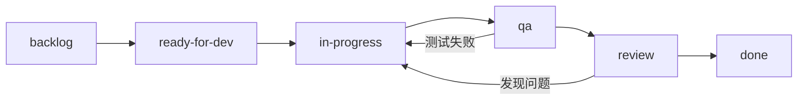
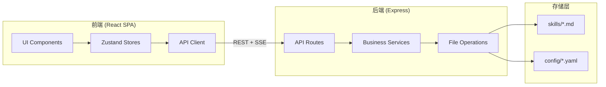

# Architecture Decision Document — Skill Manager

**Author:** Winston (Architect Agent) & Alex
**Date:** 2026-04-10

---

## Project Context Analysis

### Requirements Overview

**Functional Requirements:**

36 个功能需求（FR1-FR36），分为 7 个功能域：

| 功能域           | FR 数量         | 架构含义                              |
| ---------------- | --------------- | ------------------------------------- |
| Skill 浏览与发现 | 7 (FR1-FR7)     | 前端列表渲染、搜索引擎、Markdown 渲染 |
| 工作流编排       | 7 (FR8-FR14c)   | 拖拽排序、文件生成、模板引擎          |
| IDE 同步         | 5 (FR15-FR19)   | 文件系统复制、路径管理、并发安全      |
| IDE 导入         | 6 (FR20-FR25)   | 目录扫描、Frontmatter 解析、文件迁移  |
| Skill 管理       | 4 (FR25b-FR25d) | CRUD 操作、元数据编辑                 |
| 配置管理         | 4 (FR26-FR29)   | YAML 读写、持久化                     |
| 系统能力         | 3 (FR30-FR32)   | 文件解析、目录监控、类型区分          |

**Non-Functional Requirements:**

| NFR   | 要求                      | 架构影响                  |
| ----- | ------------------------- | ------------------------- |
| NFR1  | 搜索 < 200ms（500 Skill） | 前端内存搜索 + 模糊匹配库 |
| NFR2  | 首次加载 < 2s             | Vite 构建优化 + 代码分割  |
| NFR3  | 同步 < 2s（100 文件）     | 并行文件复制 + 流式进度   |
| NFR4  | Markdown 渲染 < 500ms     | 懒渲染 + 代码高亮按需加载 |
| NFR5  | 仅 localhost              | Express 绑定 127.0.0.1    |
| NFR6  | 路径遍历防护              | 后端路径白名单校验        |
| NFR11 | 跨平台路径                | path.posix 归一化         |
| NFR12 | UTF-8 + 中英文            | BOM 检测 + 编码归一化     |

**Scale & Complexity:**

- Primary domain: Full-stack Web App（localhost SPA + Node.js API）
- Complexity level: **Low**（标准 CRUD + 文件操作，无实时、无多租户、无合规）
- Estimated architectural components: ~15 个

### Technical Constraints & Dependencies

1. **纯本地运行** — 不依赖任何云服务或远程 API
2. **文件系统驱动** — 无数据库，所有数据存储为 `.md` 和 `.yaml` 文件
3. **单用户** — 无并发用户，但存在文件系统并发（应用写入 + 外部修改 + Watch 事件）
4. **跨平台** — macOS / Windows / Linux 文件路径兼容
5. **公版 + Fork 模式** — `src/` 公版代码 + `skills/` 用户数据 + `config/` 用户配置

### Cross-Cutting Concerns Identified

1. **文件系统 I/O** — 贯穿所有功能模块的核心操作
2. **YAML Frontmatter 解析** — Skill 文件和配置文件共用解析逻辑
3. **跨平台路径处理** — 所有文件操作必须路径归一化
4. **错误处理与恢复** — 文件不存在、权限拒绝、格式错误、写入中断
5. **数据刷新策略** — 写操作后的缓存失效与前端状态同步

---

## Starter Template Evaluation

### Primary Technology Domain

Full-stack Web App（前后端分离），基于 PRD 和产品简报中已确认的技术选型：

- 前端：React + TypeScript + Tailwind CSS
- 后端：Node.js + Express
- 构建：Vite

### Starter Options Considered

| 方案                       | 优势                                                 | 劣势                                                   | 结论        |
| -------------------------- | ---------------------------------------------------- | ------------------------------------------------------ | ----------- |
| **Next.js (App Router)**   | 前后端一体、Server Actions 直接操作 fs、一条命令启动 | Server/Client 边界复杂、HMR 与 fs 的边界行为、学习曲线 | ❌ 过度设计 |
| **Vite + React + Express** | 技术栈简单明确、前后端职责清晰、与 PRD 技术选型一致  | 需要两个进程、需要 concurrently 协调                   | ✅ 选定     |
| **Electron**               | 原生文件系统访问、桌面应用体验                       | 200MB+ 包体积、工程负担重、用户已有浏览器              | ❌ 不适合   |

### Selected Starter: Vite + React + Express（手动搭建）

**Rationale for Selection:**

1. **与 PRD 技术选型完全一致** — 产品简报和 PRD 已明确 React + Express 前后端分离
2. **职责边界清晰** — 前端只做 UI 渲染和状态管理，后端只做文件 I/O 和 API
3. **shadcn/ui 官方推荐** — shadcn/ui 对 Vite 有一流支持
4. **开发体验优秀** — Vite 的 HMR 速度远超 Webpack
5. **生产部署简单** — Express 在生产模式下 serve Vite 的 build 产物，单进程运行

**Initialization Command:**

```bash
# 前端初始化
npm create vite@latest skill-manager -- --template react-ts
cd skill-manager

# 安装核心依赖
npm install express cors gray-matter js-yaml fs-extra
# [Post-MVP] npm install chokidar  # 文件监听，MVP 阶段使用手动刷新
npm install -D @types/express @types/cors @types/fs-extra concurrently nodemon tsx

# shadcn/ui 初始化
npx shadcn-ui@latest init
npx shadcn-ui@latest add command dialog sheet card badge toast \
  form input select checkbox collapsible scroll-area separator \
  context-menu dropdown-menu alert-dialog tooltip
```

**Architectural Decisions Provided by Starter:**

| 维度                   | 决策                                 |
| ---------------------- | ------------------------------------ |
| Language & Runtime     | TypeScript (strict mode) + Node.js   |
| Styling                | Tailwind CSS v3 + CSS Variables      |
| Build Tooling          | Vite (dev) + tsc + vite build (prod) |
| Code Organization      | src/ 前端 + server/ 后端             |
| Development Experience | Vite HMR + nodemon 后端热重载        |

---

## Core Architectural Decisions

### Decision Priority Analysis

**Critical Decisions (Block Implementation):**

| #    | 决策       | 选择                                                        | 理由                                                                                                  |
| ---- | ---------- | ----------------------------------------------------------- | ----------------------------------------------------------------------------------------------------- |
| AD-1 | 前后端架构 | React SPA + Express REST API                                | PRD 已确认，职责清晰                                                                                  |
| AD-2 | 状态管理   | Zustand                                                     | 轻量、无 Provider、原生 persist、适合全局共享状态                                                     |
| AD-3 | 数据层     | 文件系统 + 内存缓存                                         | 无数据库，启动时全量扫描，chokidar 增量更新                                                           |
| AD-4 | API 通信   | REST API + SSE（Server-Sent Events）**[SSE 部分 Post-MVP]** | REST 处理 CRUD；SSE 推送文件变更事件为 Post-MVP，MVP 阶段前端通过写操作后主动刷新获取最新数据（FR31） |
| AD-5 | 搜索方案   | Fuse.js 前端模糊搜索                                        | 500 Skill 元数据约 50KB，内存搜索 < 10ms                                                              |
| AD-6 | 运行时验证 | Zod                                                         | Frontmatter 和 API 请求/响应的 runtime schema 校验                                                    |

**Important Decisions (Shape Architecture):**

| #     | 决策          | 选择                                           | 理由                                                                                                         |
| ----- | ------------- | ---------------------------------------------- | ------------------------------------------------------------------------------------------------------------ |
| AD-7  | Markdown 渲染 | react-markdown + remark-gfm + rehype-highlight | UX 规范已确认                                                                                                |
| AD-8  | 拖拽排序      | @dnd-kit/core + @dnd-kit/sortable              | UX 规范已确认，同时提供键盘排序（Alt+↑/↓）                                                                   |
| AD-9  | 键盘快捷键    | react-hotkeys-hook                             | UX 规范已确认                                                                                                |
| AD-10 | 虚拟滚动      | @tanstack/react-virtual                        | 仅用于 Skill 卡片列表，不用于 Markdown 预览                                                                  |
| AD-11 | 文件写入安全  | 原子写入（tmp + rename）                       | 防止写入中断导致文件损坏                                                                                     |
| AD-12 | 并发控制      | 写入队列（async-mutex）**[Post-MVP]**          | 防止应用写入与 chokidar 事件的竞态条件。MVP 阶段为单用户手动操作，无并发写入风险，推迟到引入 chokidar 时实现 |

**Deferred Decisions (Post-MVP):**

| #    | 决策                | 延迟理由                  |
| ---- | ------------------- | ------------------------- |
| DD-1 | Service Worker 缓存 | MVP 规模不需要离线缓存    |
| DD-2 | WebSocket 双向通信  | SSE 单向推送足够 MVP 需求 |
| DD-3 | 多 IDE 适配层       | V1 只支持 CodeBuddy       |
| DD-4 | 国际化 (i18n)       | V1 仅中文界面             |

### Data Architecture

**数据模型：**

```typescript
// 核心数据类型 — shared/types.ts

interface SkillMeta {
  id: string; // slug 化文件名（不含扩展名）
  name: string; // Frontmatter: name
  description: string; // Frontmatter: description
  category: string; // Frontmatter: category
  tags: string[]; // Frontmatter: tags
  type?: "workflow"; // Frontmatter: type
  author?: string; // Frontmatter: author
  version?: string; // Frontmatter: version
  filePath: string; // 相对于 skills/ 的路径
  fileSize: number; // 文件大小（bytes）
  lastModified: string; // ISO 8601 时间戳
}

interface SkillFull extends SkillMeta {
  content: string; // Markdown 正文（不含 Frontmatter）
  rawContent: string; // 原始文件内容（含 Frontmatter）
}

interface WorkflowStep {
  order: number;
  skillId: string;
  skillName: string;
  description: string;
}

interface Workflow {
  name: string;
  description: string;
  steps: WorkflowStep[];
}

interface SyncTarget {
  id: string;
  name: string; // e.g. "CodeBuddy"
  path: string; // 绝对路径
  enabled: boolean;
}

interface SyncResult {
  total: number;
  success: number;
  overwritten: number;
  failed: number;
  details: SyncDetail[];
}

interface Category {
  name: string;
  displayName: string;
  description?: string;
  skillCount: number;
}

interface AppConfig {
  version: string;
  sync: { targets: SyncTarget[] };
  categories: Category[];
  ui: { defaultView: "grid" | "list"; sidebarWidth: number };
}
```

**数据缓存策略：**

```
启动时：
  1. 扫描 skills/ 目录所有 .md 文件
  2. gray-matter 解析 Frontmatter → SkillMeta[]
  3. 缓存到内存 Map<id, SkillMeta>
  4. [Post-MVP] 启动 chokidar 监听 skills/ 目录

运行时（MVP）：
  - GET /api/skills → 直接返回内存缓存
  - GET /api/skills/:id → 缓存命中返回 meta，按需读取 content
  - 写操作 → 更新文件 → 更新缓存 → API 响应中返回最新数据
  - POST /api/refresh → 手动触发全量重新扫描（FR31）

运行时（Post-MVP，引入 chokidar + SSE 后）：
  - 写操作 → 更新文件 → 更新缓存 → SSE 通知前端
  - chokidar 检测外部变更 → 更新缓存 → SSE 通知前端
  - 自触发过滤：写操作标记 changeSource，chokidar 回调中跳过自触发事件
```

### Authentication & Security

**无需认证** — 纯本地 localhost 应用，单用户。

**安全措施：**

| 措施         | 实现                                      |
| ------------ | ----------------------------------------- |
| 仅 localhost | Express 绑定 `127.0.0.1`，拒绝外部连接    |
| 路径遍历防护 | 所有文件操作前校验路径在白名单目录内      |
| 输入校验     | Zod schema 校验所有 API 请求体            |
| 原子写入     | 先写 `.tmp` 文件再 `rename`，防止数据损坏 |
| 同步锁       | 写入队列防止并发写入冲突                  |

### API & Communication Patterns

**REST API 设计：**

```
# Skill 管理
GET    /api/skills                    # 获取所有 Skill 元数据列表
GET    /api/skills/:id                # 获取单个 Skill 完整内容（meta + content）
PUT    /api/skills/:id/meta           # 更新 Skill Frontmatter 元数据
DELETE /api/skills/:id                # 删除 Skill 文件
PUT    /api/skills/:id/category       # 移动 Skill 到其他分类

# 分类管理
GET    /api/categories                # 获取分类列表（含 Skill 计数）
POST   /api/categories                # 创建新分类
PUT    /api/categories/:name          # 更新分类
DELETE /api/categories/:name          # 删除分类

# 工作流编排
GET    /api/workflows                 # 获取所有工作流列表
POST   /api/workflows                 # 创建新工作流（生成 .md 文件）
PUT    /api/workflows/:id             # 更新工作流
DELETE /api/workflows/:id             # 删除工作流

# IDE 同步
POST   /api/sync/push                 # 仓库 → IDE 同步
POST   /api/sync/scan                 # 扫描 IDE 目录
POST   /api/sync/import               # IDE → 仓库导入
GET    /api/sync/targets              # 获取同步目标列表

# 配置
GET    /api/config                    # 读取应用配置
PUT    /api/config                    # 更新应用配置

# 系统
POST   /api/refresh                   # 手动触发 Skill 列表刷新
GET    /api/health                    # 健康检查

# Server-Sent Events [Post-MVP]
# GET    /api/events                  # SSE 连接，推送文件变更事件（MVP 阶段不实现，使用 POST /api/refresh 手动刷新）
```

**API 响应格式：**

```typescript
// 成功响应
interface ApiSuccess<T> {
  success: true;
  data: T;
}

// 错误响应
interface ApiError {
  success: false;
  error: {
    code: string; // e.g. "SKILL_NOT_FOUND", "PARSE_ERROR"
    message: string; // 用户可读的错误信息
    details?: unknown; // 可选的详细信息
  };
}

type ApiResponse<T> = ApiSuccess<T> | ApiError;
```

**SSE 事件格式 [Post-MVP]：**

> ⚠️ 以下 SSE 设计为 Post-MVP 阶段实现。MVP 阶段前端通过写操作后主动刷新获取最新数据（FR31）。

```typescript
interface SSEEvent {
  type: "skill:created" | "skill:updated" | "skill:deleted" | "config:updated";
  payload: {
    id?: string;
    path?: string;
    timestamp: string;
  };
}
```

### Frontend Architecture

**状态管理（Zustand）：**

```typescript
// 4 个独立 Store，按职责拆分

// stores/skill-store.ts — Skill 列表、分类、搜索
interface SkillStore {
  skills: SkillMeta[];
  categories: Category[];
  selectedCategory: string | null;
  searchQuery: string;
  selectedSkillId: string | null;
  viewMode: "grid" | "list";
  // actions
  fetchSkills: () => Promise<void>;
  setCategory: (category: string | null) => void;
  setSearchQuery: (query: string) => void;
  selectSkill: (id: string | null) => void;
  setViewMode: (mode: "grid" | "list") => void;
}

// stores/workflow-store.ts — 工作流编排状态
interface WorkflowStore {
  steps: WorkflowStep[];
  workflowName: string;
  workflowDescription: string;
  // actions
  addStep: (skillId: string) => void;
  removeStep: (index: number) => void;
  reorderSteps: (from: number, to: number) => void;
  updateStepDescription: (index: number, desc: string) => void;
  generateWorkflow: () => Promise<void>;
  reset: () => void;
}

// stores/sync-store.ts — IDE 同步状态
interface SyncStore {
  targets: SyncTarget[];
  selectedSkillIds: string[];
  syncStatus: "idle" | "syncing" | "done" | "error";
  syncResult: SyncResult | null;
  // actions
  toggleSkillSelection: (id: string) => void;
  selectByCategory: (category: string) => void;
  sync: (targetId: string) => Promise<void>;
}

// stores/ui-store.ts — UI 状态
interface UIStore {
  sidebarOpen: boolean;
  previewOpen: boolean;
  commandPaletteOpen: boolean;
  // actions
  toggleSidebar: () => void;
  togglePreview: () => void;
  toggleCommandPalette: () => void;
}
```

**前端路由（React Router）：**

```
/                          → Skill 浏览页（默认首页）
/workflow                  → 工作流编排页
/sync                      → 同步管理页
/import                    → 导入管理页
/settings                  → 设置页
```

### Infrastructure & Deployment

**开发环境：**

```bash
# 一条命令启动前后端
npm run dev
# 等价于: concurrently "npm run dev:client" "npm run dev:server"
# dev:client → vite (port 5173)
# dev:server → tsx watch server/index.ts (port 3001)
# Vite proxy: /api → http://localhost:3001
```

**生产环境：**

```bash
npm run build    # vite build → dist/
npm start        # tsx server/index.ts（serve dist/ + API）
# 单进程，单端口 3000
```

**全局命令（改善启动体验）：**

```json
// package.json
{
  "bin": {
    "skill-manager": "./bin/cli.js"
  }
}
```

```javascript
// bin/cli.js
#!/usr/bin/env node
// 启动 Express 服务 + 自动打开浏览器
```

用户安装后可通过 `npx skill-manager` 或 `npm link` 后直接 `skill-manager` 一行启动。

---

## Implementation Patterns & Consistency Rules

### Naming Patterns

**文件命名：**

| 类型       | 命名规则                | 示例                                  |
| ---------- | ----------------------- | ------------------------------------- |
| React 组件 | PascalCase.tsx          | `SkillCard.tsx`, `CategoryTree.tsx`   |
| Hook       | camelCase.ts (use 前缀) | `useSkillStore.ts`, `useHotkey.ts`    |
| 工具函数   | camelCase.ts            | `parseFrontmatter.ts`, `pathUtils.ts` |
| 类型定义   | camelCase.ts            | `skill.ts`, `api.ts`                  |
| 常量       | camelCase.ts            | `constants.ts`                        |
| 后端路由   | camelCase.ts            | `skillRoutes.ts`, `syncRoutes.ts`     |
| 后端服务   | camelCase.ts            | `skillService.ts`, `fileService.ts`   |
| 测试文件   | _.test.ts / _.test.tsx  | `SkillCard.test.tsx`                  |

**代码命名：**

| 类型      | 命名规则                     | 示例                                  |
| --------- | ---------------------------- | ------------------------------------- |
| 组件      | PascalCase                   | `SkillCard`, `WorkflowEditor`         |
| 函数      | camelCase                    | `getSkillById`, `parseYamlConfig`     |
| 变量      | camelCase                    | `skillList`, `syncTarget`             |
| 常量      | UPPER_SNAKE_CASE             | `MAX_SKILLS`, `DEFAULT_PORT`          |
| 类型/接口 | PascalCase                   | `SkillMeta`, `ApiResponse`            |
| 枚举      | PascalCase (成员 PascalCase) | `SyncStatus.Idle`                     |
| CSS 类    | Tailwind utility classes     | `className="flex items-center gap-2"` |

**API 命名：**

| 类型       | 命名规则            | 示例                             |
| ---------- | ------------------- | -------------------------------- |
| 路由路径   | kebab-case 复数名词 | `/api/skills`, `/api/categories` |
| 查询参数   | camelCase           | `?searchQuery=review`            |
| 请求体字段 | camelCase           | `{ skillName, categoryId }`      |
| 响应体字段 | camelCase           | `{ skillCount, lastModified }`   |
| 错误码     | UPPER_SNAKE_CASE    | `SKILL_NOT_FOUND`, `PARSE_ERROR` |

### Structure Patterns

**组件组织：按功能域（Feature-based）**

```
src/components/
├── ui/              # shadcn/ui 组件（自动生成）
├── layout/          # 布局组件（AppLayout, Sidebar, TopBar）
├── skills/          # Skill 浏览相关组件
├── workflow/        # 工作流编排相关组件
├── sync/            # 同步管理相关组件
├── import/          # 导入管理相关组件
├── settings/        # 设置相关组件
└── shared/          # 跨功能共享组件
```

**测试组织：Co-located（与源文件同目录）**

```
src/components/skills/
├── SkillCard.tsx
├── SkillCard.test.tsx      # 单元测试紧邻源文件
├── SkillGrid.tsx
└── SkillGrid.test.tsx
```

### Format Patterns

**日期格式：** ISO 8601 字符串（`2026-04-10T12:00:00.000Z`）
**布尔值：** `true` / `false`（不使用 1/0）
**空值：** `null`（不使用 `undefined` 作为 API 返回值）
**数组：** 空数组 `[]`（不使用 `null` 表示空集合）

### Process Patterns

**Story 生命周期（强制流程）：**

每个 Story 必须严格遵循以下完整生命周期，不允许跳过任何阶段：



| 阶段              | 执行者             | 工具/技能                                                | 质量门禁                                               |
| ----------------- | ------------------ | -------------------------------------------------------- | ------------------------------------------------------ |
| **ready-for-dev** | PM/Architect       | `bmad-create-story`                                      | Story 文件包含完整上下文和 AC                          |
| **in-progress**   | Developer (Amelia) | `bmad-dev-story`                                         | 每个 task 完成时必须有对应单元测试                     |
| **qa**            | QA/Developer       | `bmad-qa-generate-e2e-tests` 或 `bmad-testarch-automate` | 集成测试 + E2E 测试覆盖所有 AC，全量测试套件 100% 通过 |
| **review**        | Reviewer           | `bmad-code-review`                                       | 对抗式代码审查通过，无阻塞性问题                       |
| **done**          | —                  | —                                                        | 实现 + 测试 + 审查全部签收                             |

**阶段详细规则：**

1. **in-progress → qa 门禁：**
   - Story 文件中所有 tasks/subtasks 标记 `[x]`
   - 每个 task 有对应的单元测试且通过
   - `tsc --noEmit` 零错误
   - `vitest run` 全部通过

2. **qa 阶段执行内容：**
   - 为 Story 的每个 Acceptance Criteria 生成集成测试或 E2E 测试
   - 运行完整测试套件（单元 + 集成 + E2E）
   - 测试结果记录到 Story 文件的 Dev Agent Record
   - 测试失败 → 回退到 `in-progress` 修复

3. **review 阶段执行内容：**
   - 使用 `bmad-code-review` 执行多维度对抗式审查
   - 建议使用新的上下文窗口和不同的 LLM 模型
   - 发现阻塞性问题 → 回退到 `in-progress` 修复，修复后重新走 qa
   - 审查通过 → 标记 `done`

4. **Story 文件 Dev Agent Record 必须包含：**
   - 使用的 Agent 模型
   - 每个 task 的完成记录
   - QA 测试结果（测试文件列表、通过/失败数）
   - CR 审查结果（审查发现、解决方案）
   - 变更文件列表

**错误处理：**

```typescript
// 后端：全局错误中间件
app.use((err: Error, req: Request, res: Response, next: NextFunction) => {
  const statusCode = err instanceof AppError ? err.statusCode : 500;
  const code = err instanceof AppError ? err.code : 'INTERNAL_ERROR';
  res.status(statusCode).json({
    success: false,
    error: { code, message: err.message }
  });
});

// 前端：React ErrorBoundary
<ErrorBoundary fallback={<ErrorFallback />}>
  <App />
</ErrorBoundary>

// 前端：API 调用统一错误处理
async function apiCall<T>(url: string, options?: RequestInit): Promise<T> {
  const res = await fetch(url, options);
  const json = await res.json();
  if (!json.success) throw new ApiError(json.error);
  return json.data;
}
```

**文件写入安全模式：**

```typescript
// 所有文件写入必须使用原子写入
async function atomicWrite(filePath: string, content: string): Promise<void> {
  const tmpPath = `${filePath}.tmp.${Date.now()}`;
  await fs.writeFile(tmpPath, content, "utf-8");
  await fs.rename(tmpPath, filePath);
}
```

**并发控制模式 [Post-MVP]：**

> ⚠️ 以下并发控制在引入 chokidar 文件监听后使用。MVP 阶段为单用户手动操作，直接使用 `atomicWrite` 即可。

```typescript
// 使用 async-mutex 防止并发写入
import { Mutex } from "async-mutex";
const writeMutex = new Mutex();

async function safeWrite(filePath: string, content: string): Promise<void> {
  const release = await writeMutex.acquire();
  try {
    await atomicWrite(filePath, content);
  } finally {
    release();
  }
}
```

**自触发过滤模式 [Post-MVP]：**

> ⚠️ 以下模式在引入 chokidar 文件监听后使用。MVP 阶段不需要此模式。

```typescript
// 防止 chokidar 检测到自己的写入操作
const recentWrites = new Set<string>();

function markAsOwnWrite(filePath: string): void {
  recentWrites.add(filePath);
  setTimeout(() => recentWrites.delete(filePath), 1000);
}

watcher.on("change", (filePath) => {
  if (recentWrites.has(filePath)) return; // 跳过自触发
  // 处理外部变更...
});
```

**Loading 状态模式：**

```typescript
// 统一的异步操作状态
type AsyncStatus = "idle" | "loading" | "success" | "error";

// 在 Zustand store 中使用
interface AsyncState<T> {
  data: T | null;
  status: AsyncStatus;
  error: string | null;
}
```

### Enforcement Guidelines

**All AI Agents MUST:**

1. 所有文件写入使用 `atomicWrite` 函数，禁止直接 `fs.writeFile`
2. 所有 API 请求/响应使用 Zod schema 校验
3. 所有文件路径操作使用 `pathUtils` 中的归一化函数
4. 所有组件使用 shadcn/ui 基础组件，禁止引入其他 UI 库
5. 所有状态管理使用 Zustand store，禁止使用 React Context 做全局状态
6. 所有错误使用 `AppError` 类，包含 `code` 和 `statusCode`
7. 所有 API 响应使用 `ApiResponse<T>` 包装格式
8. **每个 Story 完成实现后，必须进入 qa 阶段执行测试覆盖验证（bmad-qa-generate-e2e-tests 或 bmad-testarch-automate），禁止跳过**
9. **每个 Story 通过 qa 后，必须进入 review 阶段执行代码审查（bmad-code-review），禁止跳过**
10. **Story 状态流转必须严格遵循 backlog → ready-for-dev → in-progress → qa → review → done，禁止跳过任何阶段**

#### 🔴 测试覆盖强制规则（quick-dev 与全流程 dev 均适用）

> ⚠️ 以下规则适用于**所有开发路径**，包括 `bmad-quick-dev`（含 one-shot 路径）和 `bmad-dev-story` 全流程。**任何路径均不得跳过测试步骤。**

11. **Vitest 单元/集成测试（必须）：**
    - 每个新增或修改的业务逻辑函数（service 层、utils 层）**必须**有对应的 Vitest 单元测试
    - 每个新增或修改的 React 组件**必须**有对应的 Vitest + Testing Library 组件测试
    - 每个新增或修改的 API 路由**必须**有对应的 supertest 集成测试
    - 测试文件位置：`tests/unit/`（镜像源码结构）或与源文件同目录（co-located）
    - 测试命令：`npm run test:run`，**必须全部通过，零失败**

12. **Playwright E2E 测试（必须）：**
    - 每个涉及用户可见功能的变更**必须**有对应的 Playwright E2E 测试
    - E2E 测试覆盖该功能的**主流程**（happy path）和**关键错误场景**
    - E2E 测试文件位置：`tests/e2e/`，使用 `.spec.ts` 后缀
    - 测试命令：`npm run test:e2e`，**必须全部通过，零失败**
    - 纯后端逻辑变更（无 UI 影响）可豁免 E2E，但**必须**在 PR/Story 中明确说明豁免理由

13. **测试完成门禁（所有路径均适用）：**
    - `bmad-quick-dev` plan-code-review 路径：step-03-implement 完成后，**必须**在 spec 的 `## Verification` 中列出测试命令并执行通过，方可进入 step-04-review
    - `bmad-quick-dev` one-shot 路径：实现完成后，**必须**补充 Vitest 测试和 E2E 测试，全部通过后方可提交
    - `bmad-dev-story` 全流程：每个 task 完成时**必须**同步完成对应测试（红-绿-重构循环），Step 6 为测试验证而非补充，**禁止**在所有 task 完成后才统一补写测试
    - 进入 `review` 阶段前，`npm run test:run` + `npm run test:e2e` **必须全部通过**

14. **测试覆盖率要求：**
    - 新增代码的单元测试覆盖率**不低于 80%**（通过 `npm run test:coverage` 验证）
    - 核心业务逻辑（service 层）覆盖率**不低于 90%**
    - 覆盖率不达标时，**禁止**将 Story 状态推进到 `review`

---

## Project Structure & Boundaries

### Complete Project Directory Structure

```
skill-manager/
├── README.md
├── package.json
├── tsconfig.json                    # 根 TS 配置（引用 client + server）
├── tsconfig.client.json             # 前端 TS 配置
├── tsconfig.server.json             # 后端 TS 配置
├── vite.config.ts                   # Vite 配置（含 proxy 到后端）
├── tailwind.config.js               # Tailwind 配置
├── postcss.config.js
├── components.json                  # shadcn/ui 配置
├── .env.example                     # 环境变量示例
├── .gitignore
├── .nvmrc                           # Node.js 版本锁定
├── bin/
│   └── cli.js                       # 全局命令入口
│
├── src/                             # 前端源码
│   ├── main.tsx                     # React 入口
│   ├── App.tsx                      # 根组件 + 路由
│   ├── index.css                    # 全局样式 + Tailwind + CSS Variables
│   ├── vite-env.d.ts
│   │
│   ├── components/
│   │   ├── ui/                      # shadcn/ui 组件（自动生成）
│   │   │   ├── button.tsx
│   │   │   ├── card.tsx
│   │   │   ├── command.tsx
│   │   │   ├── dialog.tsx
│   │   │   ├── sheet.tsx
│   │   │   ├── toast.tsx
│   │   │   └── ...
│   │   │
│   │   ├── layout/                  # 布局组件
│   │   │   ├── AppLayout.tsx        # 三栏布局容器
│   │   │   ├── Sidebar.tsx          # 左侧边栏（分类树 + 导航）
│   │   │   ├── TopBar.tsx           # 顶部栏（搜索 + 状态指示器）
│   │   │   ├── StatusBar.tsx        # 底部状态栏
│   │   │   └── PreviewPanel.tsx     # 右侧预览面板
│   │   │
│   │   ├── skills/                  # Skill 浏览功能
│   │   │   ├── SkillCard.tsx        # Skill 卡片组件
│   │   │   ├── SkillGrid.tsx        # 卡片网格视图
│   │   │   ├── SkillList.tsx        # 列表视图
│   │   │   ├── SkillPreview.tsx     # Markdown 预览内容
│   │   │   ├── CategoryTree.tsx     # 分类目录树
│   │   │   ├── EmptyState.tsx       # 空状态引导
│   │   │   └── MetadataEditor.tsx   # Frontmatter 编辑表单
│   │   │
│   │   ├── workflow/                # 工作流编排功能
│   │   │   ├── WorkflowEditor.tsx   # 编排器主组件
│   │   │   ├── SkillSelector.tsx    # 左侧 Skill 选择列表
│   │   │   ├── StepList.tsx         # 右侧步骤列表（可拖拽）
│   │   │   ├── StepItem.tsx         # 单个步骤项
│   │   │   └── WorkflowPreview.tsx  # 生成结果预览
│   │   │
│   │   ├── sync/                    # 同步管理功能
│   │   │   ├── SyncPanel.tsx        # 同步管理主组件
│   │   │   ├── TargetSelector.tsx   # IDE 目标选择
│   │   │   ├── SkillCheckList.tsx   # Skill 勾选列表
│   │   │   └── SyncLog.tsx          # 同步结果日志
│   │   │
│   │   ├── import/                  # 导入管理功能
│   │   │   ├── ImportWizard.tsx     # 导入向导主组件
│   │   │   ├── ScanResult.tsx       # 扫描结果列表
│   │   │   └── CategoryPicker.tsx   # 分类选择器
│   │   │
│   │   ├── settings/                # 设置功能
│   │   │   ├── SettingsPage.tsx     # 设置页主组件
│   │   │   ├── SyncTargetForm.tsx   # IDE 路径配置表单
│   │   │   └── CategoryManager.tsx  # 分类管理
│   │   │
│   │   └── shared/                  # 跨功能共享组件
│   │       ├── CommandPalette.tsx    # ⌘K 全局搜索
│   │       ├── StatusIndicator.tsx  # 同步状态指示器
│   │       ├── ErrorFallback.tsx    # 错误边界回退 UI
│   │       └── ConfirmDialog.tsx    # 通用确认对话框
│   │
│   ├── stores/                      # Zustand 状态管理
│   │   ├── skill-store.ts
│   │   ├── workflow-store.ts
│   │   ├── sync-store.ts
│   │   └── ui-store.ts
│   │
│   │   ├── hooks/                       # 自定义 Hooks
│   │   ├── useSSE.ts               # [Post-MVP] SSE 连接管理│   │   ├── useHotkeys.ts           # 键盘快捷键封装
│   │   ├── useSkillSearch.ts       # Fuse.js 搜索封装
│   │   └── useMediaQuery.ts        # 响应式断点检测
│   │
│   ├── lib/                         # 前端工具库
│   │   ├── api.ts                   # API 调用封装（fetch + 错误处理）
│   │   ├── fuse.ts                  # Fuse.js 搜索配置
│   │   └── utils.ts                 # 通用工具函数（cn, formatDate 等）
│   │
│   └── types/                       # 前端类型定义
│       └── index.ts                 # 导出所有共享类型
│
├── server/                          # 后端源码
│   ├── index.ts                     # Express 入口 + 服务启动
│   ├── app.ts                       # Express app 配置（中间件、路由注册）
│   │
│   ├── routes/                      # API 路由
│   │   ├── skillRoutes.ts
│   │   ├── categoryRoutes.ts
│   │   ├── workflowRoutes.ts
│   │   ├── syncRoutes.ts
│   │   ├── configRoutes.ts
│   │   └── eventRoutes.ts          # [Post-MVP] SSE 端点
│   │
│   ├── services/                    # 业务逻辑层
│   │   ├── skillService.ts          # Skill CRUD + 缓存管理
│   │   ├── categoryService.ts       # 分类管理
│   │   ├── workflowService.ts       # 工作流生成
│   │   ├── syncService.ts           # IDE 同步逻辑
│   │   ├── importService.ts         # IDE 导入逻辑
│   │   ├── configService.ts         # 配置读写
│   │   ├── fileWatcher.ts           # [Post-MVP] chokidar 文件监听
│   │   └── eventBus.ts              # [Post-MVP] SSE 事件总线
│   │
│   ├── utils/                       # 后端工具
│   │   ├── pathUtils.ts             # 跨平台路径归一化
│   │   ├── fileUtils.ts             # 原子写入、文件锁
│   │   ├── frontmatterParser.ts     # gray-matter + Zod 校验
│   │   └── yamlUtils.ts             # YAML 配置读写
│   │
│   ├── middleware/                   # Express 中间件
│   │   ├── errorHandler.ts          # 全局错误处理
│   │   ├── pathValidator.ts         # 路径遍历防护
│   │   └── requestLogger.ts         # 请求日志
│   │
│   └── types/                       # 后端类型定义
│       ├── errors.ts                # AppError 类定义
│       └── index.ts
│
├── shared/                          # 前后端共享代码
│   ├── types.ts                     # 共享类型定义（SkillMeta, ApiResponse 等）
│   ├── constants.ts                 # 共享常量
│   └── schemas.ts                   # Zod schemas（前后端共用）
│
├── skills/                          # 用户 Skill 文件（用户 fork 后维护）
│   ├── coding/                      # 分类目录
│   │   └── *.md
│   ├── writing/
│   │   └── *.md
│   ├── devops/
│   │   └── *.md
│   └── workflows/                   # 工作流 Skill
│       └── *.md
│
├── config/                          # 用户配置（YAML 格式）
│   ├── settings.yaml                # 全局设置（IDE 路径、同步偏好）
│   └── categories.yaml              # 分类定义
│
├── public/                          # 静态资源
│   ├── fonts/                       # Fira Code + Fira Sans 字体文件
│   │   ├── FiraCode-Regular.woff2
│   │   ├── FiraCode-Bold.woff2
│   │   ├── FiraSans-Regular.woff2
│   │   └── FiraSans-Bold.woff2
│   └── favicon.svg
│
└── tests/                           # 集成测试 & E2E 测试
    ├── integration/                 # API 集成测试
    │   ├── skills.test.ts
    │   ├── sync.test.ts
    │   └── config.test.ts
    └── fixtures/                    # 测试用 Skill 文件
        └── sample-skills/
```

### Architectural Boundaries

**API Boundaries:**



**前端不可直接操作文件系统** — 所有文件 I/O 必须通过后端 API。

**后端不可包含 UI 逻辑** — 后端只返回数据，不返回 HTML。

**shared/ 目录只包含类型和常量** — 不包含任何运行时逻辑。

### Requirements to Structure Mapping

| 功能域                   | 前端组件                  | 后端服务                                                  | API 路由                             |
| ------------------------ | ------------------------- | --------------------------------------------------------- | ------------------------------------ |
| Skill 浏览 (FR1-FR7)     | `skills/*`                | `skillService.ts`                                         | `skillRoutes.ts`                     |
| 工作流编排 (FR8-FR14c)   | `workflow/*`              | `workflowService.ts`                                      | `workflowRoutes.ts`                  |
| IDE 同步 (FR15-FR19)     | `sync/*`                  | `syncService.ts`                                          | `syncRoutes.ts`                      |
| IDE 导入 (FR20-FR25)     | `import/*`                | `importService.ts`                                        | `syncRoutes.ts`                      |
| Skill 管理 (FR25b-FR25d) | `skills/MetadataEditor`   | `skillService.ts`                                         | `skillRoutes.ts`                     |
| 配置管理 (FR26-FR29)     | `settings/*`              | `configService.ts`                                        | `configRoutes.ts`                    |
| 系统能力 (FR30-FR32)     | `hooks/useSSE` [Post-MVP] | `fileWatcher.ts` [Post-MVP] / `skillService.ts` (refresh) | `skillRoutes.ts` (POST /api/refresh) |

---

## Architecture Validation Results

### Coherence Validation ✅

**Decision Compatibility:**

- React + Vite + TypeScript + Tailwind + shadcn/ui — 成熟组合，无兼容性问题
- Express + gray-matter + chokidar + fs-extra — Node.js 生态标准库，版本兼容
- Zustand + React Router — 无冲突，Zustand 不依赖 Provider
- Fuse.js 前端搜索 + 后端全量缓存 — 数据流清晰

**Pattern Consistency:**

- 命名规则在前后端统一（camelCase 为主）
- API 响应格式统一（ApiResponse<T>）
- 错误处理模式统一（AppError + ErrorBoundary）

**Structure Alignment:**

- 目录结构按功能域划分，与 PRD 功能需求一一对应
- 前后端分离清晰，shared/ 只包含类型
- 测试组织采用 co-located + 集成测试分离

### Requirements Coverage Validation ✅

**Functional Requirements Coverage:**

- FR1-FR7（Skill 浏览）→ `skills/*` 组件 + `skillService` ✅
- FR8-FR14c（工作流编排）→ `workflow/*` 组件 + `workflowService` ✅
- FR15-FR19（IDE 同步）→ `sync/*` 组件 + `syncService` ✅
- FR20-FR25（IDE 导入）→ `import/*` 组件 + `importService` ✅
- FR25b-FR25d（Skill 管理）→ `MetadataEditor` + `skillService` ✅
- FR26-FR29（配置管理）→ `settings/*` 组件 + `configService` ✅
- FR30-FR32（系统能力）→ `frontmatterParser` + `fileWatcher` ✅

**Non-Functional Requirements Coverage:**

- NFR1（搜索 < 200ms）→ Fuse.js 前端内存搜索 ✅
- NFR2（首次加载 < 2s）→ Vite 构建 + 代码分割 ✅
- NFR3（同步 < 2s）→ 并行 fs.copyFile ✅
- NFR5（仅 localhost）→ Express 绑定 127.0.0.1 ✅
- NFR6（路径遍历防护）→ pathValidator 中间件 ✅
- NFR8-NFR10（无障碍）→ shadcn/ui (Radix UI) 内置 ✅
- NFR11（跨平台路径）→ pathUtils 归一化 ✅

### Implementation Readiness Validation ✅

**Decision Completeness:** 所有关键技术决策已文档化，包含版本和理由
**Structure Completeness:** 完整目录树已定义，所有文件和目录已规划
**Pattern Completeness:** 命名、结构、通信、错误处理模式已全面覆盖

### Adversarial Review Findings & Resolutions

| #   | 问题                       | 严重度 | 解决方案                                                                         | 状态      |
| --- | -------------------------- | ------ | -------------------------------------------------------------------------------- | --------- |
| 1   | 前后端分离启动成本         | 🟡 中  | concurrently 一条命令启动 + 生产模式单进程 + 全局 CLI 命令                       | ✅ 已解决 |
| 2   | Node.js 版本锁定缺失       | 🔴 高  | 添加 .nvmrc + package.json engines 字段                                          | ✅ 已解决 |
| 3   | 文件系统并发安全           | 🔴 高  | 原子写入（MVP）+ async-mutex 写入队列 + 自触发过滤（Post-MVP，引入 chokidar 后） | ✅ 已解决 |
| 4   | 文件写入中断恢复           | 🔴 高  | 原子写入（tmp + rename）策略                                                     | ✅ 已解决 |
| 5   | YAML 配置 schema 版本管理  | 🟡 中  | config 中添加 version 字段 + 启动时迁移检查                                      | ✅ 已解决 |
| 6   | 搜索方案可扩展性           | 🟡 中  | 采用 Fuse.js 模糊搜索替代纯字符串匹配                                            | ✅ 已解决 |
| 7   | 跨平台路径深坑             | 🔴 高  | pathUtils 统一归一化 + 所有路径操作必须经过工具函数                              | ✅ 已解决 |
| 8   | IDE 同步无冲突检测         | 🟡 中  | PRD FR17c 已确认默认覆盖 + 日志标注，架构支持                                    | ✅ 已解决 |
| 9   | 虚拟滚动与 Markdown 不兼容 | 🟡 中  | 虚拟滚动仅用于卡片列表，Markdown 预览不使用                                      | ✅ 已解决 |
| 10  | 缺少全局错误边界           | 🔴 高  | React ErrorBoundary + Express 全局错误中间件 + uncaughtException                 | ✅ 已解决 |
| 11  | Skill ID 设计问题          | 🟡 中  | slug 化文件名 + 启动时生成 Map 映射 + 冲突加后缀                                 | ✅ 已解决 |
| 12  | 启动体验差                 | 🟡 中  | 全局 CLI 命令 + 自动打开浏览器 + 后台常驻选项                                    | ✅ 已解决 |

### Architecture Completeness Checklist

**✅ Requirements Analysis**

- [x] 36 个功能需求全面分析
- [x] 12 个非功能需求架构映射
- [x] 项目规模和复杂度评估
- [x] 跨切面关注点识别

**✅ Architectural Decisions**

- [x] 6 个关键决策 + 6 个重要决策 + 4 个延迟决策
- [x] 技术栈完整指定
- [x] API 设计完整（REST + SSE）
- [x] 数据模型和缓存策略

**✅ Implementation Patterns**

- [x] 命名规则（文件、代码、API）
- [x] 结构模式（功能域组织）
- [x] 通信模式（API 格式、SSE 事件）
- [x] 过程模式（错误处理、并发控制、原子写入）

**✅ Project Structure**

- [x] 完整目录树（所有文件和目录）
- [x] 架构边界定义
- [x] 需求到结构的映射
- [x] 开发/生产环境配置

### Architecture Readiness Assessment

**Overall Status:** ✅ READY FOR IMPLEMENTATION

**Confidence Level:** High

**Key Strengths:**

1. 技术栈简单成熟，无实验性技术
2. 前后端职责边界清晰
3. 文件系统并发安全策略完善
4. 对抗性审查发现的 12 个问题全部解决
5. 与 PRD 和 UX 规范完全对齐

**Areas for Future Enhancement:**

1. Post-MVP 可考虑 WebSocket 替代 SSE 实现双向通信
2. 多 IDE 支持时需要抽象 IDE 适配层
3. Skill 数量超过 2000 时可能需要后端搜索索引

---

## Architecture Updates — Epic UX-IMPROVEMENT (2026-04-13)

> 本节记录 Epic UX-IMPROVEMENT 实施后对原始架构的补充与修订。所有变更均已在代码中落地并通过全量测试（603/603）。

### 新增架构决策

| #     | 决策                     | 选择                                                       | 理由                                                                                                                                                     |
| ----- | ------------------------ | ---------------------------------------------------------- | -------------------------------------------------------------------------------------------------------------------------------------------------------- |
| AD-13 | Zustand Store 草稿持久化 | localStorage 手动读写（非 zustand/middleware persist）     | 避免引入额外中间件依赖；`workflow-store` 在每个 action 后同步写入 `localStorage`，初始化时读取恢复，`reset()` 时清除                                     |
| AD-14 | 构建时版本注入           | Vite `define: { __APP_VERSION__ }` 读取 `package.json`     | 零运行时开销；构建产物中版本号为字面量；测试环境通过 `vitest.config.ts` 的 `define` 注入 `"test"` 占位值                                                 |
| AD-15 | 禁用按钮 Tooltip 模式    | `TooltipProvider` 包裹 `<span>` 再包裹 `disabled` 按钮     | HTML 规范中 `disabled` 元素不触发鼠标事件；必须用 `<span>` 作为 Tooltip 触发代理；`disabledReason` 为 `null` 时不渲染 `TooltipContent`                   |
| AD-16 | 分类批量操作数据加载     | `CategoryManager` 组件内并行加载分类列表 + 全量 Skill 列表 | 使用 `Promise.all([fetchCategories(), fetchSkills()])` 并行请求；前端按 `category.toLowerCase()` 过滤，与 `SkillListView` 保持一致的大小写不敏感匹配逻辑 |

### 新增实现模式

#### Zustand Store 草稿持久化模式

适用于需要跨页面刷新保留编辑状态的 Store（如工作流编排）：

```typescript
// 固定 key 常量
const DRAFT_KEY = "workflow-draft";

// 读取草稿（容错：JSON 解析失败返回空对象）
function loadDraft(): Partial<WorkflowDraft> {
  try {
    const raw = localStorage.getItem(DRAFT_KEY);
    return raw ? (JSON.parse(raw) as WorkflowDraft) : {};
  } catch { return {}; }
}

// 写入草稿（容错：隐私模式下 localStorage 不可用）
function saveDraft(draft: WorkflowDraft) {
  try { localStorage.setItem(DRAFT_KEY, JSON.stringify(draft)); }
  catch { /* ignore */ }
}

// 清除草稿（reset 时调用）
function clearDraft() {
  try { localStorage.removeItem(DRAFT_KEY); }
  catch { /* ignore */ }
}

// Store 初始化时从草稿恢复
const draft = loadDraft();
export const useWorkflowStore = create<WorkflowStore>((set) => ({
  steps: draft.steps ?? [],
  workflowName: draft.workflowName ?? "",
  // ...每个 action 在 set 后调用 saveDraft(...)
  reset: () => { clearDraft(); set({ steps: [], workflowName: "", ... }); },
}));
```

**规则：**

- 草稿 key 使用模块级常量，禁止硬编码字符串散落在 action 中
- 所有读写操作必须包裹 `try/catch`，防止隐私模式或存储配额异常
- `reset()` 必须调用 `clearDraft()`，防止草稿污染下次新建流程

#### Vite 构建时版本注入模式

```typescript
// vite.config.ts — 读取 package.json 注入版本号
import { readFileSync } from "fs";
import { dirname, resolve } from "path";
import { fileURLToPath } from "url";

const __dirname = dirname(fileURLToPath(import.meta.url));
const pkg = JSON.parse(readFileSync(resolve(__dirname, "package.json"), "utf-8")) as { version: string };

export default defineConfig({
  define: { __APP_VERSION__: JSON.stringify(pkg.version) },
  // ...
});

// src/vite-env.d.ts — 类型声明（必须，否则 tsc 报错）
declare const __APP_VERSION__: string;

// vitest.config.ts — 测试环境注入占位值
export default defineConfig({
  define: { __APP_VERSION__: JSON.stringify("test") },
  // ...
});

// 使用方式（组件中直接引用全局常量）
<span>v{__APP_VERSION__}</span>
```

**规则：**

- `__APP_VERSION__` 是构建时替换的字面量，不是运行时变量，禁止通过 `import.meta.env` 方式访问
- 测试文件中断言版本号时，期望值应为 `"test"`（与 `vitest.config.ts` 中的 `define` 值一致）

#### 禁用按钮 Tooltip 代理模式

```tsx
// ❌ 错误：disabled 按钮不触发鼠标事件，Tooltip 不会显示
<Tooltip>
  <TooltipTrigger asChild>
    <Button disabled>操作</Button>
  </TooltipTrigger>
  <TooltipContent>原因说明</TooltipContent>
</Tooltip>

// ✅ 正确：用 <span> 作为代理触发器
<Tooltip>
  <TooltipTrigger asChild>
    <span className="inline-flex">   {/* span 接收鼠标事件 */}
      <Button disabled={!canAct}>操作</Button>
    </span>
  </TooltipTrigger>
  {disabledReason && (              /* 仅在有原因时渲染 */}
    <TooltipContent side="top">
      <p>{disabledReason}</p>
    </TooltipContent>
  )}
</Tooltip>
```

**规则：**

- 所有 `disabled` 按钮的 Tooltip 必须使用 `<span className="inline-flex">` 代理
- `disabledReason` 为 `null`（按钮可用）时，不渲染 `TooltipContent`，避免空 Tooltip 闪烁
- `TooltipProvider` 必须包裹整个操作区域（不必每个按钮单独包裹）

### 架构审查发现（[R] 审查结果）

基于 Epic UX-IMPROVEMENT 实施后的代码状态，对原始架构进行全面审查，发现以下问题：

| #    | 类型        | 发现                                                                                                                  | 严重度 | 状态                            |
| ---- | ----------- | --------------------------------------------------------------------------------------------------------------------- | ------ | ------------------------------- |
| R-01 | 📋 文档缺失 | 原架构未记录 localStorage 草稿持久化模式，Dev Agent 可能重复发明或使用不一致方案                                      | 🟡 中  | ✅ 已补充（AD-13）              |
| R-02 | 📋 文档缺失 | 原架构未记录 Vite `define` 版本注入模式，测试环境 `define` 配置缺失会导致测试失败                                     | 🟡 中  | ✅ 已补充（AD-14）              |
| R-03 | 📋 文档缺失 | 原架构未记录禁用按钮 Tooltip 代理模式，是 HTML 规范的常见陷阱                                                         | 🟡 中  | ✅ 已补充（AD-15）              |
| R-04 | 📋 文档缺失 | 原架构未记录分类批量操作的数据加载策略（并行请求 + 前端过滤）                                                         | 🟢 低  | ✅ 已补充（AD-16）              |
| R-05 | ⚠️ 流程缺口 | Epic UX-IMPROVEMENT 所有 Story 直接标记为 `done`，跳过了 `qa` 和 `review` 阶段                                        | 🔴 高  | ⚠️ 待处理（见下方说明）         |
| R-06 | ⚠️ 架构漂移 | `workflow-store.ts` 原架构定义的 `WorkflowStore` 接口未包含 `editingWorkflowId` 字段，实际实现已扩展                  | 🟢 低  | ✅ 已在数据模型中存在，无需修改 |
| R-07 | ✅ 验证通过 | `CategoryManager` 批量操作使用 `moveSkillCategory(id, "uncategorized")`，与 `syncService.pushSync` 扁平化复制策略一致 | —      | ✅ 无问题                       |
| R-08 | ✅ 验证通过 | `__APP_VERSION__` 全局常量声明在 `src/vite-env.d.ts`，符合 Vite 官方推荐位置                                          | —      | ✅ 无问题                       |
| R-09 | ✅ 验证通过 | localStorage 草稿持久化未使用 `zustand/middleware`，避免了额外依赖，符合项目"无额外依赖"原则                          | —      | ✅ 无问题                       |
| R-10 | ✅ 验证通过 | 全量测试 603/603 通过，TypeScript 零错误，代码质量符合架构规范                                                        | —      | ✅ 无问题                       |

**R-05 说明（流程缺口）：**

Epic UX-IMPROVEMENT 的 Story 实施后直接标记为 `done`，未经过 `qa`（集成/E2E 测试）和 `review`（代码审查）阶段。根据架构文档中的强制流程规则（Enforcement Guideline #8、#9、#10），这是一个流程违规。

**建议后续补充：**

1. 对 4 个实际实现的 Story（1.2、1.3、2.4、3.1、3.4）运行 `bmad-qa-generate-e2e-tests` 补充 E2E 测试
2. 运行 `bmad-code-review` 对变更代码进行对抗式审查
3. 或由 Alex 明确豁免本 Epic 的 qa/review 阶段（需在 sprint-status 中注明豁免理由）

### 更新后的架构状态

| 维度         | 原始状态（2026-04-10）                     | 当前状态（2026-04-13）                                              |
| ------------ | ------------------------------------------ | ------------------------------------------------------------------- |
| 核心架构决策 | 12 个（AD-1 ~ AD-12）                      | 16 个（新增 AD-13 ~ AD-16）                                         |
| 实现模式     | 原子写入、并发控制、Loading 状态、错误处理 | 新增：草稿持久化、版本注入、禁用按钮 Tooltip 代理、批量操作数据加载 |
| Epic 完成度  | Epic 0~6 全部 done                         | Epic 0~6 + UX-IMPROVEMENT 全部 done                                 |
| 测试覆盖     | —                                          | 603 单元/集成测试全部通过                                           |
| 待处理事项   | —                                          | R-05：UX-IMPROVEMENT Epic 的 qa/review 阶段待补充或豁免             |

---

## 架构决策补充：分类设置页重组织 & 套件功能

> **更新时间：** 2026-04-13
> **来源 PRD：** [prd-category-settings-and-bundles.md](./prd-category-settings-and-bundles.md)
> **讨论来源：** Party Mode（John + Sally + Winston）

### AD-17: 套件数据存储策略

**决策：** 套件（SkillBundle）数据存储在 `config/settings.yaml` 的 `skillBundles` 字段，激活状态存储在 `activeCategories` 字段。

**理由：**

- 套件是"配置性引用关系"，不是独立的内容实体，与 `pathPresets`、`sync.targets` 数据性质一致
- 避免引入第三个配置文件，减少文件碎片化
- `AppConfigSchema` 已有 `.default([])` 向后兼容模式，直接复用
- 与 `pathPresetService` 完全对称，实现模式可无损复用

**数据模型（`shared/types.ts`）：**

```typescript
interface SkillBundle {
  id: string; // 格式：bundle-{ts36}-{rand4}
  name: string; // 英文标识，唯一，/^[a-z0-9-]+$/
  displayName: string; // 显示名称
  description?: string;
  categoryNames: string[]; // 引用分类的 name（英文标识）
  createdAt: string; // ISO 8601
  updatedAt: string;
}
```

**`AppConfig` 扩展：**

```typescript
interface AppConfig {
  // ...现有字段...
  skillBundles: SkillBundle[]; // 新增，默认 []
  activeCategories: string[]; // 新增，默认 []
}
```

**Schema 约束（`shared/schemas.ts`）：**

```typescript
const SkillBundleSchema = z.object({
  id: z.string(),
  name: z.string().regex(/^[a-z0-9-]+$/),
  displayName: z.string().min(1),
  description: z.string().optional(),
  categoryNames: z.array(z.string()).min(1).max(20),
  createdAt: z.string(),
  updatedAt: z.string(),
});

// AppConfigSchema 追加：
skillBundles: z.array(SkillBundleSchema).max(50).default([]),
activeCategories: z.array(z.string()).default([]),
```

---

### AD-18: 套件 API 设计

**决策：** 套件 API 挂载在 `/api/skill-bundles`，共 7 个端点（5 个实现 + 2 个 501 占位）。

**端点列表：**

```
GET    /api/skill-bundles              — 获取所有套件（含 brokenCategoryNames 注入）
POST   /api/skill-bundles              — 创建套件
PUT    /api/skill-bundles/:id          — 更新套件
DELETE /api/skill-bundles/:id          — 删除套件
PUT    /api/skill-bundles/:id/apply    — 一键激活套件（写入 activeCategories）

GET    /api/skill-bundles/export       — 501 占位（未来导出功能）
POST   /api/skill-bundles/import       — 501 占位（未来导入功能）
```

**注意：** `GET /api/skill-bundles/export` 必须在 `GET /api/skill-bundles/:id` 之前注册，防止 "export" 被当作 `:id` 处理（与 `skills/errors` 路由注册顺序规则一致）。

**`GET /api/skill-bundles` 响应增强：** 后端注入 `brokenCategoryNames` 字段（与 `categoryService.getCategories()` 做 diff），前端无需自行计算。

---

### AD-19: 套件服务层设计

**决策：** 新建 `server/services/bundleService.ts`，完全复用 `pathPresetService` 的函数式导出模式。

**函数签名：**

```typescript
export async function getBundles(): Promise<SkillBundle[]>;
export async function addBundle(data: SkillBundleCreate): Promise<SkillBundle>;
export async function updateBundle(
  id: string,
  data: SkillBundleUpdate,
): Promise<SkillBundle>;
export async function removeBundle(id: string): Promise<void>;
export async function applyBundle(id: string): Promise<ApplyResult>;
```

**`applyBundle` 核心逻辑：**

```typescript
async function applyBundle(id: string): Promise<ApplyResult> {
  const settings = await readSettings();
  const bundle = settings.skillBundles?.find((b) => b.id === id);
  if (!bundle) throw AppError.notFound(`Bundle ${id} not found`);

  const categories = await categoryService.getCategories();
  const validNames = bundle.categoryNames.filter((name) =>
    categories.some((c) => c.name === name),
  );

  settings.activeCategories = validNames; // 覆盖写入（不叠加）
  await writeSettings(settings);

  return {
    applied: validNames,
    skipped: bundle.categoryNames.filter((n) => !validNames.includes(n)),
  };
}
```

**关键约束：**

- `name` 唯一性校验（大小写不敏感）
- `categoryNames` 引用的分类必须存在（创建时校验，激活时宽松跳过）
- ID 生成格式：`bundle-{ts36}-{rand4}`（复用 `generateId()` 函数）
- 所有写操作通过 `safeWrite()` 保证原子性和并发安全

---

### AD-20: 套件前端状态管理

**决策：** 新建 `src/stores/bundle-store.ts`，不扩展现有 store。

**理由：**

- `skill-store.ts` 已管理 Skill 列表、分类、搜索、视图模式，职责已满
- 套件是设置页专属状态，生命周期与 Skill 列表解耦
- 与 `sync-store.ts` 独立管理同步状态的模式对称

**Store 接口：**

```typescript
interface BundleStore {
  bundles: SkillBundle[];
  bundlesLoading: boolean;
  bundlesError: string | null;

  fetchBundles: () => Promise<void>;
  createBundle: (data: SkillBundleCreate) => Promise<void>;
  updateBundle: (id: string, data: SkillBundleUpdate) => Promise<void>;
  deleteBundle: (id: string) => Promise<void>;
  applyBundle: (id: string) => Promise<ApplyResult>;
}
```

**`src/lib/api.ts` 新增函数：**

```typescript
fetchSkillBundles();
createSkillBundle(data);
updateSkillBundle(id, data);
deleteSkillBundle(id);
applySkillBundle(id);
```

---

### AD-21: 设置页 Tab 化重组织

**决策：** `SettingsPage.tsx` 改造为顶部 Tab 结构，使用 shadcn/ui `Tabs` 组件，侧边栏导航入口从"设置"重命名为"分类"。

**Tab 结构：**

```
/settings（路由不变）
  Tab[分类设置]  → CategoryManager（现有，零改动）
  Tab[套件管理]  → BundleManager（新建）
```

**实现要点：**

- 使用现有 `src/components/ui/` 中的 `Tabs` 组件（shadcn/ui 风格）
- 默认激活"分类设置" Tab
- 侧边栏 `AppLayout` 中的"设置"导航文字改为"分类"（图标保持 `⚙️` 或改为 `🗂️`）
- 路由 `/settings` 保持不变，避免破坏性变更

**损坏引用处理规则：**

- 后端 `GET /api/skill-bundles` 注入 `brokenCategoryNames`
- 前端套件卡片：`brokenCategoryNames.length > 0` 时显示黄色警告 Badge
- 激活损坏套件时自动跳过，Toast 提示跳过数量
- 删除分类时不反向扫描套件（`categoryService` 不感知 `bundleService`）

**文件变更清单（零破坏性）：**

| 文件                                        | 操作                                             |
| ------------------------------------------- | ------------------------------------------------ |
| `shared/types.ts`                           | 新增 `SkillBundle`，`AppConfig` 追加字段         |
| `shared/schemas.ts`                         | 新增 `SkillBundleSchema`，`AppConfigSchema` 扩展 |
| `shared/constants.ts`                       | 新增错误码常量                                   |
| `server/services/bundleService.ts`          | **新建**                                         |
| `server/routes/bundleRoutes.ts`             | **新建**                                         |
| `server/app.ts`                             | 注册 bundleRoutes                                |
| `src/lib/api.ts`                            | 新增 5 个 API 函数                               |
| `src/stores/bundle-store.ts`                | **新建**                                         |
| `src/components/settings/BundleManager.tsx` | **新建**                                         |
| `src/pages/SettingsPage.tsx`                | 改造：加顶部 Tab                                 |
| `src/components/layout/AppLayout.tsx`       | 修改：导航"设置"→"分类"                          |

**零改动文件：** `CategoryManager.tsx`、`categoryService.ts`、`categoryRoutes.ts`

---

---

### AD-22: 导航项与全局状态解耦模式（NAV-FIX）

**决策：** 当导航项对应的路由与全局 Zustand 状态存在生命周期耦合时，使用**自定义 button + 手动状态清除**替代 `NavLink`，而非依赖路由跳转的副作用。

**背景与根因：**

`selectedCategory` 存储在全局 Zustand store 中，与路由生命周期完全解耦。React Router v6 的 `NavLink to="/"` 在已处于 `/` 路由时不触发任何事件，导致"点击 Skill 库无法清除分类筛选"的交互 Bug。

**解决方案（方案 C — 自定义导航处理）：**

```tsx
// ❌ 错误模式：依赖 NavLink 的路由跳转来清除状态
<NavLink to="/" end>
  Skill 库
</NavLink>;

// ✅ 正确模式：自定义 button，显式清除状态 + 条件导航
const handleSkillLibraryClick = () => {
  setCategory(null); // 始终清除状态
  if (location.pathname !== "/") navigate("/"); // 仅在非目标路由时跳转
};
<button onClick={handleSkillLibraryClick}>Skill 库</button>;
```

**三态激活样式规则：**

| 场景               | 视觉效果                              | CSS 类                                                                                            |
| ------------------ | ------------------------------------- | ------------------------------------------------------------------------------------------------- |
| 在 `/`，无分类筛选 | 强激活（左侧 2px 绿线 + accent 背景） | `border-l-2 border-[hsl(var(--primary))] bg-[hsl(var(--accent))] text-[hsl(var(--primary))]`      |
| 在 `/`，有分类筛选 | 弱激活/父级态（无绿线 + accent 背景） | `border-l-2 border-transparent bg-[hsl(var(--accent))] text-[hsl(var(--foreground))]`             |
| 在其他路由         | 非激活                                | `border-l-2 border-transparent text-[hsl(var(--muted-foreground))] hover:bg-[hsl(var(--accent))]` |

**激活样式计算逻辑：**

```tsx
const isOnRoot = location.pathname === "/";
const hasFilter = selectedCategory !== null;

const activeClass = isOnRoot
  ? hasFilter
    ? "border-l-2 border-transparent bg-[hsl(var(--accent))] text-[hsl(var(--foreground))] font-medium pl-[14px]"
    : "border-l-2 border-[hsl(var(--primary))] bg-[hsl(var(--accent))] text-[hsl(var(--primary))] font-medium pl-[14px]"
  : "border-l-2 border-transparent text-[hsl(var(--muted-foreground))] hover:bg-[hsl(var(--accent))] hover:text-[hsl(var(--foreground))] pl-[14px]";
```

**适用场景（推广规则）：**

当以下条件同时满足时，必须使用此模式而非 `NavLink`：

1. 导航目标路由与当前路由相同（同路由重复点击）
2. 该路由页面存在需要被"重置"的全局状态（如筛选、搜索词、选中项）
3. 用户期望"点击导航 = 回到该页面的初始状态"

**变更范围：**

| 文件                                | 操作                                                                                             |
| ----------------------------------- | ------------------------------------------------------------------------------------------------ |
| `src/components/layout/Sidebar.tsx` | 将"Skill 库" `NavLink` 替换为自定义 `button`，引入 `useNavigate`、`useLocation`、`useSkillStore` |

**测试要求：**

- 使用 `data-testid="nav-skill-library"` 定位元素
- 覆盖三态样式（AC-5）、状态清除（AC-1/AC-2）、跨路由导航（AC-3）
- 验证幂等性：无分类筛选时点击不产生副作用

**来源：** Epic NAV-FIX / Story NAV-01（2026-04-13 完成，Party Mode 圆桌共识）

---

**AI Agent Guidelines:**

1. 严格遵循本文档中的所有架构决策
2. 使用 Implementation Patterns 中定义的命名和结构规则
3. 所有文件写入使用原子写入模式
4. 所有 API 响应使用统一的 `ApiResponse<T>` 格式
5. 前端状态管理只使用 Zustand，不使用 React Context 做全局状态
6. 遇到架构问题时参考本文档，不自行发明新模式

**First Implementation Priority:**

```bash
# Step 1: 项目初始化
npm create vite@latest skill-manager -- --template react-ts
cd skill-manager
# Step 2: 安装依赖并配置 shadcn/ui
# Step 3: 搭建 Express 后端骨架
# Step 4: 实现 Skill 文件扫描和缓存
# Step 5: 实现 Skill 浏览 API + 前端列表
```

---

### AD-23: 分类导航迁移至 Skill 库二级 Sidebar

**决策：** 将分类目录树（`CategoryTree`）从主 Sidebar 中剥离，改为在 Skill 库页面（路由 `/`）激活时，在主 Sidebar 右侧条件渲染一个独立的**二级 Sidebar** 组件。主导航中移除「分类」导航项。

**背景：**
当前 Sidebar 同时承担「顶层导航」和「分类筛选」两个职责，导致「分类」作为顶层导航项与嵌入 Sidebar 底部的 `CategoryTree` 存在语义重叠，用户困惑。

**组件结构：**

```
AppLayout
├── Sidebar（主，固定宽度 var(--sidebar-width)）
│   ├── nav（导航项：Skill 库 / 工作流 / 同步 / 导入 / 路径配置 / 设置）
│   ├── StatsPanel（新增，见 AD-24）
│   └── ActivityHeatmap（新增，见 AD-24）
└── SecondarySidebar（新增，条件渲染，仅在 pathname === "/" 时显示）
    ├── 标题「分类」
    ├── CategoryTree（现有组件，零改动）
    └── 分类管理入口链接（→ /settings）
```

**条件渲染逻辑：**

```tsx
// AppLayout.tsx 或 Layout.tsx
const location = useLocation();
const showSecondarySidebar = location.pathname === "/";

// ...
{
  showSecondarySidebar && <SecondarySidebar />;
}
```

**显示/隐藏动画：**

- 使用 CSS `transition: width 200ms ease-in-out, opacity 200ms ease-in-out`
- 隐藏时 `width: 0; opacity: 0; overflow: hidden`，避免布局抖动
- 或使用条件渲染（`&&`）配合 `AnimatePresence`（若项目已引入 framer-motion）

**二级 Sidebar 规格：**

| 属性 | 值                                                    |
| ---- | ----------------------------------------------------- |
| 宽度 | `180px`（固定，CSS 变量 `--secondary-sidebar-width`） |
| 边框 | 左侧 `border-l border-[hsl(var(--border))]`           |
| 背景 | `bg-[hsl(var(--card))]`（与主 Sidebar 一致）          |
| 内容 | `CategoryTree` + 底部「管理分类」链接                 |

**主 Sidebar 变更：**

| 变更项              | 说明                                                                          |
| ------------------- | ----------------------------------------------------------------------------- |
| 移除「分类」导航项  | 从 `navItems` 数组中删除 `{ to: "/settings", icon: Settings, label: "分类" }` |
| 移除 `CategoryTree` | 从 Sidebar 底部 `ScrollArea` 中移除                                           |
| 移除 `ScrollArea`   | 若 Sidebar 不再需要滚动，可移除该包裹层                                       |

**文件变更清单：**

| 文件                                         | 操作                                             |
| -------------------------------------------- | ------------------------------------------------ |
| `src/components/layout/Sidebar.tsx`          | 移除「分类」导航项、`CategoryTree`、`ScrollArea` |
| `src/components/layout/SecondarySidebar.tsx` | **新建**，包含 `CategoryTree` + 管理入口         |
| `src/components/layout/AppLayout.tsx`        | 条件渲染 `SecondarySidebar`                      |

**零改动文件：** `CategoryTree.tsx`（内容完全不变）

---

### AD-24: Sidebar 系统状态面板 + 活跃度热力图

**决策：** 在主 Sidebar 导航区域下方新增两个组件：`StatsPanel`（系统统计信息）和 `ActivityHeatmap`（活跃度豆点图），将 Sidebar 从纯导航工具升级为系统状态仪表盘。

**StatsPanel 组件规格：**

```tsx
// src/components/stats/StatsPanel.tsx
interface StatItem {
  icon: LucideIcon;
  count: number;
  label: string;
}
// 展示：Skill 总数 / 工作流总数 / 分类总数
// 数据来源：useSkillStore selector（已有数据，无需新 API）
const skillCount = useSkillStore(
  (s) => s.skills.filter((sk) => sk.type !== "workflow").length,
);
const workflowCount = useSkillStore(
  (s) => s.skills.filter((sk) => sk.type === "workflow").length,
);
const categoryCount = useCategoryStore((s) => s.categories.length);
```

**ActivityHeatmap 组件规格：**

```tsx
// src/components/stats/ActivityHeatmap.tsx
// 展示近 12 周（84 天）每日 Skill 文件修改次数
// 数据来源：后端新增 GET /api/stats/activity
interface ActivityDay {
  date: string; // YYYY-MM-DD
  count: number; // 当日修改文件数
}
```

**后端 API：**

```
GET /api/stats/activity?weeks=12
Response: ApiResponse<ActivityDay[]>
```

实现逻辑：

1. 扫描 `skills/` 目录下所有 `.md` 文件
2. 读取每个文件的 `fs.stat().mtime`
3. 按日期聚合，统计每天修改的文件数量
4. 返回过去 N 周的数据（默认 12 周）

**热力图颜色映射（基于项目主题色）：**

| 修改次数 | CSS 变量 / 颜色             |
| -------- | --------------------------- |
| 0        | `hsl(var(--muted))`         |
| 1–2      | `hsl(var(--primary) / 0.3)` |
| 3–5      | `hsl(var(--primary) / 0.6)` |
| 6+       | `hsl(var(--primary))`       |

**热力图布局：**

- 7 列（周一至周日）× 12 行（12 周）= 84 个豆点
- 豆点大小：`8px × 8px`，间距 `2px`
- 宽度自适应 Sidebar 宽度（`width: 100%`，豆点大小固定）
- Tooltip：鼠标悬停显示 `YYYY-MM-DD · N 次修改`

**数据刷新策略：**

- 应用启动时请求一次
- 用户执行导入、同步、删除操作后，通过 `invalidate` 触发重新请求
- 使用 React Query 或 Zustand 异步 action 管理（与项目现有数据获取模式保持一致）

**文件变更清单：**

| 文件                                       | 操作                                       |
| ------------------------------------------ | ------------------------------------------ |
| `src/components/stats/StatsPanel.tsx`      | **新建**                                   |
| `src/components/stats/ActivityHeatmap.tsx` | **新建**                                   |
| `src/components/layout/Sidebar.tsx`        | 引入并渲染 `StatsPanel`、`ActivityHeatmap` |
| `src/lib/api.ts`                           | 新增 `fetchActivityStats(weeks?: number)`  |
| `server/routes/statsRoutes.ts`             | **新建**，实现 `GET /api/stats/activity`   |
| `server/app.ts`                            | 注册 `statsRoutes`                         |

**无障碍要求：**

- 热力图整体提供 `aria-label="近 12 周 Skill 修改活跃度"`
- 每个豆点提供 `title` 属性作为 Tooltip 降级方案
- 遵循 `prefers-reduced-motion`：若用户开启减少动画，豆点颜色变化无过渡动画

---

### AD-25: 分类管理 Tab 滑块平移动画

**决策：** 「分类管理」页面（`/settings`）的 Tab 切换组件，使用 CSS `transform: translateX()` 实现背景滑块的平移动画，替代当前的硬切换。

**实现方案：自定义滑块覆盖层（不依赖 shadcn/ui Tabs 内部实现）**

```tsx
// src/components/settings/AnimatedTabSwitcher.tsx
// 或直接在 SettingsPage.tsx 中实现

const tabs = ["分类设置", "套件管理"];
const [activeIndex, setActiveIndex] = useState(0);

// 滑块使用绝对定位 + transform 平移
<div className="relative flex bg-[hsl(var(--muted))] rounded-md p-1">
  {/* 滑块背景层 */}
  <div
    className="absolute top-1 bottom-1 rounded-sm bg-[hsl(var(--background))] shadow-sm"
    style={{
      width: `calc(50% - 4px)`,
      transform: `translateX(${activeIndex * 100}%)`,
      transition: "transform 200ms ease-in-out",
    }}
  />
  {/* Tab 按钮层 */}
  {tabs.map((tab, i) => (
    <button
      key={tab}
      onClick={() => setActiveIndex(i)}
      className="relative z-10 flex-1 py-1.5 text-sm font-medium text-center"
    >
      {tab}
    </button>
  ))}
</div>;
```

**关键技术决策：**

| 决策点   | 选择                                           | 原因                                                 |
| -------- | ---------------------------------------------- | ---------------------------------------------------- |
| 动画属性 | `transform: translateX()`                      | GPU 加速，不触发 layout reflow                       |
| 动画时长 | `200ms`                                        | 与项目现有 `transition-colors duration-200` 保持一致 |
| 缓动函数 | `ease-in-out`                                  | 自然感，与项目风格统一                               |
| 滑块定位 | `position: absolute` + `transform`             | 避免使用 `left/margin-left` 触发 layout              |
| 内容切换 | 条件渲染（`activeIndex === i && <Content />`） | 简单可靠，无需额外动画                               |

**无障碍支持：**

```css
@media (prefers-reduced-motion: reduce) {
  .tab-slider {
    transition: none;
  }
}
```

或在内联样式中：

```tsx
const prefersReducedMotion = window.matchMedia('(prefers-reduced-motion: reduce)').matches;

style={{
  transition: prefersReducedMotion ? 'none' : 'transform 200ms ease-in-out',
}}
```

**文件变更清单：**

| 文件                                              | 操作                                      |
| ------------------------------------------------- | ----------------------------------------- |
| `src/pages/SettingsPage.tsx`                      | 将现有 Tab 切换逻辑替换为带滑块动画的实现 |
| `src/components/settings/AnimatedTabSwitcher.tsx` | 可选：抽取为独立组件，供其他页面复用      |

---

## N18 国际化架构决策（DD-4 升级）

> **背景：** 原 DD-4「国际化 (i18n) — V1 仅中文界面」现升级为正式实现。目标：支持中文（zh）和英文（en）双语，语言跟随用户浏览器设置，支持手动切换并持久化。

---

### AD-26: i18n 技术方案选型

**决策：** 采用 `i18next` + `react-i18next` + `i18next-browser-languagedetector` 作为国际化技术栈。

**选项对比：**

| 方案                           | 优点                                                                                 | 缺点                              | 适合场景                       |
| ------------------------------ | ------------------------------------------------------------------------------------ | --------------------------------- | ------------------------------ |
| **i18next + react-i18next** ✅ | 生态最成熟、TypeScript 支持完善、插值/复数/命名空间全支持、与 Vite/React 19 完全兼容 | 包体积略大（~30KB gzip）          | 中大型项目，需要完整 i18n 能力 |
| react-intl (FormatJS)          | 标准化 ICU 格式、国际化规范完整                                                      | API 较繁琐、Provider 模式侵入性强 | 企业级多语言项目               |
| 手写 Context + JSON            | 零依赖、完全可控                                                                     | 需自行实现插值、复数、语言检测    | 极简场景，<20 个字符串         |
| lingui                         | 编译时提取、性能最优                                                                 | 需要 Babel 插件，与 Vite 集成复杂 | 性能敏感的大型应用             |

**选择理由：**

- 项目已有 ~350 处中文 UI 字符串，需要完整的插值（`{{count}} 个 Skill`）和复数支持
- `react-i18next` 的 `useTranslation` Hook 与项目现有函数组件 + Hooks 架构完全一致
- `i18next-browser-languagedetector` 开箱即用的浏览器语言检测，无需自行实现
- TypeScript 类型安全：通过 `i18next` 的类型声明文件可实现翻译键的编译时检查

**版本锁定：**

```json
{
  "i18next": "^24.x",
  "react-i18next": "^15.x",
  "i18next-browser-languagedetector": "^8.x"
}
```

---

### AD-27: 语言检测与持久化策略

**决策：** 语言优先级链：`localStorage` 手动设置 → 浏览器 `navigator.language` → 默认 `zh`。

**检测优先级链（从高到低）：**

```
1. localStorage["skill-manager-lang"]  ← 用户手动切换后持久化
2. navigator.language / navigator.languages  ← 浏览器首选语言
3. fallbackLng: "zh"  ← 兜底默认中文
```

**语言映射规则：**

| 浏览器语言值                    | 映射到           | 说明                      |
| ------------------------------- | ---------------- | ------------------------- |
| `zh`, `zh-CN`, `zh-TW`, `zh-HK` | `zh`             | 所有中文变体统一映射到 zh |
| `en`, `en-US`, `en-GB`, `en-*`  | `en`             | 所有英文变体统一映射到 en |
| 其他（`ja`, `ko`, `fr`...）     | `zh`（fallback） | 不支持的语言降级到中文    |

**i18next 初始化配置：**

```typescript
// src/i18n/index.ts
import i18next from "i18next";
import LanguageDetector from "i18next-browser-languagedetector";
import { initReactI18next } from "react-i18next";
import { zh } from "./locales/zh";
import { en } from "./locales/en";

i18next
  .use(LanguageDetector)
  .use(initReactI18next)
  .init({
    resources: { zh: { translation: zh }, en: { translation: en } },
    supportedLngs: ["zh", "en"],
    fallbackLng: "zh",
    interpolation: { escapeValue: false }, // React 已处理 XSS
    detection: {
      order: ["localStorage", "navigator"],
      lookupLocalStorage: "skill-manager-lang",
      caches: ["localStorage"],
    },
  });

export default i18next;
```

**关键约束：**

- `supportedLngs: ["zh", "en"]` 确保不支持的语言自动 fallback，不会出现空白 UI
- `escapeValue: false`：React 已做 XSS 防护，无需 i18next 二次转义
- localStorage key 使用项目命名空间前缀 `skill-manager-lang`，避免与其他应用冲突

---

### AD-28: 翻译资源文件组织结构

**决策：** 单命名空间（`translation`）+ 按功能域分组的扁平键结构，存放于 `src/i18n/locales/`。

**目录结构：**

```
src/
└── i18n/
    ├── index.ts          # i18next 初始化
    ├── types.ts          # TypeScript 类型声明（翻译键类型安全）
    └── locales/
        ├── zh.ts         # 中文翻译（主语言，作为 source of truth）
        └── en.ts         # 英文翻译（与 zh.ts 结构完全镜像）
```

**翻译键命名规范（按功能域分组）：**

```typescript
// src/i18n/locales/zh.ts（节选）
export const zh = {
  // ── 导航 ──────────────────────────────────────
  nav: {
    skillLibrary: "Skill 库",
    workflow: "工作流",
    sync: "同步",
    import: "导入",
    pathConfig: "路径配置",
  },

  // ── 通用 UI ────────────────────────────────────
  common: {
    loading: "加载中...",
    save: "保存",
    cancel: "取消",
    delete: "删除",
    confirm: "确认",
    edit: "编辑",
    create: "新建",
    search: "搜索",
    noDescription: "暂无描述",
    saving: "保存中...",
    creating: "创建中...",
    close: "关闭",
  },

  // ── Skill 浏览页 ───────────────────────────────
  skillBrowse: {
    title: "Skill 库",
    skillCount: "{{count}} 个 Skill",
    skillCountFiltered: "{{filtered}} / {{total}} 个 Skill",
    searchPlaceholder: "筛选 Skill...",
    cardView: "卡片视图",
    listView: "列表视图",
    refresh: "刷新 Skill 列表",
    emptyTitle: "暂无 Skill",
    emptyAction: "从 IDE 导入 Skill 文件",
    coldStartDetected: "检测到 CodeBuddy IDE Skill 文件",
    coldStartFiles: "{{count}} 个文件",
    coldStartImport: "开始导入 →",
  },

  // ── 同步页 ─────────────────────────────────────
  sync: {
    title: "IDE 同步",
    subtitle: "选择 Skill 并配置同步目标路径，将 Skill 一键同步到 IDE 项目目录",
    selectSkills: "选择 Skill",
    selectedCount: "已选 {{count}}",
    clearSelection: "清除选择",
    startSync: "开始同步",
    syncing: "同步中...",
    clearResults: "清除结果",
    syncComplete: "同步完成",
    syncSuccess: "同步完成！{{count}} 个文件已同步",
    syncFailed: "同步失败",
    noSkillSelected: "请先选择要同步的 Skill",
    noTargetEnabled: "请先添加并启用同步目标",
    successCount: "成功 {{count}}",
    overwrittenCount: "覆盖 {{count}}",
    failedCount: "失败 {{count}}",
    statusNew: "新建",
    statusOverwritten: "覆盖",
    statusFailed: "失败",
  },

  // ── 设置页 ─────────────────────────────────────
  settings: {
    title: "分类管理",
    tabCategories: "分类设置",
    tabBundles: "套件管理",
  },

  // ── 套件管理 ───────────────────────────────────
  bundle: {
    title: "套件管理",
    createNew: "新建套件",
    empty: "暂无套件",
    emptyHint: "套件是分类的组合，点击「新建套件」开始创建",
    namePlaceholder: "套件标识（英文，如 frontend-dev）",
    displayNamePlaceholder: "显示名称（如 前端日常开发）",
    descriptionPlaceholder: "描述（可选）",
    selectCategories: "选择分类（至少 1 个）",
    searchCategories: "搜索分类...",
    noMatchCategories: "无匹配分类",
    selectedCount: "已选 {{count}} 个分类",
    confirmCreate: "确认创建",
    nameError: "名称只能包含小写字母、数字和连字符",
    createSuccess: "套件创建成功",
    createFailed: "创建套件失败",
    updateSuccess: "套件更新成功",
    updateFailed: "更新套件失败",
    deleteSuccess: "套件已删除",
    deleteFailed: "删除套件失败",
    activateSuccess_withSkipped:
      "已激活 {{applied}} 个分类，跳过 {{skipped}} 个已删除分类",
    activateSuccess: "已激活 {{applied}} 个分类",
    activateFailed: "激活失败",
  },

  // ── 元数据编辑器 ───────────────────────────────
  metadata: {
    title: "编辑元数据",
    fieldName: "名称",
    fieldDescription: "描述",
    fieldTags: "标签（逗号分隔）",
    fieldMoveCategory: "移动到分类",
    movePlaceholder: "目标分类名称",
    moveButton: "移动",
    deleteConfirmTitle: "确认删除",
    saveFailed: "保存失败",
    deleteFailed: "删除失败",
    moveFailed: "移动失败",
  },

  // ── Header ─────────────────────────────────────
  header: {
    searchPlaceholder: "⌘K 搜索 Skill...",
    searchAriaLabel: "全局搜索",
    toggleTheme: "切换主题",
    switchLanguage: "切换语言",
  },

  // ── Toast 消息 ─────────────────────────────────
  toast: {
    loadFailed: "加载数据失败",
    loadSkillsFailed: "加载 Skill 列表失败",
    loadBundlesFailed: "加载套件失败",
    syncNoSkill: "请先选择要同步的 Skill",
    syncFailed: "同步失败",
  },
} as const;
```

**TypeScript 类型安全：**

```typescript
// src/i18n/types.ts
import { zh } from "./locales/zh";

// 从 zh.ts 推导类型，确保 en.ts 结构完全一致
export type TranslationKeys = typeof zh;

// 声明模块类型，启用 useTranslation 的键类型检查
declare module "i18next" {
  interface CustomTypeOptions {
    defaultNS: "translation";
    resources: { translation: TranslationKeys };
  }
}
```

**关键约束：**

- `zh.ts` 是 source of truth，`en.ts` 必须与其结构完全镜像（TypeScript 类型强制保证）
- 使用 `as const` 确保键名不被意外修改
- 禁止在组件中硬编码中文字符串，所有 UI 文本必须通过 `t()` 调用

---

### AD-29: 组件层 i18n 集成模式

**决策：** 组件使用 `useTranslation` Hook；Store 中的 Toast 消息提升到组件层调用；语言切换按钮集成到 Header。

**组件使用模式：**

```typescript
// 标准用法
import { useTranslation } from "react-i18next";

export default function SkillBrowsePage() {
  const { t } = useTranslation();

  return (
    <h1>{t("skillBrowse.title")}</h1>
    <span>{t("skillBrowse.skillCount", { count: skills.length })}</span>
  );
}
```

**Store 中 Toast 消息的处理策略：**

Store（Zustand）无法使用 React Hook，因此 Toast 消息必须提升到组件层：

```typescript
// ❌ 禁止：在 store action 中直接写中文
// sync-store.ts
lastSyncError: "同步失败",  // 不可翻译

// ✅ 正确：store 抛出错误，组件层捕获并翻译
// sync-store.ts — store 只存储错误对象或错误码
catch (err) {
  set({ syncStatus: "error", lastSyncError: err instanceof Error ? err.message : "SYNC_FAILED" });
  throw err;  // 重新抛出，让组件层处理 Toast
}

// SyncExecutor.tsx — 组件层捕获并显示翻译后的 Toast
try {
  await pushSync(selectedSkillIds);
} catch (err) {
  toast.error(t("toast.syncFailed"));
}
```

**语言切换 UI（Header 集成）：**

```tsx
// src/components/layout/Header.tsx
import { useTranslation } from "react-i18next";

export default function Header() {
  const { t, i18n } = useTranslation();
  const currentLang = i18n.language.startsWith("zh") ? "zh" : "en";

  const toggleLanguage = () => {
    const next = currentLang === "zh" ? "en" : "zh";
    i18n.changeLanguage(next);
    // i18next-browser-languagedetector 自动持久化到 localStorage
  };

  return (
    <header>
      {/* ... 现有内容 ... */}
      <button
        type="button"
        aria-label={t("header.switchLanguage")}
        onClick={toggleLanguage}
        className="..."
      >
        {currentLang === "zh" ? "EN" : "中"}
      </button>
    </header>
  );
}
```

**`main.tsx` 初始化：**

```typescript
// src/main.tsx
import "./i18n/index";  // 必须在 React 渲染前导入，确保 i18next 初始化完成
import React from "react";
import ReactDOM from "react-dom/client";
import App from "./App";

ReactDOM.createRoot(document.getElementById("root")!).render(
  <React.StrictMode>
    <App />
  </React.StrictMode>
);
```

**关键约束：**

- `import "./i18n/index"` 必须是 `main.tsx` 中的第一个 import（在 React 之前），确保同步初始化
- Store 中禁止直接写中文 Toast 消息，统一提升到组件层
- 语言切换无需页面刷新，`react-i18next` 的响应式机制自动触发组件重渲染

---

### AD-30: i18n 实施边界与约束

**决策：** 明确 i18n 的覆盖范围、不覆盖范围，以及实施顺序。

**覆盖范围（必须翻译）：**

| 类型       | 示例                       | 处理方式                             |
| ---------- | -------------------------- | ------------------------------------ |
| 导航标签   | "Skill 库"、"工作流"       | `t("nav.skillLibrary")`              |
| 页面标题   | "IDE 同步"、"分类管理"     | `t("sync.title")`                    |
| 按钮文字   | "保存"、"取消"、"新建套件" | `t("common.save")`                   |
| 表单标签   | "名称"、"描述"、"标签"     | `t("metadata.fieldName")`            |
| 占位符文字 | "筛选 Skill..."            | `t("skillBrowse.searchPlaceholder")` |
| 状态文本   | "加载中..."、"同步中..."   | `t("common.loading")`                |
| Toast 消息 | "套件创建成功"             | `t("bundle.createSuccess")`          |
| 空状态文本 | "暂无 Skill"               | `t("skillBrowse.emptyTitle")`        |
| 错误提示   | "名称只能包含小写字母..."  | `t("bundle.nameError")`              |
| aria-label | "全局搜索"、"关闭"         | `t("header.searchAriaLabel")`        |

**不覆盖范围（保持原样）：**

| 类型                                | 原因                                            |
| ----------------------------------- | ----------------------------------------------- |
| Skill 文件内容（Markdown 正文）     | 用户自己创建的内容，不属于 UI 文本              |
| Skill 的 `name`、`description` 字段 | 用户数据，不翻译                                |
| 分类名称（`displayName`）           | 用户自定义数据                                  |
| 代码注释                            | 不影响用户界面                                  |
| 错误码（`SKILL_NOT_FOUND` 等）      | 技术标识符，不面向用户                          |
| 后端 API 响应中的 `message` 字段    | 后端不做 i18n，前端根据 `code` 显示翻译后的消息 |

**后端错误消息处理策略：**

```typescript
// ✅ 正确：前端根据错误码显示翻译消息，不依赖后端 message 字段
catch (err) {
  if (err instanceof ApiError) {
    // 根据 code 映射到翻译键
    const msgKey = ERROR_CODE_TO_I18N_KEY[err.code] ?? "common.unknownError";
    toast.error(t(msgKey));
  }
}

// src/i18n/locales/zh.ts — 错误码映射
errors: {
  SKILL_NOT_FOUND: "Skill 不存在",
  VALIDATION_ERROR: "输入数据格式有误",
  BUNDLE_LIMIT_EXCEEDED: "套件数量已达上限（50 个）",
  BUNDLE_NAME_DUPLICATE: "套件名称已存在",
  // ...
}
```

**实施顺序（按模块优先级）：**

```
Phase 1 — 基础设施（无 UI 变更）
  1. 安装依赖：i18next、react-i18next、i18next-browser-languagedetector
  2. 创建 src/i18n/index.ts（初始化）
  3. 创建 src/i18n/locales/zh.ts（提取所有中文字符串）
  4. 创建 src/i18n/locales/en.ts（英文翻译）
  5. 创建 src/i18n/types.ts（TypeScript 类型声明）
  6. 修改 src/main.tsx（导入 i18n 初始化）

Phase 2 — Layout 层（影响全局）
  7. Header.tsx — 语言切换按钮 + 搜索框文本
  8. Sidebar.tsx — 导航标签
  9. SecondarySidebar.tsx — 分类管理链接

Phase 3 — 页面层（按使用频率）
  10. SkillBrowsePage.tsx — 主页面
  11. SyncPage.tsx + SyncExecutor.tsx + SyncSkillSelector.tsx
  12. SettingsPage.tsx + BundleManager.tsx + CategoryManager.tsx
  13. WorkflowPage.tsx + 子组件
  14. PathsPage.tsx + PathPresetManager.tsx
  15. ImportPage + 子组件

Phase 4 — 共享组件
  16. CommandPalette.tsx
  17. MetadataEditor.tsx
  18. EmptyState.tsx、SkillCard.tsx、SkillList.tsx
  19. Toast 消息（Store 层提升到组件层）
  20. dialog.tsx 中的 sr-only 关闭按钮文本
```

**文件变更清单：**

| 文件                                            | 操作     | 说明                                                           |
| ----------------------------------------------- | -------- | -------------------------------------------------------------- |
| `package.json`                                  | 新增依赖 | `i18next`、`react-i18next`、`i18next-browser-languagedetector` |
| `src/i18n/index.ts`                             | 新建     | i18next 初始化配置                                             |
| `src/i18n/types.ts`                             | 新建     | TypeScript 类型声明                                            |
| `src/i18n/locales/zh.ts`                        | 新建     | 中文翻译资源（~350 个键）                                      |
| `src/i18n/locales/en.ts`                        | 新建     | 英文翻译资源（与 zh.ts 结构镜像）                              |
| `src/main.tsx`                                  | 修改     | 首行导入 `./i18n/index`                                        |
| `src/components/layout/Header.tsx`              | 修改     | 添加语言切换按钮，文本 i18n 化                                 |
| `src/components/layout/Sidebar.tsx`             | 修改     | 导航标签 i18n 化                                               |
| `src/components/layout/SecondarySidebar.tsx`    | 修改     | 文本 i18n 化                                                   |
| `src/pages/SkillBrowsePage.tsx`                 | 修改     | 全页面文本 i18n 化                                             |
| `src/pages/SyncPage.tsx`                        | 修改     | 文本 i18n 化                                                   |
| `src/pages/SettingsPage.tsx`                    | 修改     | Tab 标签 i18n 化                                               |
| `src/pages/WorkflowPage.tsx`                    | 修改     | 文本 i18n 化                                                   |
| `src/pages/PathsPage.tsx`                       | 修改     | 文本 i18n 化                                                   |
| `src/pages/import/index.tsx` 等                 | 修改     | 导入流程文本 i18n 化                                           |
| `src/components/settings/BundleManager.tsx`     | 修改     | 全组件文本 i18n 化                                             |
| `src/components/settings/CategoryManager.tsx`   | 修改     | 全组件文本 i18n 化                                             |
| `src/components/settings/PathPresetManager.tsx` | 修改     | 全组件文本 i18n 化                                             |
| `src/components/sync/SyncExecutor.tsx`          | 修改     | 文本 i18n 化 + Toast 提升                                      |
| `src/components/sync/SyncSkillSelector.tsx`     | 修改     | 文本 i18n 化                                                   |
| `src/components/sync/SyncTargetManager.tsx`     | 修改     | 文本 i18n 化                                                   |
| `src/components/skills/MetadataEditor.tsx`      | 修改     | 文本 i18n 化                                                   |
| `src/components/skills/SkillCard.tsx`           | 修改     | 文本 i18n 化                                                   |
| `src/components/skills/SkillList.tsx`           | 修改     | 文本 i18n 化                                                   |
| `src/components/skills/EmptyState.tsx`          | 修改     | 文本 i18n 化                                                   |
| `src/components/shared/CommandPalette.tsx`      | 修改     | 文本 i18n 化                                                   |
| `src/components/ui/dialog.tsx`                  | 修改     | sr-only 关闭按钮文本 i18n 化                                   |
| `src/components/workflow/` 子组件               | 修改     | 文本 i18n 化                                                   |
| `src/stores/sync-store.ts`                      | 修改     | 移除中文 Toast 消息，改为抛出错误                              |
| `src/stores/bundle-store.ts`                    | 修改     | 移除中文 Toast 消息，改为抛出错误                              |
| `src/stores/skill-store.ts`                     | 修改     | 移除中文错误消息，改为错误码                                   |

---

## 架构决策补充：External Skills Hub — 外部技能仓库聚合与管理（2026-04-13）

**输入文档：** `prd-external-skills-hub.md`、`product-brief-external-skills-hub.md`
**PRD 功能需求：** FR-EH-01 ~ FR-EH-36（36 条）
**影响范围：** 新增同步脚本 + GitHub Action、SkillMeta 类型扩展、前端来源标签 + 只读保护、后端只读拦截、分类扩展、默认套件

---

### AD-31: 外部仓库配置文件设计与解析策略

**决策：** 新增 `config/repositories.yaml` 配置文件，采用白名单 + 黑名单双重筛选模式，黑名单优先级高于白名单。配置文件不存在或格式错误时系统正常启动（降级为空数组）。

**理由：**

- 配置文件驱动而非硬编码，天然支持多仓库扩展（≥10 个仓库）
- 白名单模式确保只有经过人工审核的通用 Skill 才会进入本地仓库，避免噪音
- 黑名单作为安全阀，即使白名单误配也能快速排除
- 降级策略与现有 `categories.yaml`、`settings.yaml` 的容错模式一致（FR-EH-05、FR-EH-06）

**配置文件结构（`config/repositories.yaml`）：**

```yaml
repositories:
  - id: anthropic-official # 唯一标识，用于 skill-repos/ 子目录名和 Frontmatter source 字段
    name: "Anthropic Official Skills" # 显示名称，用于前端来源标签
    url: "https://github.com/anthropics/skills.git"
    branch: main
    skillsPath: "skills" # 仓库内 Skill 目录的相对路径
    enabled: true # 启用开关
    include: # 白名单：只拉取这些 Skill
      - name: "pdf"
        targetCategory: "document-processing"
      - name: "docx"
        targetCategory: "document-processing"
      - name: "xlsx"
        targetCategory: "document-processing"
      - name: "pptx"
        targetCategory: "document-processing"
      - name: "mcp-builder"
        targetCategory: "dev-tools"
      - name: "webapp-testing"
        targetCategory: "testing"
      - name: "skill-creator"
        targetCategory: "meta-skills"
      - name: "frontend-design"
        targetCategory: "design"
      - name: "claude-api"
        targetCategory: "dev-tools"
    exclude: # 黑名单：排除这些 Skill（优先级高于 include）
      - "slack-gif-creator"
      - "algorithmic-art"
      - "brand-guidelines"
      - "canvas-design"
      - "theme-factory"
      - "internal-comms"
      - "web-artifacts-builder"
      - "doc-coauthoring"
```

**新增类型定义（`shared/types.ts`）：**

```typescript
/** 外部仓库 Skill 映射项 */
export interface RepoSkillMapping {
  /** Skill 名称（对应仓库中的目录名） */
  name: string;
  /** 目标分类 */
  targetCategory: string;
}

/** 外部仓库配置 */
export interface ExternalRepository {
  /** 唯一标识 */
  id: string;
  /** 显示名称 */
  name: string;
  /** Git 仓库 HTTPS URL */
  url: string;
  /** 分支名 */
  branch: string;
  /** 仓库内 Skill 目录的相对路径 */
  skillsPath: string;
  /** 是否启用 */
  enabled: boolean;
  /** 白名单：只拉取这些 Skill */
  include: RepoSkillMapping[];
  /** 黑名单：排除这些 Skill（优先级高于 include） */
  exclude: string[];
}

/** 仓库配置文件结构 */
export interface RepositoriesConfig {
  repositories: ExternalRepository[];
}
```

**新增 Zod Schema（`shared/schemas.ts`）：**

```typescript
/** RepoSkillMapping Schema */
export const RepoSkillMappingSchema = z.object({
  name: z.string().min(1),
  targetCategory: z.string().min(1),
});

/** ExternalRepository Schema */
export const ExternalRepositorySchema = z.object({
  id: z
    .string()
    .min(1)
    .regex(/^[a-z0-9-]+$/),
  name: z.string().min(1),
  url: z
    .string()
    .url()
    .regex(/^https:\/\/github\.com\//),
  branch: z.string().min(1).default("main"),
  skillsPath: z.string().min(1).default("skills"),
  enabled: z.boolean().default(true),
  include: z.array(RepoSkillMappingSchema).default([]),
  exclude: z.array(z.string()).default([]),
});

/** RepositoriesConfig Schema */
export const RepositoriesConfigSchema = z.object({
  repositories: z.array(ExternalRepositorySchema).default([]),
});
```

**解析策略（同步脚本中使用）：**

```typescript
// scripts/sync-external-skills.mjs
import { readFileSync } from "fs";
import { load } from "js-yaml";

function loadRepositoriesConfig(configPath) {
  try {
    const raw = readFileSync(configPath, "utf-8");
    const parsed = load(raw);
    // Zod 校验（运行时安全）
    return RepositoriesConfigSchema.parse(parsed);
  } catch (err) {
    if (err.code === "ENOENT") {
      console.log("[sync] repositories.yaml 不存在，跳过外部仓库同步");
      return { repositories: [] };
    }
    console.error("[sync] repositories.yaml 解析失败:", err.message);
    return { repositories: [] };
  }
}
```

**关键约束：**

- `id` 字段必须匹配 `/^[a-z0-9-]+$/`，与 `skill-repos/{id}/` 目录名一致
- `url` 字段必须是 `https://github.com/` 开头的合法 URL（NFR-EH-08 安全要求）
- 配置文件仅在同步脚本中读取，后端应用启动时**不**读取此文件（零运行时开销）

---

### AD-32: 外部仓库本地存储与 Git 隔离策略

**决策：** 外部仓库 clone 到 `skill-repos/` 目录，该目录被 `.gitignore` 忽略。同步脚本负责 clone/pull 操作，`skill-repos/` 仅作为临时中转站。

**理由：**

- `skill-repos/` 是 clone 的完整 Git 仓库，体积大且频繁变更，不应纳入版本控制
- 与 `node_modules/` 的忽略策略一致——运行时依赖，不提交
- 同步脚本从 `skill-repos/` 读取 → 筛选 → 复制到 `skills/`，`skills/` 目录下的外部 Skill 文件**是**版本控制的（通过 PR 合并）
- GitHub Action 环境中 `skill-repos/` 是临时的（每次 Action 运行都是全新环境），首次必须 `git clone`

**目录结构：**

```
skill-package/
├── skill-repos/                          # .gitignore 忽略
│   └── anthropic-official/               # clone 的 anthropics/skills 仓库
│       ├── skills/
│       │   ├── pdf/
│       │   ├── docx/
│       │   ├── slack-gif-creator/        # 存在但不会被复制（黑名单）
│       │   └── ...
│       └── ...
├── skills/                               # 版本控制
│   ├── coding/                           # 原有
│   ├── document-processing/              # 新增（外部 Skill 同步过来）
│   │   ├── pdf/
│   │   │   └── SKILL.md                  # 含注入的来源 Frontmatter
│   │   ├── docx/
│   │   ├── xlsx/
│   │   └── pptx/
│   ├── dev-tools/
│   ├── testing/
│   ├── design/
│   └── meta-skills/
```

**`.gitignore` 变更：**

```gitignore
# External skill repositories (cloned by sync script)
skill-repos/
```

**关键约束：**

- `skill-repos/` 目录下的内容**绝不**手动修改，由同步脚本全权管理
- `skills/` 目录下的外部 Skill 文件通过 PR 合并后成为版本控制的一部分
- 同步脚本在 GitHub Action 中运行时，`skill-repos/` 在 Action 结束后自动清理（临时工作区）

---

### AD-33: GitHub Action 同步工作流设计

**决策：** 新增 `.github/workflows/sync-external-skills.yml`，支持 cron 定时触发（每日 UTC 00:00）和 `workflow_dispatch` 手动触发。同步完成后通过 `peter-evans/create-pull-request@v6` 自动创建 PR。

**理由：**

- 定时触发确保 ≤24 小时同步延迟（NFR-EH-01 要求 < 5 分钟执行时间）
- `workflow_dispatch` 支持手动触发，便于调试和紧急同步
- 创建 PR 而非直接 push，保留人工审核环节（决策记录 #9）
- `peter-evans/create-pull-request` 是 GitHub 官方推荐的 PR 创建 Action，成熟稳定

**工作流文件（`.github/workflows/sync-external-skills.yml`）：**

```yaml
name: Sync External Skills

on:
  schedule:
    - cron: "0 0 * * *" # 每日 UTC 00:00
  workflow_dispatch: # 支持手动触发

permissions:
  contents: write
  pull-requests: write

jobs:
  sync:
    runs-on: ubuntu-latest
    steps:
      - name: Checkout repository
        uses: actions/checkout@v4

      - name: Setup Node.js
        uses: actions/setup-node@v4
        with:
          node-version: 18

      - name: Install dependencies
        run: npm ci

      - name: Run sync script
        run: node scripts/sync-external-skills.mjs

      - name: Create PR if changes exist
        uses: peter-evans/create-pull-request@v6
        with:
          title: "chore: sync external skills"
          body: |
            Automated sync of external skills from registered repositories.

            This PR was created by the `sync-external-skills` GitHub Action.
            Please review the changes before merging.
          branch: chore/sync-external-skills
          commit-message: "chore: sync external skills"
          labels: "automated,external-skills"
          delete-branch: true
```

**关键约束：**

- `permissions` 必须声明 `contents: write` 和 `pull-requests: write`
- PR 分支名固定为 `chore/sync-external-skills`，`delete-branch: true` 确保合并后自动清理
- 同步脚本失败不阻塞 PR 创建步骤（脚本内部已做容错处理）

---

### AD-34: 同步脚本核心逻辑与 Frontmatter 注入策略

**决策：** 新增 `scripts/sync-external-skills.mjs`（ESM 格式 Node.js 脚本），负责完整的 clone → 筛选 → 复制 → Frontmatter 注入流程。支持 `--dry-run` 模式。

**理由：**

- 独立脚本而非后端 API，因为同步操作仅在 CI 环境运行，不需要 Express 服务器
- ESM 格式（`.mjs`）与项目 `"type": "module"` 配置一致
- `--dry-run` 模式满足 NFR-EH-11 可维护性要求
- Frontmatter 注入使用 `gray-matter`（项目已有依赖），保持技术栈一致

**脚本核心流程：**

```
┌─────────────────────────────────────────────────────────────┐
│                  sync-external-skills.mjs                    │
├─────────────────────────────────────────────────────────────┤
│  1. 读取 config/repositories.yaml                            │
│  2. 遍历 enabled: true 的仓库                                │
│  3. 对每个仓库：                                              │
│     ├─ git clone（首次）或 git pull（增量）到 skill-repos/{id}/ │
│     ├─ 根据 include/exclude 筛选 Skill 目录                   │
│     ├─ 复制 Skill 目录到 skills/{targetCategory}/{skillName}/  │
│     ├─ 读取 Skill 主 .md 文件                                 │
│     ├─ 注入 Frontmatter 来源字段                               │
│     └─ 写回文件                                               │
│  4. 输出变更摘要日志                                           │
└─────────────────────────────────────────────────────────────┘
```

**Frontmatter 注入逻辑：**

```javascript
import matter from "gray-matter";
import { readFileSync, writeFileSync } from "fs";

function injectSourceMetadata(skillMdPath, repo, skillName) {
  const raw = readFileSync(skillMdPath, "utf-8");
  const parsed = matter(raw);

  // 注入来源字段
  parsed.data.source = repo.id;
  parsed.data.sourceUrl = `${repo.url.replace(".git", "")}/tree/${repo.branch}/${repo.skillsPath}/${skillName}`;
  parsed.data.sourceRepo = repo.url.replace(".git", "");
  parsed.data.readonly = true;

  // 写回
  const output = matter.stringify(parsed.content, parsed.data);
  writeFileSync(skillMdPath, output, "utf-8");
}
```

**Skill 目录复制策略：**

```javascript
// 完整复制 Skill 目录（保留子文件结构）
// 例如：skill-repos/anthropic-official/skills/pdf/ → skills/document-processing/pdf/
import { cpSync, existsSync, mkdirSync } from "fs";

function copySkillDirectory(sourceDir, targetDir) {
  if (!existsSync(targetDir)) {
    mkdirSync(targetDir, { recursive: true });
  }
  cpSync(sourceDir, targetDir, { recursive: true });
}
```

**Skill 主文件发现逻辑：**

```javascript
// 优先查找 SKILL.md，其次查找目录下第一个 .md 文件
function findMainSkillFile(skillDir) {
  const skillMd = path.join(skillDir, "SKILL.md");
  if (existsSync(skillMd)) return skillMd;

  const files = readdirSync(skillDir).filter((f) => f.endsWith(".md"));
  return files.length > 0 ? path.join(skillDir, files[0]) : null;
}
```

**ID 冲突检测（本地优先）：**

```javascript
// 检查 skills/ 目录下是否已存在同名 Skill（非外部来源）
function hasLocalConflict(skillName, targetCategory) {
  const targetPath = path.join(SKILLS_ROOT, targetCategory, skillName);
  if (!existsSync(targetPath)) return false;

  // 检查是否是外部 Skill（有 source 字段）
  const mainFile = findMainSkillFile(targetPath);
  if (!mainFile) return true; // 无法判断，视为冲突

  const parsed = matter(readFileSync(mainFile, "utf-8"));
  return !parsed.data.source; // 无 source 字段 = 本地 Skill = 冲突
}
```

**`--dry-run` 模式：**

```javascript
const isDryRun = process.argv.includes("--dry-run");

if (isDryRun) {
  console.log(`[DRY-RUN] 将复制: ${sourcePath} → ${targetPath}`);
  console.log(`[DRY-RUN] 将注入 Frontmatter: source=${repo.id}, readonly=true`);
} else {
  copySkillDirectory(sourcePath, targetPath);
  injectSourceMetadata(mainFile, repo, skillName);
}
```

**日志输出格式（NFR-EH-10）：**

```
[sync] ========================================
[sync] 开始同步外部 Skill 仓库
[sync] ========================================
[sync] 读取配置: config/repositories.yaml
[sync] 发现 1 个启用的仓库
[sync] ----------------------------------------
[sync] [anthropic-official] 开始处理...
[sync] [anthropic-official] git clone https://github.com/anthropics/skills.git
[sync] [anthropic-official] 筛选: 9 个 include, 8 个 exclude
[sync] [anthropic-official] 复制: pdf → document-processing/pdf ✓
[sync] [anthropic-official] 复制: docx → document-processing/docx ✓
[sync] [anthropic-official] 跳过: slack-gif-creator（黑名单）
[sync] [anthropic-official] 完成: 9 个 Skill 同步成功
[sync] ----------------------------------------
[sync] 总计: 9 个 Skill 同步, 0 个跳过, 0 个失败
[sync] ========================================
```

**关键约束：**

- Git 操作超时设置 60 秒（`execSync` 的 `timeout` 参数）
- 仓库 clone/pull 失败时跳过该仓库，不中断整体流程
- Frontmatter 注入失败时仍复制文件（降级为无来源元数据），记录警告
- `include` 中的 Skill 在仓库中不存在时记录警告，跳过

---

### AD-35: SkillMeta 类型扩展与 Frontmatter 解析

**决策：** `shared/types.ts` 的 `SkillMeta` 接口新增 4 个可选字段：`source`、`sourceUrl`、`sourceRepo`、`readonly`。`shared/schemas.ts` 的 `SkillMetaSchema` 对应扩展。`frontmatterParser` 自动提取这些字段。

**理由：**

- 可选字段确保向后兼容——现有 Skill 无这些字段时正常工作（FR-EH-34）
- 字段命名遵循现有 camelCase 规范
- 复用现有 `frontmatterParser` 解析流程，零额外解析开销

**`shared/types.ts` — `SkillMeta` 扩展：**

```typescript
export interface SkillMeta {
  // ...现有字段（id, name, description, category, tags, type, author, version, filePath, fileSize, lastModified）...

  /** 来源仓库 ID（外部 Skill 专用，对应 repositories.yaml 中的 id） */
  source?: string;
  /** Skill 在 GitHub 上的 URL（外部 Skill 专用） */
  sourceUrl?: string;
  /** 仓库 GitHub URL（外部 Skill 专用） */
  sourceRepo?: string;
  /** 是否只读（外部 Skill 为 true，本地 Skill 无此字段或为 false） */
  readonly?: boolean;
}
```

**`shared/schemas.ts` — `SkillMetaSchema` 扩展：**

```typescript
export const SkillMetaSchema = z.object({
  // ...现有字段...
  source: z.string().optional(),
  sourceUrl: z.string().url().optional(),
  sourceRepo: z.string().url().optional(),
  readonly: z.boolean().optional(),
});
```

**`server/utils/frontmatterParser.ts` — 解析扩展：**

```typescript
// parseFrontmatter 函数中，从 gray-matter 解析结果提取新字段
const meta: SkillMeta = {
  // ...现有字段映射...
  source: data.source || undefined,
  sourceUrl: data.sourceUrl || undefined,
  sourceRepo: data.sourceRepo || undefined,
  readonly: data.readonly === true ? true : undefined,
};
```

**关键约束：**

- `readonly` 字段严格检查 `=== true`，避免 truthy 值误判
- `sourceUrl` 和 `sourceRepo` 使用 `z.string().url()` 校验，确保是合法 URL
- 新字段均为 `optional`，不影响现有 Skill 的解析（向后兼容）

---

### AD-36: 只读 Skill 后端保护策略

**决策：** 在 `skillService.ts` 的 `updateSkillMeta`、`deleteSkill`、`moveSkillToCategory` 三个写操作中新增 `readonly` 检查，为 `true` 时返回 403 + `SKILL_READONLY` 错误。

**理由：**

- 后端拦截是安全底线——即使前端 UI 被绕过（如直接调用 API），后端也能阻止非法操作
- 复用现有 `AppError` 工厂方法模式，与 `bundleNotFound`、`skillNotFound` 等一致
- 403 Forbidden 语义正确——资源存在但不允许操作

**`shared/constants.ts` — 新增错误码：**

```typescript
export const ErrorCode = {
  // ...现有错误码...

  // 只读 Skill 相关
  SKILL_READONLY: "SKILL_READONLY",
} as const;
```

**`server/types/errors.ts` — 新增工厂方法：**

```typescript
/** Skill 只读（外部 Skill 不可编辑/删除/移动） */
static skillReadonly(skillId: string): AppError {
  return new AppError(
    ErrorCode.SKILL_READONLY,
    `Skill "${skillId}" 为只读（外部 Skill），不可编辑`,
    HttpStatus.FORBIDDEN,
  );
}
```

**`server/services/skillService.ts` — 写操作拦截：**

```typescript
// updateSkillMeta 中新增（在 skillNotFound 检查之后）
export async function updateSkillMeta(id: string, updates: {...}): Promise<SkillMeta> {
  ensureInitialized();
  const meta = skillCache.get(id);
  if (!meta) throw AppError.skillNotFound(id);
  if (meta.readonly) throw AppError.skillReadonly(id);  // ← 新增
  // ...原有逻辑...
}

// deleteSkill 中新增
export async function deleteSkill(id: string): Promise<void> {
  ensureInitialized();
  const meta = skillCache.get(id);
  if (!meta) throw AppError.skillNotFound(id);
  if (meta.readonly) throw AppError.skillReadonly(id);  // ← 新增
  // ...原有逻辑...
}

// moveSkillToCategory 中新增
export async function moveSkillToCategory(id: string, targetCategory: string): Promise<SkillMeta> {
  ensureInitialized();
  const meta = skillCache.get(id);
  if (!meta) throw AppError.skillNotFound(id);
  if (meta.readonly) throw AppError.skillReadonly(id);  // ← 新增
  // ...原有逻辑...
}
```

**关键约束：**

- `readonly` 检查必须在 `skillNotFound` 检查之后（先确认资源存在，再检查权限）
- 三个写操作**全部**拦截，不遗漏
- 前端根据 `SKILL_READONLY` 错误码显示翻译后的提示消息

---

### AD-37: 前端来源标签与只读标识 UI 策略

**决策：** SkillCard 组件根据 `skill.source` 渲染来源 Badge（GitHub 图标 + 仓库名），根据 `skill.readonly` 渲染锁图标。SkillPreview 组件底部新增来源信息区域，元数据编辑区域根据 `readonly` 禁用。

**理由：**

- 来源标签使用 `muted` 色调，不抢占卡片主要信息的视觉焦点（FR-EH-20）
- 锁图标放在卡片左下角，与来源标签（右上角）形成对角线布局，视觉平衡
- 前端禁用 + 后端拦截形成双重保护（FR-EH-21 ~ FR-EH-26）
- 使用 `lucide-react` 的 `Github` 和 `Lock` 图标，与项目现有图标库一致

**SkillCard 组件变更：**

```tsx
// src/components/skills/SkillCard.tsx
import { Github, Lock } from "lucide-react";

function SkillCard({ skill }: { skill: SkillMeta }) {
  return (
    <Card className="relative ...">
      {/* 来源标签 — 右上角 */}
      {skill.source && (
        <button
          type="button"
          className="absolute top-2 right-2 flex items-center gap-1 text-xs text-muted-foreground hover:text-foreground transition-colors"
          onClick={(e) => {
            e.stopPropagation();
            if (skill.sourceUrl) {
              window.open(skill.sourceUrl, "_blank", "noopener,noreferrer");
            }
          }}
          title={t("skill.viewOnGithub")}
        >
          <Github className="h-3 w-3" />
          <span className="max-w-[120px] truncate">{skill.source}</span>
        </button>
      )}

      {/* 只读锁图标 — 左下角 */}
      {skill.readonly && (
        <div
          className="absolute bottom-2 left-2 text-muted-foreground"
          title={t("skill.readonlyTooltip")}
        >
          <Lock className="h-3.5 w-3.5" />
        </div>
      )}

      {/* ...原有卡片内容... */}
    </Card>
  );
}
```

**SkillPreview 组件变更：**

```tsx
// src/components/skills/SkillPreview.tsx

// 底部来源信息区域（仅外部 Skill 显示）
{skill.source && (
  <div className="border-t pt-4 mt-4 space-y-2">
    <h4 className="text-sm font-medium text-muted-foreground">
      {t("skill.sourceInfo")}
    </h4>
    <div className="flex items-center gap-2 text-sm">
      <Github className="h-4 w-4" />
      <span>{skill.source}</span>
    </div>
    {skill.sourceRepo && (
      <a
        href={skill.sourceUrl || skill.sourceRepo}
        target="_blank"
        rel="noopener noreferrer"
        className="inline-flex items-center gap-1 text-sm text-primary hover:underline"
      >
        {t("skill.viewOnGithub")}
        <ExternalLink className="h-3 w-3" />
      </a>
    )}
  </div>
)}

// 元数据编辑区域禁用
<MetadataEditor
  skill={skill}
  disabled={skill.readonly}
  disabledTooltip={t("skill.readonlyEditTooltip")}
/>

// 删除按钮禁用
<Button
  variant="destructive"
  disabled={skill.readonly}
  title={skill.readonly ? t("skill.readonlyDeleteTooltip") : undefined}
>
  {t("common.delete")}
</Button>
```

**新增 i18n 翻译键（`src/i18n/locales/zh.ts`）：**

```typescript
skill: {
  viewOnGithub: "在 GitHub 上查看",
  sourceInfo: "来源信息",
  readonlyTooltip: "外部 Skill（只读）",
  readonlyEditTooltip: "外部 Skill 为只读，由上游仓库管理",
  readonlyDeleteTooltip: "外部 Skill 不可删除",
},
```

**关键约束：**

- 来源标签点击事件必须 `e.stopPropagation()` 防止触发卡片点击
- 外部链接必须使用 `target="_blank"` + `rel="noopener noreferrer"`（NFR-EH-09）
- `disabled` 属性传递到 MetadataEditor 内部的所有表单控件

---

### AD-38: 预设分类体系扩展策略

**决策：** `config/categories.yaml` 从 4 个分类扩展到 9 个分类。新增 5 个分类：`document-processing`、`dev-tools`、`testing`、`design`、`meta-skills`。现有 4 个分类不变，现有 Skill 分类归属不变。

**理由：**

- 新增分类覆盖外部 Skill 的多样性（FR-EH-27）
- 分类名使用 kebab-case，与现有分类命名规范一致
- 追加而非替换，确保零破坏性变更（NFR-EH-06）

**扩展后的 `config/categories.yaml`：**

```yaml
# Skill Manager 默认分类
# 原有分类（不变）
- name: coding
  displayName: 编程开发
  description: 代码编写、调试、重构相关的 Skill
- name: writing
  displayName: 文档写作
  description: 文档、注释、技术写作相关的 Skill
- name: devops
  displayName: DevOps
  description: 部署、CI/CD、运维相关的 Skill
- name: workflows
  displayName: 工作流
  description: 多 Skill 组合的自动化工作流

# 新增分类（外部 Skill 驱动）
- name: document-processing
  displayName: 文档处理
  description: PDF/DOCX/XLSX/PPTX 等文档格式的读写与转换
- name: dev-tools
  displayName: 开发工具
  description: MCP 构建、API 集成等开发工具链
- name: testing
  displayName: 测试
  description: 自动化测试、前端功能验证
- name: design
  displayName: 设计
  description: 前端设计、UI/UX 相关
- name: meta-skills
  displayName: 元技能
  description: Skill 创建、优化、评估等元级能力
```

**关键约束：**

- 新增分类的 `name` 必须与 `repositories.yaml` 中 `targetCategory` 值一致
- 同步脚本在目标分类不存在时自动创建分类目录（`fs.mkdirSync`），但**不**自动修改 `categories.yaml`——分类定义由人工维护
- 现有 Skill 的 `category` 字段不受影响

---

### AD-39: 默认套件自动创建策略

**决策：** 系统启动时（`bundleService` 初始化阶段）检测 `settings.yaml` 中是否存在 `name: "default"` 的套件。如不存在，自动创建包含所有 9 个出厂分类的默认套件。默认套件可编辑但不可删除。

**理由：**

- 默认套件为用户提供开箱即用的完整技能组合（FR-EH-30 ~ FR-EH-33）
- 自动创建策略与现有 `settings.yaml` 的 `.default([])` 向后兼容模式一致
- 不可删除保护通过 `removeBundle` 中的前置检查实现

**自动创建逻辑（`server/services/bundleService.ts`）：**

```typescript
const DEFAULT_BUNDLE_NAME = "default";
const DEFAULT_BUNDLE_CATEGORIES = [
  "coding",
  "writing",
  "devops",
  "workflows",
  "document-processing",
  "dev-tools",
  "testing",
  "design",
  "meta-skills",
];

/**
 * 确保默认套件存在 — 在应用启动时调用
 */
export async function ensureDefaultBundle(): Promise<void> {
  const settings = await readSettings();
  const bundles = settings.skillBundles ?? [];

  const hasDefault = bundles.some((b) => b.name === DEFAULT_BUNDLE_NAME);
  if (hasDefault) return;

  const now = new Date().toISOString();
  const defaultBundle: SkillBundle = {
    id: `bundle-default`,
    name: DEFAULT_BUNDLE_NAME,
    displayName: "默认套件",
    description: "包含所有出厂预设分类的完整技能组合",
    categoryNames: DEFAULT_BUNDLE_CATEGORIES,
    createdAt: now,
    updatedAt: now,
  };

  settings.skillBundles = [...bundles, defaultBundle];
  await writeSettings(settings);
  console.log("[bundleService] 已自动创建默认套件");
}
```

**删除保护（`server/services/bundleService.ts`）：**

```typescript
export async function removeBundle(id: string): Promise<void> {
  const settings = await readSettings();
  const bundle = settings.skillBundles?.find((b) => b.id === id);
  if (!bundle) throw AppError.bundleNotFound(id);

  // 默认套件不可删除
  if (bundle.name === DEFAULT_BUNDLE_NAME) {
    throw AppError.badRequest("默认套件不可删除");
  }

  // ...原有删除逻辑...
}
```

**启动时调用（`server/index.ts`）：**

```typescript
// 应用启动序列
await initializeSkillCache();
await ensureDefaultBundle(); // ← 新增
```

**关键约束：**

- 默认套件的 `id` 固定为 `bundle-default`（不使用随机 ID），便于识别
- 默认套件的 `categoryNames` 包含所有 9 个出厂分类
- 用户可编辑默认套件（修改包含的分类），但不可删除
- `ensureDefaultBundle` 是幂等操作——已存在时不重复创建

---

### AD-40: 边界情况处理与容错策略总览

**决策：** 所有边界情况采用"跳过 + 记录日志"策略，不中断整体流程。遵循"宁可少同步，不可破坏现有功能"原则。

**边界情况处理矩阵：**

| #   | 场景                                 | 处理策略                          | 日志级别 | 影响范围                  |
| --- | ------------------------------------ | --------------------------------- | -------- | ------------------------- |
| 1   | `repositories.yaml` 不存在           | 返回空数组，系统正常启动          | `info`   | 无影响                    |
| 2   | `repositories.yaml` 格式错误         | 返回空数组，记录错误              | `error`  | 无影响                    |
| 3   | 仓库 clone/pull 失败（网络错误）     | 跳过该仓库，继续处理其他仓库      | `error`  | 该仓库的 Skill 不更新     |
| 4   | Git 操作超时（>60s）                 | 跳过该仓库                        | `error`  | 同上                      |
| 5   | `include` 中的 Skill 在仓库中不存在  | 跳过该 Skill                      | `warn`   | 该 Skill 不同步           |
| 6   | Skill 文件格式异常（无 Frontmatter） | 跳过 Frontmatter 注入，仍复制文件 | `warn`   | Skill 无来源元数据        |
| 7   | Frontmatter 注入失败                 | 仍复制文件（降级）                | `warn`   | Skill 无来源元数据        |
| 8   | Skill ID 冲突（本地同名）            | 跳过外部 Skill，本地优先          | `warn`   | 外部 Skill 不同步         |
| 9   | 目标分类目录不存在                   | 自动创建目录（`mkdirSync`）       | `info`   | 无影响                    |
| 10  | 仓库被删除/不可达                    | 保留上次同步的 Skill 不删除       | `error`  | 该仓库的 Skill 保持旧版本 |
| 11  | `url` 不是合法 GitHub HTTPS URL      | Zod 校验失败，跳过该仓库          | `error`  | 该仓库不处理              |

**容错原则：**

```
1. 单个仓库失败 → 不影响其他仓库
2. 单个 Skill 失败 → 不影响同仓库其他 Skill
3. Frontmatter 注入失败 → 降级为无来源元数据（文件仍复制）
4. 配置文件缺失/错误 → 降级为空配置（系统正常运行）
5. 网络超时 → 跳过，保留上次同步结果
```

**同步脚本退出码：**

```javascript
// 全部成功 → exit 0
// 部分失败 → exit 0（不阻塞 PR 创建）
// 配置文件错误 → exit 0（降级为空操作）
// 脚本自身异常（未捕获错误） → exit 1
```

**关键约束：**

- 同步脚本**永远不删除** `skills/` 目录下的现有文件——只新增或覆盖
- 仓库不可达时保留上次同步的 Skill，不做"清理"操作
- 所有日志使用 `[sync]` 前缀，便于在 GitHub Action 日志中过滤

---

### 更新后的项目目录结构（增量变更）

```
skill-manager/
├── skill-repos/                          # 新增，.gitignore 忽略
│   └── anthropic-official/               # clone 的外部仓库
│
├── skills/
│   ├── coding/                           # 原有
│   ├── writing/                          # 原有
│   ├── devops/                           # 原有
│   ├── workflows/                        # 原有
│   ├── document-processing/              # 新增（外部 Skill）
│   │   ├── pdf/
│   │   ├── docx/
│   │   ├── xlsx/
│   │   └── pptx/
│   ├── dev-tools/                        # 新增（外部 Skill）
│   │   ├── mcp-builder/
│   │   └── claude-api/
│   ├── testing/                          # 新增（外部 Skill）
│   │   └── webapp-testing/
│   ├── design/                           # 新增（外部 Skill）
│   │   └── frontend-design/
│   └── meta-skills/                      # 新增（外部 Skill）
│       └── skill-creator/
│
├── scripts/
│   └── sync-external-skills.mjs          # 新增：同步脚本
│
├── config/
│   ├── categories.yaml                   # 修改：4 → 9 个分类
│   ├── settings.yaml                     # 修改：新增 default 套件（自动创建）
│   └── repositories.yaml                 # 新增：仓库注册配置
│
└── .github/
    └── workflows/
        └── sync-external-skills.yml      # 新增：GitHub Action
```

### 文件变更清单

| 文件                                         | 操作     | 说明                                                                                                                                  |
| -------------------------------------------- | -------- | ------------------------------------------------------------------------------------------------------------------------------------- |
| `shared/types.ts`                            | 修改     | `SkillMeta` 新增 `source`/`sourceUrl`/`sourceRepo`/`readonly`；新增 `ExternalRepository`/`RepoSkillMapping`/`RepositoriesConfig` 类型 |
| `shared/schemas.ts`                          | 修改     | `SkillMetaSchema` 扩展 4 个可选字段；新增 `RepoSkillMappingSchema`/`ExternalRepositorySchema`/`RepositoriesConfigSchema`              |
| `shared/constants.ts`                        | 修改     | 新增 `SKILL_READONLY` 错误码                                                                                                          |
| `server/types/errors.ts`                     | 修改     | 新增 `AppError.skillReadonly()` 工厂方法                                                                                              |
| `server/services/skillService.ts`            | 修改     | `updateSkillMeta`/`deleteSkill`/`moveSkillToCategory` 新增 readonly 检查                                                              |
| `server/services/bundleService.ts`           | 修改     | 新增 `ensureDefaultBundle()` 函数 + `removeBundle` 默认套件删除保护                                                                   |
| `server/utils/frontmatterParser.ts`          | 修改     | 解析 `source`/`sourceUrl`/`sourceRepo`/`readonly` 字段                                                                                |
| `server/index.ts`                            | 修改     | 启动序列新增 `ensureDefaultBundle()` 调用                                                                                             |
| `src/components/skills/SkillCard.tsx`        | 修改     | 新增来源标签（GitHub 图标 + 仓库名）+ 只读锁图标                                                                                      |
| `src/components/skills/SkillPreview.tsx`     | 修改     | 新增来源信息区域 + readonly 禁用逻辑                                                                                                  |
| `src/i18n/locales/zh.ts`                     | 修改     | 新增 `skill.viewOnGithub` 等翻译键                                                                                                    |
| `src/i18n/locales/en.ts`                     | 修改     | 新增对应英文翻译                                                                                                                      |
| `config/categories.yaml`                     | 修改     | 4 → 9 个出厂分类                                                                                                                      |
| `config/repositories.yaml`                   | **新建** | 外部仓库注册配置                                                                                                                      |
| `scripts/sync-external-skills.mjs`           | **新建** | 同步脚本                                                                                                                              |
| `.github/workflows/sync-external-skills.yml` | **新建** | GitHub Action 工作流                                                                                                                  |
| `.gitignore`                                 | 修改     | 新增 `skill-repos/` 忽略规则                                                                                                          |

**零改动文件：** `categoryService.ts`、`categoryRoutes.ts`、`bundleRoutes.ts`、`syncService.ts`、`workflowService.ts`、`configService.ts`

### 架构一致性验证

| 验证项     | 结果 | 说明                                                                              |
| ---------- | ---- | --------------------------------------------------------------------------------- |
| 命名规范   | ✅   | 新增类型 PascalCase、字段 camelCase、错误码 UPPER_SNAKE_CASE、API 路径 kebab-case |
| 错误处理   | ✅   | 复用 `AppError` 工厂方法 + `ErrorCode` 常量                                       |
| Zod 校验   | ✅   | 新增 Schema 遵循现有模式（`z.object` + `.optional()` + `.default()`）             |
| 文件写入   | ✅   | 同步脚本使用 `writeFileSync`（CI 环境单线程，无并发风险）                         |
| 向后兼容   | ✅   | 所有新增字段 optional、配置文件缺失降级为空、现有功能零回归                       |
| i18n 集成  | ✅   | 新增 UI 文本通过 `t()` 调用，遵循 AD-28/AD-29 模式                                |
| 组件模式   | ✅   | 使用 `lucide-react` 图标、shadcn/ui 组件、Tailwind 样式                           |
| 服务层模式 | ✅   | `bundleService` 新增函数遵循函数式导出模式（AD-19）                               |
