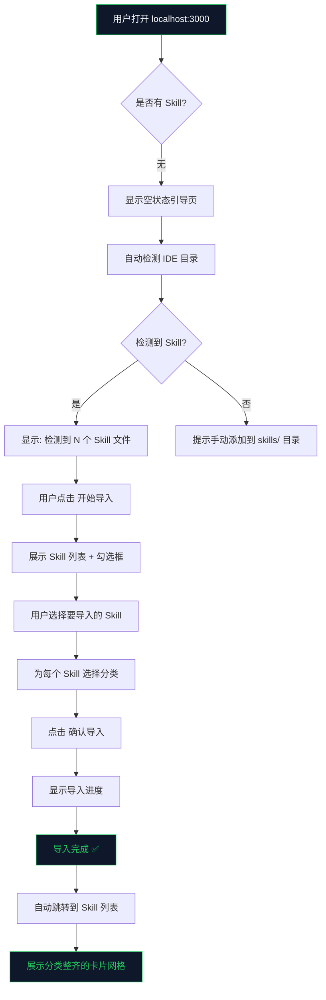
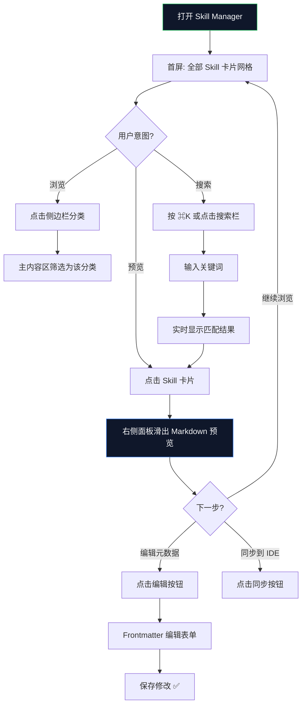
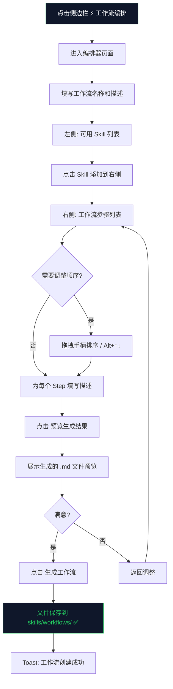
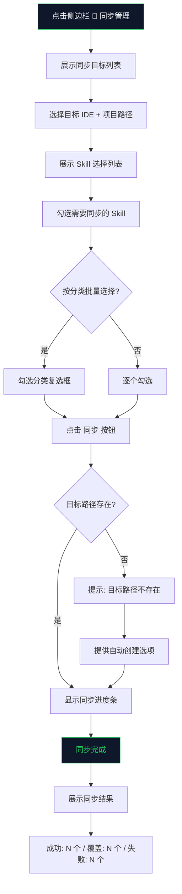

---
stepsCompleted:
  [
    "step-01-init",
    "step-02-discovery",
    "step-03-core-experience",
    "step-04-emotional-response",
    "step-05-inspiration",
    "step-06-design-system",
    "step-07-defining-experience",
    "step-08-visual-foundation",
    "step-09-design-directions",
    "step-10-user-journeys",
    "step-11-component-strategy",
    "step-12-ux-patterns",
    "step-13-responsive-accessibility",
    "step-14-complete",
  ]
inputDocuments: ["product-brief-skill-package.md", "prd.md"]
workflowType: "ux-design"
---

# UX Design Specification — Skill Manager

**Author:** Alex
**Date:** 2026-04-10

---

## Executive Summary

### 项目愿景

Skill Manager 是一个面向个人开发者的本地 Web 应用，定位为**私人 AI 技能仓库的中控台**。它解决的核心问题是：开发者在 CodeBuddy、Cursor、Windsurf 等多个 AI IDE 中积累了大量 Skill 技能文件（Markdown 格式的 Prompt 工程资产），但这些文件散落在不同 IDE 的独立目录中，无法统一管理、跨 IDE 同步和智能编排。

从 UX 角度，Skill Manager 的核心价值主张是：**让开发者在一个界面中一目了然地看到自己所有的 AI 技能资产，并能高效地组织、编排和同步它们。**

### 目标用户

**主要用户画像：** 资深全栈开发者（如 Alex）

- 同时使用 2-3 个 AI IDE 进行日常开发
- 积累了 30+ 个私人 Skill 文件
- 技术水平中级以上，熟悉 Git 操作
- 习惯暗色主题的 IDE 环境
- 对键盘快捷键有肌肉记忆（⌘K、⌘B 等）
- 追求效率，厌恶不必要的操作步骤

### 关键设计挑战

1. **信息架构挑战**：如何在一个界面中同时展示分类导航、Skill 列表和内容预览，而不显得拥挤
2. **冷启动体验**：新用户 fork 后面对空白界面时，如何快速引导到"从 IDE 导入"的核心路径
3. **工作流编排交互**：如何让多 Skill 组合编排既直觉又高效
4. **开发者工具风格**：如何在暗色主题下保持信息层次清晰、操作反馈明确

### 设计机会

1. **IDE 心智模型复用**：目标用户每天使用 IDE 8+ 小时，三栏布局（文件树 | 编辑器 | 预览）是他们最熟悉的交互模式
2. **Command Palette（⌘K）**：开发者对全局搜索有强烈的肌肉记忆，可以成为核心导航方式
3. **零摩擦同步**：一键操作 + 即时反馈，让同步操作感觉像"呼吸一样自然"
4. **渐进式功能发现**：首次使用只需关注导入和浏览，编排和同步在有内容后自然引入

---

## Core User Experience

### 定义体验

Skill Manager 的核心体验可以用一句话概括：**"打开即看到全部，搜索即找到目标，一键即完成同步。"**

用户最频繁的操作是**浏览和查找 Skill**——他们打开 Skill Manager 的第一动机是"看看我有什么"，而不是执行某个特定操作。因此，首屏必须是 Skill Library（技能库），而不是 Dashboard。

**核心用户动作优先级：**

| 优先级 | 动作            | 频率       | 设计权重                |
| ------ | --------------- | ---------- | ----------------------- |
| P0     | 浏览 Skill 列表 | 每次打开   | 首屏核心                |
| P0     | 搜索/筛选 Skill | 高频       | 常驻顶部                |
| P1     | 预览 Skill 内容 | 高频       | 侧边面板                |
| P1     | 同步到 IDE      | 中频       | 侧边栏入口 + 状态指示器 |
| P2     | 工作流编排      | 低频高价值 | 独立页面                |
| P2     | 导入/配置       | 低频       | 侧边栏入口              |

### 平台策略

- **平台**：Web SPA（localhost 运行），桌面浏览器优先
- **交互方式**：鼠标 + 键盘为主，不需要考虑触控
- **离线能力**：纯本地运行，天然离线可用
- **浏览器支持**：Chrome、Firefox、Safari、Edge 最新版本

### 无摩擦交互

以下交互应该感觉完全自然，零思考成本：

1. **⌘K 全局搜索**：任何时候按下 ⌘K 即可搜索 Skill、跳转页面、执行操作
2. **点击即预览**：点击 Skill 卡片，右侧面板即时展示 Markdown 渲染内容
3. **一键同步**：选择 Skill → 点击同步 → 完成，不超过 3 次点击
4. **分类导航**：侧边栏分类树点击即筛选，无需等待加载

### 关键成功时刻

1. **"原来我有这么多 Skill"**：首次导入后看到分类整齐的卡片网格
2. **"3 秒找到了"**：通过搜索或分类浏览快速定位目标 Skill
3. **"一键搞定"**：同步完成后看到 "35/35 成功" 的即时反馈
4. **"这个工作流太方便了"**：编排完成后预览生成的工作流文件

### 体验原则

1. **内容优先**：界面服务于内容展示，不做过度装饰
2. **IDE 心智模型**：复用开发者最熟悉的三栏布局和快捷键体系
3. **即时反馈**：每个操作都有明确的视觉反馈，不让用户猜测
4. **渐进式复杂度**：简单操作零门槛，高级功能按需发现

---

## Desired Emotional Response

### 主要情感目标

| 情感       | 描述                      | 设计支撑                         |
| ---------- | ------------------------- | -------------------------------- |
| **掌控感** | "我的所有 Skill 尽在掌握" | 全貌展示、分类清晰、搜索精准     |
| **效率感** | "操作快速，不浪费时间"    | 键盘快捷键、一键操作、即时响应   |
| **专业感** | "这是为开发者设计的工具"  | 暗色主题、代码字体、IDE 风格布局 |
| **安全感** | "我的 Skill 不会丢失"     | Git 版本控制、本地存储、同步日志 |

### 情感旅程映射

| 阶段       | 期望情感    | 设计策略                            |
| ---------- | ----------- | ----------------------------------- |
| 首次发现   | 好奇 + 期待 | 简洁的空状态引导，自动检测 IDE 目录 |
| 首次导入   | 惊喜 + 满足 | 流式展示发现的 Skill，即时分类      |
| 日常浏览   | 从容 + 掌控 | 清晰的信息层次，快速导航            |
| 搜索查找   | 高效 + 精准 | < 200ms 响应，高亮匹配              |
| 工作流编排 | 创造 + 成就 | 直觉化拖拽，实时预览                |
| 同步操作   | 信任 + 安心 | 进度反馈，详细日志                  |
| 出错时     | 理解 + 可控 | 清晰错误信息，明确恢复路径          |

### 微情感设计

- **信心 > 困惑**：每个操作都有明确的视觉引导和反馈
- **成就 > 挫败**：操作成功时给予积极反馈（✅ 绿色 Toast）
- **信任 > 怀疑**：同步前显示将要执行的操作，同步后显示详细日志
- **专注 > 分心**：暗色主题减少视觉干扰，内容区域最大化

### 情感设计原则

1. **减法设计**：去除一切不必要的视觉噪音，让用户专注于 Skill 内容
2. **即时满足**：每个操作都在 2 秒内给出反馈
3. **优雅降级**：出错时不崩溃，提供清晰的恢复路径
4. **尊重专业**：不做过度引导，信任用户的技术能力

---

## UX Pattern Analysis & Inspiration

### 灵感产品分析

#### VS Code — 文件管理与预览

- **核心优势**：三栏布局（文件树 | 编辑器 | 预览）是开发者最熟悉的心智模型
- **可借鉴**：侧边栏可折叠、⌘K Command Palette、键盘导航、暗色主题
- **适用场景**：Skill Manager 的整体布局和导航模式

#### GitHub — 仓库浏览

- **核心优势**：文件列表 + README 预览的双栏布局，信息密度适中
- **可借鉴**：文件卡片展示、搜索筛选、标签系统
- **适用场景**：Skill 卡片网格和分类浏览

#### Raycast — Command Palette

- **核心优势**：⌘K 全局搜索，支持搜索、跳转、执行操作
- **可借鉴**：搜索即导航、模糊匹配、快捷键体系
- **适用场景**：Skill Manager 的全局搜索和快速操作

#### Notion — 内容管理

- **核心优势**：侧边栏目录树 + 内容区域的布局，支持拖拽排序
- **可借鉴**：分类目录树的交互、拖拽排序、空状态引导
- **适用场景**：工作流编排器的交互设计

### 可迁移 UX 模式

**导航模式：**

- VS Code 风格的可折叠侧边栏 → Skill 分类导航
- ⌘K Command Palette → 全局搜索和快速操作

**交互模式：**

- 点击即预览（VS Code 侧边预览） → Skill 内容预览面板
- 拖拽排序（Notion 块排序） → 工作流 Step 排序

**视觉模式：**

- 暗色主题 + 绿色强调色（Terminal 风格） → 开发者工具视觉语言
- 卡片网格 + 标签（GitHub） → Skill 列表展示

### 应避免的反模式

- **过度动画**：开发者工具不需要花哨的过渡动画，快速响应更重要
- **模态弹窗滥用**：避免用模态框打断用户流程，优先使用侧边面板和 Toast
- **隐藏导航**：不要使用汉堡菜单隐藏核心导航，侧边栏应常驻可见
- **强制引导**：不要用步骤向导强制用户完成设置，提供可跳过的引导

### 设计灵感策略

**采用：**

- VS Code 三栏布局 → 因为它支持核心浏览体验
- ⌘K Command Palette → 因为它匹配用户的肌肉记忆

**适配：**

- GitHub 卡片网格 → 简化为 Skill 专用卡片，突出名称、描述、标签
- Notion 拖拽排序 → 限定在工作流编排器中使用，不做全局拖拽

**避免：**

- Dashboard 风格首页 → 开发者不需要图表和统计
- 复杂的设置向导 → 与"10 分钟上手"的目标冲突

---

## Design System Foundation

### 设计系统选择

**选择：shadcn/ui + Tailwind CSS**

shadcn/ui 是基于 Radix UI 的组件库，组件代码直接复制到项目中（不是 npm 依赖），完全可定制，与 Tailwind CSS 深度集成。

### 选择理由

| 维度         | shadcn/ui 优势                                             |
| ------------ | ---------------------------------------------------------- |
| **可定制性** | 组件代码在项目中，可完全控制样式和行为                     |
| **暗色主题** | CSS 变量方案，轻松映射 Code Dark + Run Green               |
| **无障碍**   | 基于 Radix UI，WCAG 2.1 AA 合规开箱即用                    |
| **包体积**   | 零额外依赖，tree-shaking 天然支持                          |
| **开发效率** | 关键组件现成（Command、Dialog、Sheet、Card、Badge、Toast） |
| **社区生态** | 开发者工具社区标配，丰富的暗色主题参考                     |

### 实现方案

```bash
# 初始化 shadcn/ui
npx shadcn-ui@latest init

# 安装核心组件
npx shadcn-ui@latest add command dialog sheet card badge toast
npx shadcn-ui@latest add form input select checkbox
npx shadcn-ui@latest add collapsible scroll-area separator
npx shadcn-ui@latest add context-menu dropdown-menu
npx shadcn-ui@latest add alert-dialog tooltip
```

**额外依赖（shadcn/ui 未覆盖）：**

```bash
# 拖拽排序（工作流编排器）
npm install @dnd-kit/core @dnd-kit/sortable @dnd-kit/utilities

# Markdown 渲染（预览面板）
npm install react-markdown remark-gfm rehype-highlight

# 键盘快捷键管理
npm install react-hotkeys-hook

# 虚拟滚动（大量 Skill 时的性能优化）
npm install @tanstack/react-virtual
```

### 定制策略

**CSS 变量覆盖：**

```css
:root {
  /* Skill Manager 暗色主题 */
  --background: 222.2 84% 4.9%; /* #0F172A Code Dark */
  --foreground: 210 40% 98%;
  --primary: 142.1 76.2% 36.3%; /* #22C55E Run Green */
  --primary-foreground: 355.7 100% 97.3%;
  --secondary: 217.2 32.6% 17.5%;
  --accent: 217.2 32.6% 17.5%;
  --muted: 217.2 32.6% 17.5%;
  --border: 217.2 32.6% 17.5%;
}
```

**组件映射：**

| 功能       | shadcn/ui 组件               | 定制说明                            |
| ---------- | ---------------------------- | ----------------------------------- |
| 全局搜索   | `Command` (cmdk)             | 支持 Skill 搜索、页面跳转、快速操作 |
| 分类目录树 | `Collapsible` + 自定义 Tree  | 可折叠分类，显示 Skill 计数         |
| Skill 卡片 | `Card` + `Badge`             | 展示名称、描述、分类标签            |
| 内容预览   | `Sheet` (侧滑面板)           | 右侧滑出，Markdown 渲染             |
| 工作流编排 | `Card` + `@dnd-kit/sortable` | 左选右排，拖拽排序                  |
| 同步结果   | `Toast` + `Dialog`           | 成功/失败即时反馈                   |
| 配置表单   | `Form` + `Input` + `Select`  | YAML 配置可视化编辑                 |
| 确认操作   | `AlertDialog`                | 删除、覆盖等危险操作确认            |

---

## 2. Core User Experience

### 2.1 定义体验

**Skill Manager 的定义体验：** "一眼看到全部 Skill，点击即预览内容"

就像 Spotify 的定义体验是"搜索即播放"，Skill Manager 的定义体验是**打开即浏览**。用户打开应用的那一刻，所有 Skill 以分类卡片网格的形式呈现，点击任意卡片，右侧面板即时展示完整的 Markdown 渲染内容。

这个体验如果做对了，用户会说："终于有一个地方能一目了然地看到自己所有的 AI 技能资产了。"

### 2.2 用户心智模型

**用户当前的解决方案：**

- 在文件管理器中逐个打开 `.codebuddy/skills/` 目录下的 `.md` 文件
- 用 IDE 的文件树浏览 Skill，但没有分类和搜索
- 手动复制文件到其他 IDE 的 Skill 目录

**用户带来的心智模型：**

- **IDE 文件树**：左侧目录树 → 右侧内容，这是最熟悉的模式
- **⌘K 搜索**：按下快捷键 → 输入关键词 → 跳转到目标
- **Git 操作**：commit、push、pull 的概念可以映射到"同步"操作

**用户期望：**

- 打开即看到内容，不需要额外操作
- 搜索响应 < 200ms，和 IDE 一样快
- 操作结果即时反馈，不需要刷新页面

### 2.3 成功标准

| 标准       | 指标                   | 测量方式     |
| ---------- | ---------------------- | ------------ |
| 浏览效率   | 3 秒内找到目标 Skill   | 用户测试     |
| 搜索响应   | < 200ms                | 前端性能监控 |
| 同步零摩擦 | ≤ 3 次点击完成同步     | 操作步骤计数 |
| 编排直觉化 | 5 分钟内完成首个工作流 | 用户测试     |
| 冷启动顺畅 | 10 分钟内完成首次配置  | 用户测试     |

### 2.4 Novel UX Patterns

**已建立模式（直接采用）：**

- 三栏布局（文件树 | 列表 | 预览）
- ⌘K Command Palette
- 卡片网格展示
- 侧边栏导航

**创新组合（适配使用）：**

- **左选右排编排器**：左侧 Skill 列表点击添加 + 右侧拖拽排序，结合了列表选择的精准性和拖拽的直觉性
- **同步状态常驻指示器**：顶部栏右侧显示同步状态（🟢 已同步 · 3 min ago），轻提醒不打扰
- **自动检测冷启动**：首次打开自动扫描 IDE 目录，显示检测到的 Skill 数量，降低决策成本

### 2.5 体验机制

**1. 启动（Initiation）：**

- 用户运行 `npm start`，浏览器自动打开 `localhost:3000`
- 首次使用：显示空状态引导，自动检测 IDE 目录
- 日常使用：直接展示 Skill 卡片网格

**2. 交互（Interaction）：**

- 侧边栏分类树点击筛选
- 卡片网格浏览和点击预览
- ⌘K 搜索和快速操作
- 工作流编排器的选择和排序

**3. 反馈（Feedback）：**

- 搜索结果即时高亮匹配关键词
- 同步进度条 + 完成 Toast
- 操作成功/失败的颜色编码（绿色/红色）

**4. 完成（Completion）：**

- 同步完成显示详细日志（成功数、覆盖数、失败数）
- 工作流生成后展示预览，可直接保存
- 导入完成后自动跳转到 Skill 列表

---

## Visual Design Foundation

### 色彩系统

#### 主色调

| 角色                 | 色值                  | 用途                         |
| -------------------- | --------------------- | ---------------------------- |
| **Code Dark**        | `#0F172A` (slate-900) | 主背景色                     |
| **Run Green**        | `#22C55E` (green-500) | 主强调色、操作按钮、成功状态 |
| **Surface**          | `#1E293B` (slate-800) | 卡片背景、侧边栏背景         |
| **Surface Elevated** | `#334155` (slate-700) | 悬浮状态、选中状态           |
| **Border**           | `#475569` (slate-600) | 分割线、边框                 |

#### 语义色彩

| 语义               | 色值                  | 用途                   |
| ------------------ | --------------------- | ---------------------- |
| **Primary**        | `#22C55E` (green-500) | 主操作、同步按钮、成功 |
| **Primary Hover**  | `#16A34A` (green-600) | 主操作悬浮             |
| **Secondary**      | `#3B82F6` (blue-500)  | 链接、信息提示         |
| **Warning**        | `#F59E0B` (amber-500) | 警告、覆盖提示         |
| **Error**          | `#EF4444` (red-500)   | 错误、删除操作         |
| **Text Primary**   | `#F8FAFC` (slate-50)  | 主文本                 |
| **Text Secondary** | `#94A3B8` (slate-400) | 次要文本、描述         |
| **Text Muted**     | `#64748B` (slate-500) | 占位符、禁用文本       |

#### 对比度合规

| 组合                                            | 对比度 | WCAG 等级           |
| ----------------------------------------------- | ------ | ------------------- |
| Text Primary (#F8FAFC) on Code Dark (#0F172A)   | 15.4:1 | AAA ✅              |
| Text Secondary (#94A3B8) on Code Dark (#0F172A) | 5.77:1 | AA ✅               |
| Run Green (#22C55E) on Code Dark (#0F172A)      | 6.4:1  | AA ✅               |
| Text Primary (#F8FAFC) on Surface (#1E293B)     | 11.2:1 | AAA ✅              |
| Run Green (#22C55E) on Surface (#1E293B)        | 4.6:1  | AA ✅               |
| Text Muted (#64748B) on Code Dark (#0F172A)     | 3.65:1 | ⚠️ 仅用于装饰性文本 |

> **⚠️ 重要约束：** `Text Muted (#64748B)` 对比度不满足 AA 标准（4.5:1），**仅可用于**占位符文本和禁用状态等装饰性内容，**禁止用于**任何需要用户阅读的信息性文本。空状态描述等可读文本必须使用 `Text Secondary (#94A3B8)` 或更高对比度的颜色。

### 字体系统

#### 字体选择

| 角色          | 字体      | 备选                         | 用途                     |
| ------------- | --------- | ---------------------------- | ------------------------ |
| **代码/标题** | Fira Code | JetBrains Mono, monospace    | 标题、Skill 名称、代码块 |
| **正文**      | Fira Sans | Inter, system-ui, sans-serif | 描述文本、正文内容       |

#### 字体层级

| 层级  | 字体      | 大小             | 行高 | 字重 | 用途                 |
| ----- | --------- | ---------------- | ---- | ---- | -------------------- |
| H1    | Fira Code | 24px (1.5rem)    | 32px | 700  | 页面标题             |
| H2    | Fira Code | 20px (1.25rem)   | 28px | 600  | 区域标题             |
| H3    | Fira Code | 16px (1rem)      | 24px | 600  | 卡片标题、Skill 名称 |
| Body  | Fira Sans | 14px (0.875rem)  | 20px | 400  | 正文、描述           |
| Small | Fira Sans | 12px (0.75rem)   | 16px | 400  | 标签、辅助信息       |
| Code  | Fira Code | 13px (0.8125rem) | 20px | 400  | 代码块、内联代码     |

### 间距与布局基础

#### 间距系统

基于 4px 基础单位的间距系统：

| Token      | 值   | 用途                   |
| ---------- | ---- | ---------------------- |
| `space-1`  | 4px  | 内联元素间距           |
| `space-2`  | 8px  | 紧凑元素间距           |
| `space-3`  | 12px | 标签内边距             |
| `space-4`  | 16px | 卡片内边距、列表项间距 |
| `space-6`  | 24px | 区域间距               |
| `space-8`  | 32px | 大区域间距             |
| `space-12` | 48px | 页面边距               |

#### 布局网格

```
三栏布局：
┌──────────┬────────────────────┬──────────────────┐
│ 侧边栏    │     主内容区         │    预览面板       │
│ 240px    │     flex-1          │    400px         │
│ (可折叠)  │     (min: 480px)    │    (可折叠)       │
└──────────┴────────────────────┴──────────────────┘

侧边栏：固定宽度 240px，可通过 ⌘B 折叠
主内容区：弹性宽度，最小 480px
预览面板：固定宽度 400px，点击卡片时滑出
```

#### 圆角系统

| Token        | 值   | 用途             |
| ------------ | ---- | ---------------- |
| `rounded-sm` | 4px  | 标签、小按钮     |
| `rounded-md` | 6px  | 输入框、下拉菜单 |
| `rounded-lg` | 8px  | 卡片、面板       |
| `rounded-xl` | 12px | 模态框、大面板   |

### 字体加载策略

- **本地打包**：Fira Code 和 Fira Sans 字体文件打包到项目 `public/fonts/` 目录，不依赖 CDN
- **字体子集化**：仅打包 Latin + CJK 常用字符子集，Fira Code 控制在 ~100KB
- **加载策略**：使用 `font-display: swap` 避免 FOIT（不可见文本闪烁），优先显示系统字体
- **预加载**：在 `<head>` 中使用 `<link rel="preload">` 预加载 Fira Code Regular 和 Fira Sans Regular
- **回退字体**：Fira Code → JetBrains Mono → Menlo → monospace；Fira Sans → Inter → system-ui → sans-serif

### 无障碍考量

- 所有信息性文本对比度 ≥ 4.5:1（WCAG 2.1 AA），装饰性文本除外
- 焦点指示器使用 Run Green 2px outline（`focus-visible` 而非 `focus`）
- 所有交互元素最小点击区域 44x44px
- 支持 `prefers-reduced-motion` 媒体查询

---

## Design Direction Decision

### 设计方向探索

基于产品定位（开发者工具）、目标用户（IDE 重度用户）和品牌调性（专业、高效、暗色），我们探索了以下设计方向：

**方向 A：纯 IDE 风格** — 完全模拟 VS Code 的界面风格，包括 Activity Bar、Status Bar
**方向 B：现代开发者工具风格** — 借鉴 Linear、Raycast 的现代暗色设计，更简洁优雅
**方向 C：混合风格** — IDE 布局 + 现代视觉设计，兼顾熟悉感和美观度

### 选定方向

**选择方向 C：混合风格 — IDE 布局 + 现代视觉设计**

### 设计理由

1. **熟悉感**：三栏布局复用 IDE 心智模型，用户零学习成本
2. **现代感**：使用 shadcn/ui 的现代组件风格，比纯 IDE 模拟更美观
3. **品牌差异**：Code Dark + Run Green 的配色方案在暗色工具中独具辨识度
4. **实现效率**：shadcn/ui 组件开箱即用，不需要从零模拟 IDE 组件

### 实现方案

````
┌─────────────────────────────────────────────────────────────┐
│  ┌─ Logo ──┐  🔍 ⌘K 搜索 Skill...              🟢 已同步  │  ← 顶部栏
├──────────┬──────────────────────────┬───────────────────────┤
│          │                          │                       │
│ 📂 全部   │  coding (12)             │  # code-review        │
│ 📂 coding │  ┌────────┐ ┌────────┐  │                       │
│ 📂 writing│  │code-   │ │test-   │  │  执行全面的代码审查，   │
│ 📂 devops │  │review  │ │coverage│  │  检查代码风格、潜在     │
│ 📂 workflow│ │⭐ coding│ │⭐ coding│  │  bug、性能问题等。     │
│          │  └────────┘ └────────┘  │                       │
│ ─────── │  ┌────────┐ ┌────────┐  │  ```typescript        │
│ ⚡ 编排   │  │fast-   │ │bug-fix │  │  // 代码示例...        │
│ 🔄 同步   │  │commit  │ │        │  │  ```                  │
│ 📥 导入   │  │⭐ coding│ │⭐ coding│  │                       │
│ ⚙️ 设置   │  └────────┘ └────────┘  │  Tags: react, ts      │
│          │                          │                       │
├──────────┴──────────────────────────┴───────────────────────┤
│  Skill Manager v1.0  │  32 Skills  │  最后同步: 3 min ago   │  ← 状态栏
└─────────────────────────────────────────────────────────────┘
````

---

## User Journey Flows

### Journey 1: 首次使用 — 从 IDE 导入



### Journey 2: 日常浏览与搜索



### Journey 3: 工作流编排



### Journey 4: 一键同步到 IDE



### 旅程模式

**导航模式：**

- 侧边栏分类树作为主导航，⌘K 作为快捷导航
- 所有功能页面通过侧边栏入口访问

**决策模式：**

- 选择操作使用复选框（支持批量）
- 危险操作（删除、覆盖）使用确认对话框

**反馈模式：**

- 操作成功：绿色 Toast 通知
- 操作失败：红色 Toast + 详细错误信息
- 进行中：进度条 + 百分比

### 流程优化原则

1. **最短路径到价值**：首次使用 → 导入 → 浏览，3 步到达核心价值
2. **减少认知负荷**：每个步骤只做一个决策
3. **即时反馈**：每个操作 < 2 秒给出结果
4. **优雅错误恢复**：出错时提供明确的修复建议

---

## Component Strategy

### 设计系统组件（shadcn/ui 提供）

| 组件                        | 用途                 | 定制程度                      |
| --------------------------- | -------------------- | ----------------------------- |
| `Command`                   | ⌘K 全局搜索          | 中 — 自定义搜索逻辑和结果展示 |
| `Card`                      | Skill 卡片           | 高 — 自定义卡片布局和交互     |
| `Badge`                     | 分类标签、状态标签   | 低 — 仅调整颜色               |
| `Sheet`                     | 预览面板（右侧滑出） | 中 — 自定义宽度和内容         |
| `Dialog` / `AlertDialog`    | 确认操作、详情弹窗   | 低 — 使用默认样式             |
| `Toast`                     | 操作反馈通知         | 低 — 仅调整颜色               |
| `Form` / `Input` / `Select` | 配置表单、编辑表单   | 低 — 使用默认样式             |
| `Checkbox`                  | 多选操作             | 低 — 使用默认样式             |
| `Collapsible`               | 侧边栏分类折叠       | 中 — 自定义展开/折叠动画      |
| `ScrollArea`                | 长列表滚动区域       | 低 — 使用默认样式             |
| `Separator`                 | 区域分割线           | 低 — 使用默认样式             |
| `Tooltip`                   | 操作提示             | 低 — 使用默认样式             |

### 自定义组件

#### SkillCard — Skill 卡片

**用途：** 在卡片网格中展示单个 Skill 的摘要信息
**内容：** Skill 名称、描述（截断 2 行）、分类标签、类型标识（workflow）
**状态：** default、hover（边框高亮）、selected（绿色边框）、focused（绿色 outline）
**交互：** 点击打开预览面板，右键菜单（编辑、删除、同步）

```
┌─────────────────────────┐
│  code-review             │
│  ────────────────────── │
│  执行全面的代码审查，检查  │
│  代码风格、潜在 bug...    │
│  ────────────────────── │
│  🏷️ coding  🏷️ react     │
└─────────────────────────┘
```

#### CategoryTree — 分类目录树

**用途：** 侧边栏中展示 Skill 分类层级
**内容：** 分类名称、Skill 计数、展开/折叠图标
**状态：** default、hover、active（当前选中分类）、expanded/collapsed
**交互：** 点击选中分类并筛选主内容区，点击箭头展开/折叠

```
📂 全部 Skills (32)
📂 coding (12)        ← active
📂 writing (8)
📂 devops (5)
📂 workflows (7)
```

#### WorkflowEditor — 工作流编排器

**用途：** 工作流编排页面的核心组件
**内容：** 左侧可用 Skill 列表（含搜索筛选） + 右侧工作流步骤列表
**交互：**

- 左侧：搜索框 + 分类筛选 + 点击添加（解决大量 Skill 时的查找问题）
- 右侧：拖拽手柄 (≡) 排序 + Alt+↑/↓ 键盘排序 + ✕ 移除按钮 + inline 编辑描述
- 拖拽无障碍：`aria-grabbed`、`aria-dropeffect` 属性 + 屏幕阅读器播报拖拽状态

**Compact 断点适配（< 1024px）：**

- 左右双栏变为上下堆叠：上方为 Skill 选择器（折叠式），下方为步骤列表
- 拖拽排序保持可用，触控区域增大到 48x48px

**边界情况：**

- 工作流生成后自动触发 Skill 列表刷新（通过后端 API 重新扫描 skills/ 目录）
- 工作流 Skill 在卡片上使用 ⚡ 图标 + `workflow` 标签视觉区分
- 编排器支持编辑已有工作流（加载已有 .md 文件解析为步骤列表）

#### SyncPanel — 同步管理面板

**用途：** 同步管理页面的核心组件
**内容：** IDE 目标列表、Skill 选择列表、同步进度、结果日志
**交互：** 选择目标、勾选 Skill、点击同步、查看日志

#### ImportWizard — 导入向导

**用途：** 从 IDE 导入 Skill 的流程组件
**内容：** 扫描结果列表、分类选择、导入进度
**交互：** 勾选 Skill、选择分类、确认导入

#### StatusIndicator — 同步状态指示器

**用途：** 顶部栏右侧的同步状态显示
**内容：** 同步状态图标 + 文字（🟢 已同步 · 3 min ago / 🟡 5 个未同步）
**交互：** 点击跳转到同步管理页面

### 组件实现策略

**Phase 1 — 核心组件（MVP 必需）：**

1. `SkillCard` — Skill 浏览的基础
2. `CategoryTree` — 分类导航的基础
3. `ImportWizard` — 冷启动的关键
4. `StatusIndicator` — 顶部栏常驻

**Phase 2 — 功能组件：** 5. `WorkflowEditor` — 工作流编排 6. `SyncPanel` — 同步管理

**Phase 3 — 增强组件：** 7. Markdown 预览增强（代码高亮、目录导航）8. 批量操作工具栏

---

## UX Consistency Patterns

### 按钮层级

| 层级            | 样式                          | 用途         | 示例                       |
| --------------- | ----------------------------- | ------------ | -------------------------- |
| **Primary**     | 绿色填充 (`bg-green-500`)     | 主操作、确认 | 同步、生成工作流、确认导入 |
| **Secondary**   | 暗色边框 (`border-slate-600`) | 次要操作     | 取消、返回、预览           |
| **Ghost**       | 透明背景                      | 工具栏操作   | 编辑、删除、刷新           |
| **Destructive** | 红色填充 (`bg-red-500`)       | 危险操作     | 删除 Skill、清理文件       |

### 反馈模式

| 类型        | 视觉            | 持续时间       | 用途                   |
| ----------- | --------------- | -------------- | ---------------------- |
| **Success** | 🟢 绿色 Toast   | 5 秒自动消失   | 同步成功、保存成功     |
| **Error**   | 🔴 红色 Toast   | 手动关闭       | 同步失败、解析错误     |
| **Warning** | 🟡 黄色 Toast   | 5 秒自动消失   | 文件覆盖、格式警告     |
| **Info**    | 🔵 蓝色 Toast   | 3 秒自动消失   | 操作提示、状态更新     |
| **Loading** | 进度条 + 百分比 | 操作完成后消失 | 同步进行中、导入进行中 |

#### Toast 堆叠与合并策略

- **位置**：右下角（避免被预览面板遮挡）
- **最大堆叠数**：同时最多显示 3 个 Toast，超出时最早的自动消失
- **批量操作合并**：同步/导入等批量操作的结果合并为**单个汇总 Toast**（如 "同步完成：35 成功 / 2 覆盖 / 0 失败"），不逐个弹出
- **撤销支持**：删除操作的 Success Toast 附带 [撤销] 按钮，5 秒内可撤销（软删除 → 确认删除）
- **Error Toast 详情**：Error Toast 提供 [查看详情] 按钮，点击展开完整错误日志

### 表单模式

- **标签位置**：标签在输入框上方（垂直布局）
- **验证时机**：失焦时验证（onBlur），不使用实时验证
- **错误提示**：红色文字在输入框下方，带错误图标
- **必填标识**：标签后加红色星号 `*`
- **占位符**：使用 `slate-500` 颜色，提供输入示例

### 导航模式

- **侧边栏**：常驻左侧，240px 宽度，⌘B 切换显示/隐藏
- **面包屑**：不使用（层级简单，侧边栏已足够）
- **页面切换**：无页面跳转动画，即时切换
- **活跃状态**：侧边栏当前项使用 `bg-slate-800` + 左侧绿色竖线

### 空状态模式

| 场景       | 图标 | 标题                   | 描述                      | 操作                |
| ---------- | ---- | ---------------------- | ------------------------- | ------------------- |
| 无 Skill   | 📦   | 欢迎来到 Skill Manager | 你的技能仓库还是空的      | [从 CodeBuddy 导入] |
| 无工作流   | ⚡   | 还没有工作流           | 从 Skill 列表中选择组合   | [创建工作流]        |
| 无同步目标 | 🔄   | 还没有配置同步目标     | 在设置中添加项目路径      | [前往设置]          |
| 搜索无结果 | 🔍   | 没有找到匹配的 Skill   | 试试其他关键词            | —                   |
| 分类为空   | 📂   | 该分类下还没有 Skill   | 导入或移动 Skill 到此分类 | [导入 Skill]        |

### 模态框与面板模式

- **预览面板**：使用 `Sheet`（右侧滑出），不使用模态框
- **确认操作**：使用 `AlertDialog`（居中模态），仅用于危险操作
- **编辑表单**：使用 `Dialog`（居中模态），用于 Frontmatter 编辑
- **全局搜索**：使用 `Command`（居中浮层），⌘K 触发

### 键盘快捷键体系

| 快捷键                 | 操作            | 作用域                       | 冲突处理                                  |
| ---------------------- | --------------- | ---------------------------- | ----------------------------------------- |
| `⌘K`                   | 打开全局搜索    | 全局                         | `e.preventDefault()` 拦截浏览器地址栏聚焦 |
| `⌘B`                   | 切换侧边栏      | 全局（非输入框）             | 输入框内不拦截，保留浏览器加粗行为        |
| `⌘Enter`               | 确认操作        | 表单/对话框                  | 无冲突                                    |
| `Escape`               | 关闭面板/对话框 | 全局                         | 无冲突                                    |
| `J` / `K`              | 上下导航列表    | Skill 列表（非输入框焦点）   | 仅在卡片网格获得焦点时激活                |
| `Space`                | 预览选中 Skill  | Skill 列表（非输入框焦点）   | 仅在卡片获得焦点时激活                    |
| `Enter`                | 打开选中项      | 列表                         | 无冲突                                    |
| `Delete` / `Backspace` | 删除选中项      | 列表（非输入框焦点，需确认） | 输入框内不拦截                            |

#### 快捷键焦点上下文管理

> **关键实现规则：** 单键快捷键（J/K/Space/Delete）采用**焦点上下文隔离**机制：
>
> - 当焦点在 `<input>`、`<textarea>`、`[contenteditable]` 元素内时，**所有单键快捷键失效**，保留原生输入行为
> - 当焦点在卡片网格或列表区域时，单键快捷键激活
> - `⌘B` 在输入框内不拦截（保留浏览器加粗），在其他区域拦截（切换侧边栏）
> - `⌘K` 始终拦截（全局搜索优先级最高），因为这是核心导航方式
> - 实现方案：使用 `useHotkeys` hook + `enableOnFormTags: false` 配置

---

## Responsive Design & Accessibility

### 响应式策略

Skill Manager 是本地 Web 应用，主要在桌面浏览器中使用。响应式设计以**桌面优先**为原则，确保在不同桌面窗口大小下的良好体验。

#### 断点策略

| 断点         | 宽度            | 布局                                  |
| ------------ | --------------- | ------------------------------------- |
| **Compact**  | < 1024px        | 单栏：侧边栏折叠，预览面板全屏覆盖    |
| **Standard** | 1024px - 1439px | 双栏：侧边栏 + 主内容区，预览面板覆盖 |
| **Wide**     | ≥ 1440px        | 三栏：侧边栏 + 主内容区 + 预览面板    |

#### 布局适配

**Wide（≥ 1440px）— 完整三栏：**

```
┌──────────┬──────────────────┬──────────────────┐
│ 侧边栏    │    主内容区        │    预览面板       │
│ 240px    │    flex-1         │    400px         │
└──────────┴──────────────────┴──────────────────┘
```

**Standard（1024px - 1439px）— 双栏 + 推挤式预览：**

```
默认状态（无预览）：
┌──────────┬──────────────────────────────────────┐
│ 侧边栏    │    主内容区（卡片网格 3-4 列）           │
│ 240px    │    flex-1                             │
└──────────┴──────────────────────────────────────┘

预览激活状态（点击卡片后）：
┌──────────┬──────────────────┬───────────────────┐
│ 侧边栏    │  主内容区（2 列）  │   预览面板          │
│ 240px    │  flex-1          │   360px           │
│          │  (min: 380px)    │   (push 模式)      │
└──────────┴──────────────────┴───────────────────┘
```

> **预览面板行为（Standard 断点）：** 采用 **push 模式**而非 overlay 模式。点击卡片时，预览面板从右侧推入，主内容区宽度自动收缩（卡片网格从 3-4 列变为 2 列）。用户始终能看到卡片列表，保持浏览上下文。点击预览面板的关闭按钮或按 Escape 可收起预览面板。

**Compact（< 1024px）— 单栏：**

```
┌────────────────────────────────────────────────┐
│ ☰ 顶部栏 + 搜索                                 │
├────────────────────────────────────────────────┤
│                                                │
│    主内容区（全宽）                                │
│                                                │
└────────────────────────────────────────────────┘
  ↑ 侧边栏通过 ☰ 按钮抽屉式展开
```

### 无障碍策略

**合规目标：WCAG 2.1 AA**

#### 色彩无障碍

- 所有信息性文本对比度 ≥ 4.5:1（正文）/ ≥ 3:1（大文本）
- 装饰性文本（占位符、禁用状态）允许低于 4.5:1，但不承载关键信息
- 不仅依赖颜色传达信息（错误状态同时使用图标 + 颜色 + 文字）
- 支持 `prefers-contrast: more` 媒体查询（高对比度模式下提升 Text Secondary 亮度）
- **不支持亮色主题**：本产品为暗色主题专属设计，不响应 `prefers-color-scheme: light`（开发者工具的用户群体普遍偏好暗色主题）

#### 键盘无障碍

- 所有交互元素可通过 Tab 键访问
- 焦点顺序遵循视觉布局顺序
- 焦点指示器清晰可见（2px solid Run Green outline）
- 支持 Escape 关闭所有浮层
- 模态框内焦点陷阱（Focus Trap）

#### 屏幕阅读器支持

- 所有交互元素提供 `aria-label`
- 动态内容更新使用 `aria-live` 区域
- 页面区域使用语义化 HTML 标签（`<nav>`、`<main>`、`<aside>`）
- Skill 卡片使用 `role="article"` + `aria-label`
- 搜索结果数量通过 `aria-live="polite"` 播报

#### 动效无障碍

- 支持 `prefers-reduced-motion` 媒体查询
- 减少动效模式下：取消所有过渡动画，仅保留即时状态切换
- 进度条在减少动效模式下使用文字百分比替代动画

### 测试策略

**自动化测试：**

- axe-core 集成到 CI/CD，每次构建自动检测无障碍问题
- Lighthouse Accessibility Score ≥ 90

**手动测试：**

- 键盘导航完整流程测试
- VoiceOver（macOS）屏幕阅读器测试
- 色彩对比度检查（Chrome DevTools）

### 实现指南

**开发规范：**

- 使用语义化 HTML（`<button>` 而非 `<div onClick>`）
- 所有图标按钮必须有 `aria-label`
- 表单输入必须关联 `<label>`
- 使用 `focus-visible` 而非 `focus` 避免鼠标点击时显示焦点环
- shadcn/ui 组件已内置 Radix UI 的无障碍支持，确保不覆盖默认行为

---

---

## 附录 A：后端 API 交互设计

### 冷启动 — IDE 目录扫描

冷启动的"自动检测 IDE 目录"通过 Node.js 后端 API 实现（浏览器无法直接访问文件系统）：

**API 设计：**

```
GET /api/scan/codebuddy
→ 扫描 settings.yaml 中配置的 CodeBuddy Skill 路径
→ 返回: { files: [...], count: number, scanTime: number }
```

**交互状态：**

- **扫描中**：显示 Skeleton 加载动画 + "正在扫描 IDE 目录..." 文字
- **扫描超时**（> 10 秒）：自动中断，显示 "扫描超时，请检查路径配置" + 手动重试按钮
- **路径不存在**：显示 "未找到 CodeBuddy Skill 目录" + 路径配置入口
- **权限被拒**：显示 "无法访问目录，请检查文件权限" + 权限修复指南链接
- **目录为空**：显示 "目录存在但没有 .md 文件" + 手动添加引导

**扫描范围限制：**

- 仅扫描配置路径的一级目录（不递归深层嵌套）
- 仅匹配 `.md` 文件扩展名
- 单次扫描最大文件数限制 1000

### 同步操作 — 并发安全

**同步锁机制：**

- 同步操作使用文件锁（`lockfile`），防止多标签页并发写入
- 同步进行中禁用同步按钮，显示 "同步进行中..." 状态
- 浏览器关闭/刷新时，通过 `beforeunload` 事件警告用户

**覆盖判定：**

- 目标路径存在同名文件即视为"覆盖"（不做内容 hash 比较，保持简单）
- 覆盖文件在同步日志中标注 `[覆盖]` 标签

### 数据刷新策略

- MVP 采用**手动刷新**（PRD FR31），不使用文件监听
- 导入/同步/删除等写操作完成后，自动触发一次 Skill 列表刷新
- 页面顶部提供手动刷新按钮（🔄 图标）

---

## 附录 B：搜索实现策略

### 搜索范围与性能

- **搜索范围**：Skill 的 `name`、`description`、`tags` 字段（Frontmatter 元数据），**不搜索 Markdown 正文**
- **搜索方式**：前端内存搜索（Skill 元数据在页面加载时全量缓存到内存）
- **匹配逻辑**：模糊匹配 + AND 逻辑（多关键词以空格分隔）
- **性能保障**：500 个 Skill 的元数据约 50KB，内存搜索 < 10ms

### ⌘K Command Palette 结果分组

搜索结果按类型分组展示，每组最多显示 5 条：

```
🔍 搜索: "review"

📄 Skills
  code-review — 执行全面的代码审查...
  pr-review — Pull Request 审查...

⚡ 工作流
  code-quality-workflow — 代码质量工作流...

📌 快速操作
  > 同步管理
  > 设置
```

### 搜索结果高亮

- 在 SkillCard 的名称和描述中高亮匹配关键词（使用 `<mark>` 标签 + 绿色背景）
- 如果匹配关键词在被截断的描述部分，自动展开显示匹配行（而非固定截断 2 行）

---

## 附录 C：视图切换

### 卡片视图 vs 列表视图

主内容区支持两种视图模式切换：

**卡片视图（默认）：**

- 网格布局，每张卡片展示名称、描述（2 行）、标签
- 适合浏览和视觉化发现
- 卡片尺寸固定高度 160px，宽度自适应（min-width: 240px）

**列表视图：**

- 紧凑的单行列表，每行展示名称、描述（1 行截断）、分类、标签
- 适合大量 Skill 时的高效浏览
- 信息密度更高，单屏可展示 20+ 条

**切换控件：** 主内容区右上角的图标切换按钮（网格图标 / 列表图标），用户偏好保存到 localStorage。

---

## 附录 D：对抗性审查发现与解决方案

| #   | 问题                            | 严重度 | 解决方案                               | 状态      |
| --- | ------------------------------- | ------ | -------------------------------------- | --------- |
| 1   | Standard 断点预览面板覆盖主内容 | 🔴 高  | 改为 push 模式，主内容区自动收缩       | ✅ 已解决 |
| 2   | ⌘K/⌘B 与浏览器快捷键冲突        | 🔴 高  | 焦点上下文隔离 + e.preventDefault 策略 | ✅ 已解决 |
| 3   | 冷启动后端 API 交互缺失         | 🔴 高  | 新增附录 A 定义完整 API 交互状态       | ✅ 已解决 |
| 4   | shadcn/ui 缺少关键组件          | 🟡 中  | 补充 context-menu、额外依赖清单        | ✅ 已解决 |
| 5   | 工作流编排器边界情况            | 🟡 中  | 补充搜索筛选、移除操作、Compact 适配   | ✅ 已解决 |
| 6   | Text Muted 对比度不满足 AA      | 🟡 中  | 限制使用范围，仅用于装饰性文本         | ✅ 已解决 |
| 7   | Toast 堆叠/合并策略缺失         | 🟡 中  | 新增堆叠策略、批量合并、撤销支持       | ✅ 已解决 |
| 8   | 字体加载策略缺失                | 🟡 中  | 新增本地打包 + preload + swap 策略     | ✅ 已解决 |
| 9   | 搜索实现策略不明确              | 🟡 中  | 新增附录 B 定义搜索范围和分组逻辑      | ✅ 已解决 |
| 10  | 缺少列表视图选项                | 🟡 中  | 新增附录 C 定义卡片/列表视图切换       | ✅ 已解决 |
| 11  | prefers-color-scheme 矛盾       | 🟢 低  | 明确声明暗色主题专属，不支持亮色       | ✅ 已解决 |
| 12  | 同步并发安全                    | 🟡 中  | 新增附录 A 定义同步锁和覆盖判定        | ✅ 已解决 |
| 13  | 虚拟滚动缺失                    | 🟡 中  | 补充 @tanstack/react-virtual 依赖      | ✅ 已解决 |

---

## 附录 E：信息架构总览

```
Skill Manager
├── 🔍 全局搜索 (⌘K Command Palette)
├── 📂 Skill 浏览 (首页/默认视图)
│   ├── 侧边栏: 分类目录树
│   ├── 主内容区: 卡片网格
│   └── 预览面板: Markdown 渲染
├── ⚡ 工作流编排
│   ├── 左侧: 可用 Skill 列表
│   └── 右侧: 工作流步骤编排
├── 🔄 同步管理
│   ├── IDE 目标列表
│   ├── Skill 选择
│   └── 同步日志
├── 📥 导入管理
│   ├── IDE 扫描
│   ├── Skill 选择
│   └── 分类归属
└── ⚙️ 设置
    ├── IDE 路径配置
    └── 分类管理
```
