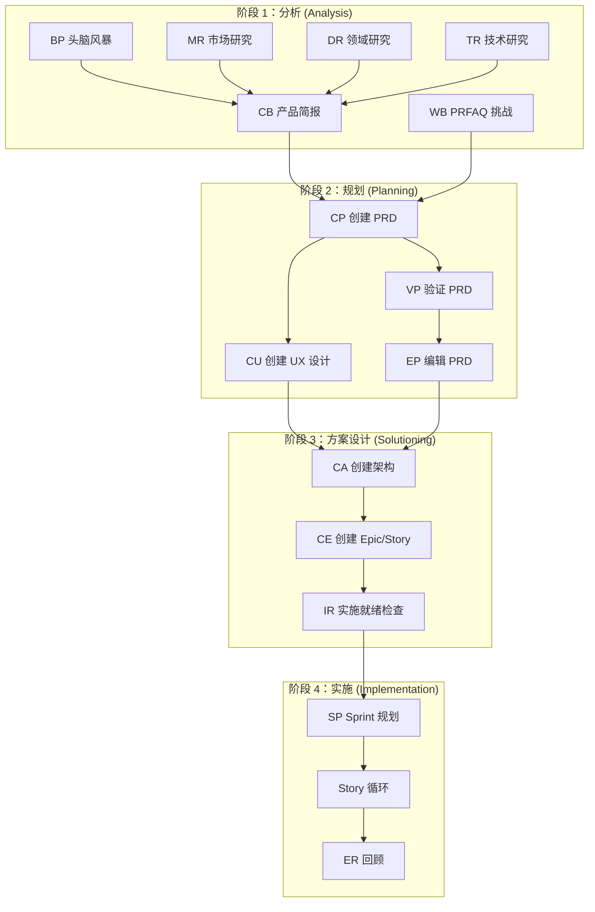
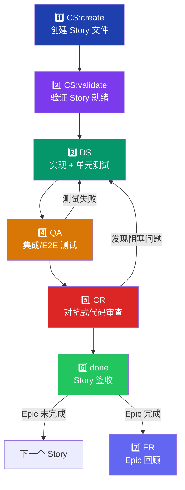
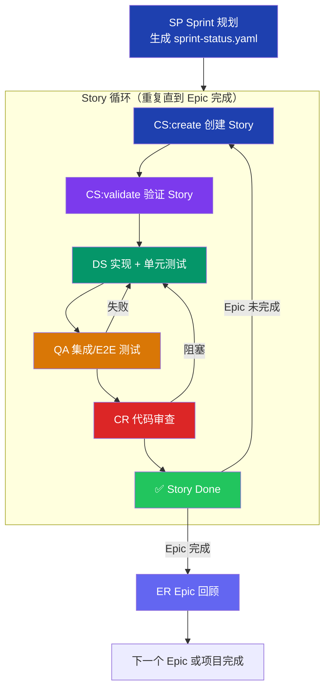
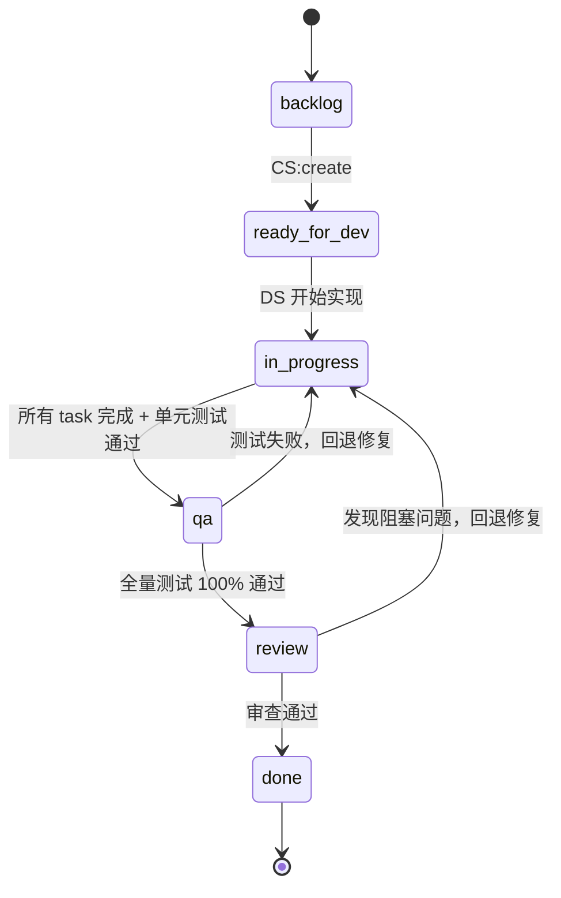

# Skill Manager — 完整执行链路

**项目：** skill-package
**日期：** 2026-04-10
**作者：** Winston (Architect Agent) & Alex
**版本：** v1.0

---

## 一、BMad Method 四阶段全局链路



### 阶段产出物

| 阶段 | 技能 | 产出物 | 存放位置 |
|------|------|--------|----------|
| 分析 | BP/MR/DR/TR | 研究报告、头脑风暴记录 | `planning-artifacts/` |
| 分析 | CB/WB | 产品简报 / PRFAQ | `planning-artifacts/` |
| 规划 | CP/VP/EP | PRD | `planning-artifacts/prd.md` |
| 规划 | CU | UX 设计规范 | `planning-artifacts/ux-design-specification.md` |
| 方案 | CA | 架构决策文档 | `planning-artifacts/architecture.md` |
| 方案 | CE | Epic & Story 列表 | `planning-artifacts/epics.md` |
| 方案 | IR | 实施就绪报告 | `planning-artifacts/implementation-readiness-report-*.md` |
| 实施 | SP | Sprint 状态 | `implementation-artifacts/sprint-status.yaml` |
| 实施 | CS/DS/QA/CR | Story 文件 | `implementation-artifacts/{story-id}.md` |
| 实施 | ER | 回顾报告 | `implementation-artifacts/` |

---

## 二、Story 生命周期（完整执行链路）

这是项目的核心执行循环。每个 Story 必须严格遵循以下 7 步流程：



### 详细步骤说明

#### 步骤 1：CS:create — 创建 Story 文件

| 属性 | 值 |
|------|-----|
| **技能** | `bmad-create-story` (action: create) |
| **执行者** | PM (John) / Architect (Winston) / Developer (Amelia) |
| **输入** | `epics.md` 中的 Story 定义 + `architecture.md` + `prd.md` |
| **输出** | `implementation-artifacts/{story-id}.md` |
| **sprint-status 状态** | `backlog` → `ready-for-dev` |

**执行内容：**
- 从 epics.md 中提取 Story 的 AC、Technical Notes
- 从 architecture.md 中提取相关的架构决策和模式
- 从 prd.md 中提取相关的 FR/NFR
- 生成完整的 Story 文件，包含 Tasks/Subtasks 分解
- 更新 sprint-status.yaml 状态

**质量门禁：**
- [ ] Story 文件包含完整的 Acceptance Criteria
- [ ] Tasks/Subtasks 分解合理，每个 task 可独立测试
- [ ] Technical Notes 引用了正确的架构决策
- [ ] Dev Notes 包含实现所需的关键信息

---

#### 步骤 2：CS:validate — 验证 Story 就绪

| 属性 | 值 |
|------|-----|
| **技能** | `bmad-create-story` (action: validate) |
| **执行者** | PM / Architect |
| **输入** | 步骤 1 生成的 Story 文件 |
| **输出** | Story 验证报告（通过/不通过） |
| **sprint-status 状态** | 保持 `ready-for-dev` |

**执行内容：**
- 验证 Story 文件的完整性和一致性
- 检查 AC 是否可测试
- 检查 Tasks 分解是否合理
- 检查与 architecture.md 的对齐
- 检查与 prd.md 的 FR/NFR 覆盖

**质量门禁：**
- [ ] 所有 AC 使用 Given/When/Then 格式
- [ ] 每个 AC 可映射到至少一个测试用例
- [ ] Tasks 之间无循环依赖
- [ ] 无遗漏的 FR/NFR 覆盖

---

#### 步骤 3：DS — 实现 + 单元测试

| 属性 | 值 |
|------|-----|
| **技能** | `bmad-dev-story` |
| **执行者** | Developer (Amelia) |
| **输入** | 已验证的 Story 文件 |
| **输出** | 代码实现 + 单元测试 |
| **sprint-status 状态** | `ready-for-dev` → `in-progress` |

**执行内容：**
- 按 Story 文件中的 Tasks/Subtasks 顺序实现
- 每个 task 完成后编写对应的单元测试
- 每个 task 完成后运行完整测试套件
- 在 Story 文件中标记 `[x]` 并更新 Dev Agent Record
- 更新 Story 文件的 File List

**质量门禁（in-progress → qa）：**
- [ ] Story 文件中所有 tasks/subtasks 标记 `[x]`
- [ ] 每个 task 有对应的单元测试文件
- [ ] `tsc --noEmit` 零错误
- [ ] `vitest run` 全部通过
- [ ] Dev Agent Record 记录了每个 task 的完成情况

**Amelia 的强制规则（来自 bmad-agent-dev SKILL.md）：**
- 实现前必须完整阅读 Story 文件
- 按 Tasks/Subtasks 顺序执行，不跳过不重排
- 仅当实现和测试都完成且通过时才标记 `[x]`
- 每个 task 后运行完整测试套件
- 不间断执行直到所有 tasks 完成
- 禁止谎报测试状态

---

#### 步骤 4：QA — 集成/E2E 测试覆盖

| 属性 | 值 |
|------|-----|
| **技能** | `bmad-qa-generate-e2e-tests` 或 `bmad-testarch-automate` |
| **执行者** | QA / Developer (Amelia) |
| **输入** | 步骤 3 的代码实现 + Story 的 AC |
| **输出** | 集成测试 + E2E 测试文件 |
| **sprint-status 状态** | `in-progress` → `qa` |

**执行内容：**
- 为 Story 的每个 Acceptance Criteria 生成集成测试或 E2E 测试
- 后端 API 测试 → `tests/integration/api/`
- 前端 E2E 测试 → `tests/e2e/` 或 `e2e/`
- 运行完整测试套件（单元 + 集成 + E2E）
- 测试结果记录到 Story 文件的 Dev Agent Record

**质量门禁（qa → review）：**
- [ ] 每个 AC 至少有一个对应的集成/E2E 测试
- [ ] `vitest run` 全部通过（单元 + 集成）
- [ ] `playwright test` 全部通过（E2E，如适用）
- [ ] 测试结果记录到 Story 文件

**回退规则：**
- 测试失败 → 回退到 `in-progress`，修复后重新进入 `qa`

---

#### 步骤 5：CR — 对抗式代码审查

| 属性 | 值 |
|------|-----|
| **技能** | `bmad-code-review` |
| **执行者** | Reviewer（建议使用新上下文窗口 + 不同 LLM） |
| **输入** | 步骤 3-4 的代码变更 + Story 文件 |
| **输出** | 代码审查报告 |
| **sprint-status 状态** | `qa` → `review` |

**执行内容（4 步流程）：**
1. **step-01-gather-context** — 收集 Story 文件、变更文件列表、架构约束
2. **step-02-review** — 三层并行审查：
   - Blind Hunter（盲点猎手）：寻找隐藏的 bug 和逻辑错误
   - Edge Case Hunter（边界猎手）：遍历所有分支路径和边界条件
   - Acceptance Auditor（验收审计）：逐条验证 AC 是否满足
3. **step-03-triage** — 将发现分类为 Blocker / Major / Minor / Nit
4. **step-04-present** — 呈现审查结果和修复建议

**质量门禁（review → done）：**
- [ ] 无 Blocker 级别问题
- [ ] 所有 Major 问题已解决或有明确的延迟理由
- [ ] 审查结果记录到 Story 文件的 Dev Agent Record

**回退规则：**
- 发现 Blocker/Major → 回退到 `in-progress`，修复后重新走 `qa` → `review`

---

#### 步骤 6：done — Story 签收

| 属性 | 值 |
|------|-----|
| **sprint-status 状态** | `review` → `done` |

**签收条件：**
- [ ] 代码审查通过，无阻塞性问题
- [ ] Story 文件 Dev Agent Record 完整记录：
  - 使用的 Agent 模型
  - 每个 task 的实现和单元测试结果
  - QA 阶段：生成的测试文件列表、测试通过/失败数
  - CR 阶段：审查发现、解决方案、最终审查结论
  - 变更文件列表
- [ ] sprint-status.yaml 已更新

---

#### 步骤 7：ER — Epic 回顾（Epic 完成后）

| 属性 | 值 |
|------|-----|
| **技能** | `bmad-retrospective` |
| **执行者** | 全团队（Party Mode） |
| **触发条件** | Epic 内所有 Story 达到 `done` |
| **输出** | 回顾报告 |

**执行内容：**
- 回顾 Epic 中所有 Story 的实现过程
- 提取经验教训（What went well / What didn't / Action items）
- 评估架构决策的实际效果
- 识别技术债务
- 为下一个 Epic 提供改进建议

---

## 三、Sprint 级别执行链路



### Sprint Status 状态机




---

## 四、完整技能调用链路参考

### 从零到交付的完整链路

```
┌─────────────────────────────────────────────────────────────┐
│ 阶段 1：分析                                                  │
│                                                               │
│  [可选] BP 头脑风暴                                            │
│  [可选] MR 市场研究 / DR 领域研究 / TR 技术研究                  │
│  [必选] CB 产品简报  或  WB PRFAQ 挑战                          │
│                                                               │
│  产出: product-brief-skill-package.md                         │
└───────────────────────────┬─────────────────────────────────┘
                            │
┌───────────────────────────▼─────────────────────────────────┐
│ 阶段 2：规划                                                  │
│                                                               │
│  [必选] CP 创建 PRD                                            │
│  [可选] VP 验证 PRD → EP 编辑 PRD                               │
│  [推荐] CU 创建 UX 设计                                        │
│                                                               │
│  产出: prd.md, ux-design-specification.md                     │
└───────────────────────────┬─────────────────────────────────┘
                            │
┌───────────────────────────▼─────────────────────────────────┐
│ 阶段 3：方案设计                                               │
│                                                               │
│  [必选] CA 创建架构                                             │
│  [必选] CE 创建 Epic & Story                                    │
│  [必选] IR 实施就绪检查                                          │
│                                                               │
│  产出: architecture.md, epics.md,                              │
│        implementation-readiness-report-*.md                    │
└───────────────────────────┬─────────────────────────────────┘
                            │
┌───────────────────────────▼─────────────────────────────────┐
│ 阶段 4：实施                                                   │
│                                                               │
│  [必选] SP Sprint 规划                                          │
│         产出: sprint-status.yaml                               │
│                                                               │
│  ┌─── Story 循环（每个 Story 重复） ───────────────────────┐   │
│  │                                                          │   │
│  │  1. [必选] CS:create  创建 Story 文件                     │   │
│  │  2. [推荐] CS:validate 验证 Story 就绪                    │   │
│  │  3. [必选] DS  实现 + 单元测试                             │   │
│  │  4. [必选] QA  集成/E2E 测试覆盖                           │   │
│  │  5. [必选] CR  对抗式代码审查                               │   │
│  │  6. [必选] done 签收                                       │   │
│  │                                                          │   │
│  │  回退: QA 失败 → DS / CR 阻塞 → DS → QA → CR             │   │
│  │                                                          │   │
│  └──────────────────────────────────────────────────────────┘   │
│                                                               │
│  [推荐] ER Epic 回顾（每个 Epic 完成后）                         │
│                                                               │
│  [随时] SS Sprint 状态检查                                      │
│  [随时] CK Checkpoint 人工审查                                  │
│  [随时] CC 纠偏（重大变更时）                                    │
└─────────────────────────────────────────────────────────────┘
```

### 技能依赖关系图

| 技能 | 前置依赖 (after) | 后续技能 (before) | 是否必选 |
|------|------------------|-------------------|----------|
| SP Sprint 规划 | — | CS | ✅ 必选 |
| CS:create 创建 Story | SP | CS:validate | ✅ 必选 |
| CS:validate 验证 Story | CS:create | DS | 推荐 |
| DS 实现 Story | CS:validate | CR, QA | ✅ 必选 |
| QA 测试覆盖 | DS | — | ✅ 必选（项目强制） |
| CR 代码审查 | DS | ER | ✅ 必选（项目强制） |
| ER Epic 回顾 | CR | — | 推荐 |

> **注意：** BMad Method 官方定义中 QA 和 CR 不是 `required: true`，但本项目通过 architecture.md 的 Enforcement Guidelines 将其提升为强制要求。


---

## 五、快速参考卡片

### Story 执行 Checklist

```
□ 1. CS:create  — 创建 Story 文件（bmad-create-story）
□ 2. CS:validate — 验证 Story 就绪（bmad-create-story validate）
□ 3. DS — 实现 + 单元测试（bmad-dev-story）
    □ 每个 task 有单元测试
    □ tsc --noEmit 通过
    □ vitest run 全部通过
□ 4. QA — 集成/E2E 测试（bmad-qa-generate-e2e-tests）
    □ 每个 AC 有对应测试
    □ 全量测试 100% 通过
    □ 结果记录到 Story 文件
□ 5. CR — 代码审查（bmad-code-review）
    □ 无 Blocker 问题
    □ Major 问题已解决
    □ 结果记录到 Story 文件
□ 6. done — 更新 sprint-status.yaml
□ 7. ER — Epic 回顾（Epic 完成后，bmad-retrospective）
```

### 状态流转速查

```
backlog ──CS:create──▶ ready-for-dev ──DS──▶ in-progress ──QA──▶ qa ──CR──▶ review ──done──▶ done
                                              ▲                    │            │
                                              │    QA 失败 ────────┘            │
                                              │    CR 阻塞 ────────────────────┘
```
