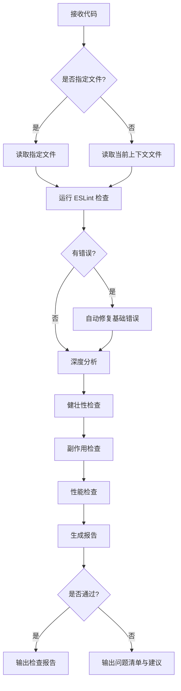

# 前端代码质量检查

## 核心能力

对前端代码进行全方位体检，确保交付代码具备生产级质量。适用于 React/Vue/Taro 等现代前端框架。

## 适用场景

- 代码提交前 (Pre-commit) 的自我检查
- Code Review 前的自检准备
- 复杂逻辑重构后的回归检查
- 接手他人代码时的质量评估
- Bug 修复后的代码验证

## 相关技能

| 技能名称                        | 协作关系 | 使用场景                             |
| ------------------------------- | -------- | ------------------------------------ |
| `staged-code-review`            | 上游技能 | 当需要审查暂存区代码并执行提交时使用 |
| `frontend-staged-bundle-review` | 并行技能 | 关注代码体积优化时配合使用           |
| `code-comment-writer`           | 下游技能 | 审查后发现代码可读性问题时，补充注释 |
| `tech-stack-detection`          | 前置技能 | 不确定项目技术栈时先进行检测         |

---

## 检查清单

### 1. 静态代码分析 (Lint & Fix)

**目标**：零 ESLint 错误，统一代码风格。

- **执行**：运行 Lint 检查，优先修复 `no-unused-vars`、`no-undef`、`exhaustive-deps` 等高危错误。
- **原则**：**仅修复本次改动引入的错误**，避免扩大变更范围。

#### 常见 Lint 错误优先级

| 优先级 | 规则                                 | 说明                    |
| ------ | ------------------------------------ | ----------------------- |
| 🔴 高  | `no-undef`                           | 未定义变量，必定报错    |
| 🔴 高  | `no-unused-vars`                     | 未使用变量，代码冗余    |
| 🔴 高  | `exhaustive-deps`                    | Hook 依赖缺失，逻辑错误 |
| 🟡 中  | `@typescript-eslint/no-explicit-any` | 使用 any 类型           |
| 🟡 中  | `react-hooks/rules-of-hooks`         | Hook 使用规范           |
| 🟢 低  | `prefer-const`                       | 代码风格问题            |

### 2. 健壮性与防御性编程

**目标**：消除运行时异常，处理所有边界情况。

#### 2.1 类型与接口 (TypeScript)

- [ ] **接口定义**：Props 接口完整，必填/可选区分明确。
- [ ] **默认值**：可选参数必须有默认值或空值保护。
- [ ] **泛型约束**：复杂类型使用泛型提升类型安全性。

#### 2.2 逻辑健壮性

- [ ] **空值保护**：使用可选链 `?.` 和空值合并 `??` 处理深层对象访问。
- [ ] **边界处理**：检查数组空判断、除零错误、负数索引等。
- [ ] **异步安全**：必须使用 `try-catch` 包裹 await 调用；处理 loading/error 状态。
- [ ] **类型守卫**：使用类型谓词进行运行时类型检查。

```typescript
// ✅ 健壮性代码示例
const handleSearch = async (keyword: string) => {
  if (!keyword?.trim()) return; // 边界保护

  try {
    setLoading(true);
    const res = await api.search(keyword);
    setList(res?.items ?? []); // 空值保护
  } catch (err) {
    reportError(err); // 错误处理
  } finally {
    setLoading(false); // 状态复位
  }
};

// ✅ 类型守卫示例
const isUser = (obj: unknown): obj is User => {
  return typeof obj === "object" && obj !== null && "id" in obj;
};
```

#### 2.3 交互与竞态

- [ ] **竞态处理**：组件卸载或新请求发起时，忽略旧请求的返回（使用 AbortController 或标志位）。
- [ ] **防重复**：提交按钮在 loading 期间应 disable。
- [ ] **请求取消**：使用 AbortController 取消未完成的请求。

```typescript
// ✅ 竞态处理示例
useEffect(() => {
  const controller = new AbortController();

  const fetchData = async () => {
    try {
      const res = await api.fetch({ signal: controller.signal });
      setData(res);
    } catch (err) {
      if (err.name !== "AbortError") {
        reportError(err);
      }
    }
  };

  fetchData();
  return () => controller.abort();
}, []);
```

### 3. 上下文与副作用

**目标**：隔离变更影响，防止回归。

- [ ] **上游依赖**：修改公用组件时，检查对其他调用方的影响。
- [ ] **副作用清理**：`useEffect` 中注册的监听器、定时器必须有对应的清理函数。
- [ ] **状态污染**：避免直接修改 props 或全局状态对象。
- [ ] **闭包陷阱**：注意事件回调中引用的 state 是否为最新值。

#### 副作用清理检查表

| 副作用类型                   | 清理方式                         |
| ---------------------------- | -------------------------------- |
| `setTimeout` / `setInterval` | `clearTimeout` / `clearInterval` |
| `addEventListener`           | `removeEventListener`            |
| `IntersectionObserver`       | `observer.disconnect()`          |
| 自定义订阅                   | `subscription.unsubscribe()`     |
| WebSocket                    | `socket.close()`                 |

### 4. 性能优化

**目标**：减少无效渲染，提升响应速度。

- [ ] **渲染控制**：合理使用 `React.memo`、`useMemo`、`useCallback` 避免子组件不必要的重渲染。
- [ ] **频率控制**：搜索、滚动、Resize 等高频事件必须使用 `debounce` 或 `throttle`。
- [ ] **列表渲染**：确保列表项拥有稳定且唯一的 `key`。
- [ ] **懒加载**：大型组件使用 `React.lazy` 进行代码分割。

#### 性能优化决策树

```
是否频繁重渲染？
├─ 是 → 是否传入新的 props？
│       ├─ 是 → 使用 useMemo/useCallback 缓存
│       └─ 否 → 检查父组件状态更新逻辑
└─ 否 → 是否需要优化？
        ├─ 列表项 → 确保 key 唯一稳定
        └─ 大组件 → 考虑 React.lazy
```

### 5. Vue 专项检查

**目标**：Vue 框架特有的质量检查点。

- [ ] **响应式陷阱**：避免直接修改 props，使用 emit 触发更新。
- [ ] **生命周期**：`onMounted` 中的副作用需在 `onUnmounted` 中清理。
- [ ] **计算属性**：避免在 computed 中执行副作用。
- [ ] **watch 深度**：深层对象监听需设置 `deep: true`。
- [ ] **v-for 与 v-if**：避免同时使用，优先使用计算属性过滤。

### 6. Taro 小程序专项检查

**目标**：小程序平台特有的质量检查点。

- [ ] **API 兼容性**：使用 Taro API 替代 Web API。
- [ ] **分包配置**：新页面是否放入正确的分包。
- [ ] **setData 优化**：避免频繁调用，合并更新。
- [ ] **图片资源**：使用 CDN 或压缩后的图片。
- [ ] **生命周期**：`useDidShow` / `useDidHide` 的正确使用。

---

## 执行流程



---

## 输出格式

请按以下 Markdown 格式输出检查报告：

```markdown
## 代码质量检查报告

### 📋 检查概览

- **检查文件**：`[文件名]`
- **技术栈**：React / Vue / Taro
- **检查时间**：[时间戳]
- **总体评分**：🟢 优秀 (90+) / 🟡 良好 (70-89) / 🔴 需改进 (<70)

---

### 1️⃣ ESLint 检查

| 状态       | 规则       | 位置        | 说明     |
| ---------- | ---------- | ----------- | -------- |
| ✅ PASS    | -          | -           | 无错误   |
| 或 ⚠️ WARN | `[规则名]` | `文件:行号` | 问题描述 |
| 或 ❌ FAIL | `[规则名]` | `文件:行号` | 错误描述 |

**修复记录**：

- [列出已自动修复的问题]

---

### 2️⃣ 健壮性评估

#### 风险点清单

| 严重程度 | 位置        | 问题描述 | 修复建议 |
| -------- | ----------- | -------- | -------- |
| 🔴 高    | `文件:行号` | 问题     | 建议     |
| 🟡 中    | `文件:行号` | 问题     | 建议     |
| 🟢 低    | `文件:行号` | 建议     | 建议     |

#### 评分明细

- 空值保护：✅ 良好 / ⚠️ 需改进 / ❌ 存在风险
- 边界处理：✅ 良好 / ⚠️ 需改进 / ❌ 存在风险
- 异步安全：✅ 良好 / ⚠️ 需改进 / ❌ 存在风险

---

### 3️⃣ 副作用与上下文

#### 影响范围分析

- **上游影响**：[分析修改对调用方的影响]
- **下游影响**：[分析对被调用模块的影响]
- **全局影响**：[是否有全局状态或公共组件的变更]

#### 副作用检查

| 类型           | 状态    | 说明 |
| -------------- | ------- | ---- |
| 定时器清理     | ✅ / ❌ | 说明 |
| 事件监听器清理 | ✅ / ❌ | 说明 |
| 请求取消       | ✅ / ❌ | 说明 |

---

### 4️⃣ 性能优化建议

| 优先级 | 位置        | 问题 | 优化建议 | 预期收益 |
| ------ | ----------- | ---- | -------- | -------- |
| 🔴 高  | `文件:行号` | 问题 | 建议     | 收益     |
| 🟡 中  | `文件:行号` | 问题 | 建议     | 收益     |
| 🟢 低  | `文件:行号` | 建议 | 建议     | 收益     |

---

### 📊 总结

- **阻断问题**：X 个（必须修复）
- **警告问题**：X 个（建议修复）
- **优化建议**：X 个（可选优化）

#### 行动建议

- [ ] ✅ 建议提交（无阻断问题）
- [ ] ⚠️ 建议修复后再提交（存在警告问题）
- [ ] ❌ 必须修复后再提交（存在阻断问题）

#### 相关技能推荐

- 如需补充注释：使用 `code-comment-writer` 技能
- 如需检查包体积：使用 `frontend-staged-bundle-review` 技能
- 如需暂存区审查：使用 `staged-code-review` 技能
```

---

## 快速参考

### 常见问题速查表

| 问题类型 | 典型场景                            | 解决方案                 |
| -------- | ----------------------------------- | ------------------------ |
| 空值错误 | `Cannot read property of undefined` | 使用 `?.` 可选链         |
| 竞态问题 | 快速切换页面导致数据错乱            | AbortController 取消请求 |
| 内存泄漏 | 组件卸载后仍执行 setState           | useEffect 清理函数       |
| 无限渲染 | useEffect 依赖项设置错误            | 检查依赖数组完整性       |
| 性能问题 | 列表渲染卡顿                        | 使用 key + React.memo    |

### React/Vue 对照表

| 检查项     | React                    | Vue                        |
| ---------- | ------------------------ | -------------------------- |
| 副作用清理 | `useEffect` 返回清理函数 | `onUnmounted`              |
| 计算缓存   | `useMemo`                | `computed`                 |
| 回调缓存   | `useCallback`            | 无需手动处理               |
| 状态更新   | `setState` 或 `useState` | `ref` / `reactive`         |
| Props 校验 | TypeScript 接口          | `props` 定义 + `validator` |
