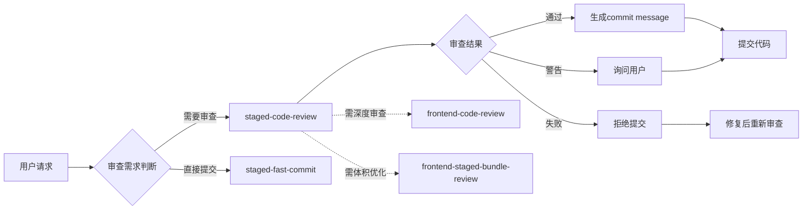

# Git 暂存区代码审查

## 核心能力

在执行 `git commit` 前，对暂存区（staged）的代码变更进行全面审查，确保提交内容符合质量标准，并生成规范的提交 message。

## 适用场景

- 执行 `git commit` 前的最后一道质量关卡
- 需要将需求单号、Story ID 等信息关联到提交记录时
- 多技术栈项目的差异化代码检查
- 团队协作中的代码质量保障
- CI/CD 流水线前的本地检查

## 技能协作



### 协作场景

| 场景         | 推荐技能组合                                       | 说明                             |
| ------------ | -------------------------------------------------- | -------------------------------- |
| 快速迭代提交 | staged-fast-commit                                 | 跳过审查，直接规范化提交         |
| 标准提交流程 | staged-code-review                                 | 完整审查后提交                   |
| 深度质量检查 | staged-code-review + frontend-code-review          | 先审查暂存区，再深度分析关键文件 |
| 体积敏感场景 | staged-code-review + frontend-staged-bundle-review | 同时关注代码质量和包体积         |

---

## 执行流程

### Step 1：读取暂存区 Diff

```bash
git diff --staged
```

获取所有已暂存文件的变更内容，作为后续审查的输入。

**前置检查**：

```bash
# 检查是否有暂存内容
git diff --staged --quiet && echo "暂存区为空" || echo "存在暂存内容"

# 获取暂存文件列表
git diff --staged --name-only
```

### Step 2：识别技术栈

根据变更文件的扩展名和内容，自动判断技术栈，并应用对应的检查规则：

| 文件特征                                           | 技术栈             | 应用规则                      |
| -------------------------------------------------- | ------------------ | ----------------------------- |
| `*.tsx` / `*.jsx` / `*.ts` / `*.js` + React import | React / TypeScript | 闭包陷阱、Hook 依赖、渲染性能 |
| `*.vue`                                            | Vue                | 响应式陷阱、生命周期副作用    |
| `*.go`                                             | Go                 | 错误处理、goroutine 泄漏      |
| `*.py`                                             | Python             | 异常处理、类型注解            |
| `*.java` / `*.kt`                                  | Java / Kotlin      | 空指针、资源释放              |
| `*.rs`                                             | Rust               | 所有权、生命周期              |
| 通用                                               | 所有技术栈         | 通用代码质量规则（见下方）    |

### Step 3：执行代码审查

按以下维度逐一检查 diff 内容：

#### 3.1 通用检查项

- [ ] **调试代码**：是否遗留 `console.log`、`debugger`、`print`、`TODO`（未处理）、`console.error`（非错误处理用途）等。
- [ ] **敏感信息**：是否包含硬编码的密码、Token、密钥、内网地址、手机号、身份证号等。
- [ ] **注释质量**：删除无意义注释；复杂逻辑必须有说明性注释。
- [ ] **错误处理**：新增的异步/IO 操作是否有错误处理。
- [ ] **边界条件**：空值、空数组、极端输入是否有保护。
- [ ] **代码规范**：命名规范、缩进格式、换行风格是否符合团队约定。

#### 3.2 技术栈专项检查（React/TypeScript 示例）

- [ ] Hook 依赖数组是否完整（`exhaustive-deps`）。
- [ ] 传递给子组件的对象/函数是否用 `useMemo` / `useCallback` 包裹。
- [ ] `useEffect` 是否有对应的清理函数。
- [ ] 列表渲染的 `key` 是否使用稳定唯一 ID。
- [ ] 新增 Props 是否有 TypeScript 类型定义。
- [ ] 是否存在潜在的记忆化滥用或缺失。

#### 3.3 技术栈专项检查（Vue 示例）

- [ ] `watch` 是否有 `immediate`/`deep` 不当使用。
- [ ] `v-if` 和 `v-for` 是否混用在同一元素。
- [ ] 响应式数据是否在 `setup` 外部被直接修改。
- [ ] 组件卸载时是否清理了定时器、事件监听器。

### Step 4：解析用户附加参数

若用户在指令中携带了关联参数，需提取并写入提交 message：

| 参数格式            | 含义              | 写入 message 示例               |
| ------------------- | ----------------- | ------------------------------- |
| `--story=STORY-123` | 关联需求/Story ID | `feat: xxx\n\nStory: STORY-123` |
| `--task=TASK-456`   | 关联任务 ID       | `feat: xxx\n\nTask: TASK-456`   |
| `--fix=BUG-789`     | 关联缺陷 ID       | `fix: xxx\n\nFixes: BUG-789`    |
| `--ref=DOC-001`     | 关联文档/参考     | `feat: xxx\n\nRef: DOC-001`     |
| `--review`          | 强制审查模式      | 不自动提交，只输出审查报告      |

多个参数可同时使用，均追加到 message 尾部。

### Step 5：根据审查结果决定后续步骤

| 审查结论                      | 后续行动                                                      |
| ----------------------------- | ------------------------------------------------------------- |
| ✅ **通过**：无阻断性问题     | 生成提交 message，询问用户是否提交                            |
| ⚠️ **警告**：有建议项但不阻断 | 列出建议，询问用户是否继续提交                                |
| ❌ **失败**：存在阻断性问题   | 列出必须修复的问题，**不执行提交**，建议 `git add` 后重新审查 |

**阻断性问题（必须修复才能提交）：**

- 硬编码的密码、Token、私钥
- 明显的语法错误或编译失败
- 遗留的 `debugger` 语句
- 可能导致安全漏洞的代码（如 XSS、SQL 注入）
- 违反团队核心规范的代码（如强制类型检查）

---

## 提交 Message 规范

遵循 [Conventional Commits](https://www.conventionalcommits.org/) 规范：

```
<type>(<scope>): <subject>

[body]

[footer]
```

**type 类型：**

| type       | 适用场景                   | 示例                            |
| ---------- | -------------------------- | ------------------------------- |
| `feat`     | 新功能                     | `feat(user): 新增头像上传功能`  |
| `fix`      | Bug 修复                   | `fix(cart): 修复数量计算错误`   |
| `refactor` | 重构（不影响功能）         | `refactor(utils): 重构工具函数` |
| `perf`     | 性能优化                   | `perf(list): 优化列表渲染性能`  |
| `style`    | 代码格式调整（不影响逻辑） | `style: 统一代码缩进格式`       |
| `test`     | 测试相关                   | `test(user): 添加登录单元测试`  |
| `chore`    | 构建/工具链/依赖更新       | `chore: 升级依赖版本`           |
| `docs`     | 文档变更                   | `docs: 更新 API 文档`           |
| `ci`       | CI/CD 配置变更             | `ci: 添加自动化测试流程`        |
| `revert`   | 回滚提交                   | `revert: 回滚用户模块改动`      |

**含关联参数的完整示例：**

```
feat(user): 新增用户头像上传功能

支持 JPG/PNG 格式，限制 2MB 以内，上传后自动裁剪为 1:1 比例。

Story: STORY-123
Task: TASK-456
```

---

## 实用脚本

### 快速审查命令

```bash
# 审查暂存区并关联 Story
git-review --story=STORY-123

# 审查暂存区并关联多个参数
git-review --story=STORY-123 --task=TASK-456

# 强制审查模式（不自动提交）
git-review --review

# 查看暂存文件列表
git diff --staged --name-only

# 查看暂存文件统计
git diff --staged --stat
```

### 审查后快速修复

```bash
# 撤销某个文件的暂存
git reset HEAD <file>

# 修改后重新暂存
git add <file>

# 重新审查
git-review
```

---

## 输出格式

请按以下 Markdown 格式输出审查报告：

```markdown
## 📋 暂存区代码审查报告

### 审查概览

- **变更文件数**：X 个
- **技术栈**：[识别结果]
- **审查结论**：✅ 通过 / ⚠️ 警告 / ❌ 失败

### 文件清单

| 文件         | 变更行数 | 状态 |
| ------------ | -------- | ---- |
| `src/xxx.ts` | +10/-5   | ✅   |
| `src/yyy.ts` | +3/-1    | ⚠️   |

---

### 通用检查

| 检查项   | 状态              | 说明                 |
| -------- | ----------------- | -------------------- |
| 调试代码 | ✅ PASS / ❌ FAIL | [具体问题描述，如有] |
| 敏感信息 | ✅ PASS / ❌ FAIL | [具体问题描述，如有] |
| 错误处理 | ✅ PASS / ⚠️ WARN | [具体问题描述，如有] |
| 边界条件 | ✅ PASS / ⚠️ WARN | [具体问题描述，如有] |
| 注释质量 | ✅ PASS / ⚠️ WARN | [具体问题描述，如有] |

---

### 技术栈专项检查（[技术栈名称]）

| 检查项       | 状态              | 位置 / 说明          |
| ------------ | ----------------- | -------------------- |
| [检查项描述] | ✅ PASS / ❌ FAIL | `文件名:行号` [说明] |

---

### 问题清单

#### ❌ 阻断性问题（必须修复）

- `文件名:行号`：[问题描述] → [修复建议]

#### ⚠️ 建议项（可选处理）

- `文件名:行号`：[问题描述] → [优化建议]

---

### 提交 Message
```

[type]([scope]): [subject]

[body（如有）]

[footer（如有，含关联参数）]

```

---

### 后续步骤

- [ ] 直接提交（审查通过）
- [ ] 修复后重新审查
- [ ] 放弃本次提交
- [ ] 转至 frontend-code-review 深度审查
- [ ] 转至 frontend-staged-bundle-review 体积优化
```

---

## 最佳实践

### 提交前自查

1. **确认暂存内容**：`git diff --staged` 确认无误
2. **运行审查**：执行暂存区审查
3. **处理问题**：根据审查结果修复阻断性问题
4. **规范提交**：使用生成的规范化 message 提交

### 团队协作建议

1. **统一审查标准**：团队共享同一套审查规则
2. **阻断性规则明确**：明确哪些问题必须修复
3. **自动化集成**：配合 Git Hooks 自动执行审查
4. **审查记录留存**：重要审查报告可归档备查

### 常见问题处理

| 问题           | 处理方式             |
| -------------- | -------------------- |
| 暂存区为空     | 提示先执行 `git add` |
| 变更文件过多   | 建议拆分为多个提交   |
| 技术栈识别失败 | 使用通用规则审查     |
| 敏感信息误报   | 允许用户确认后继续   |
